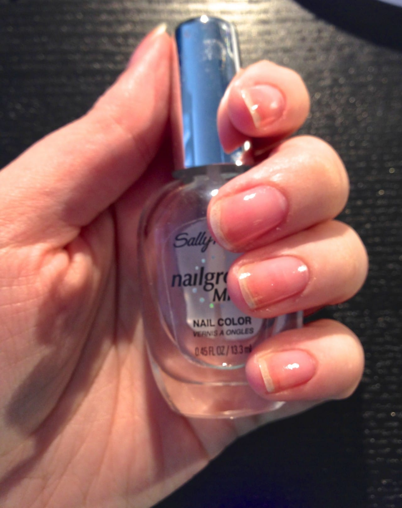
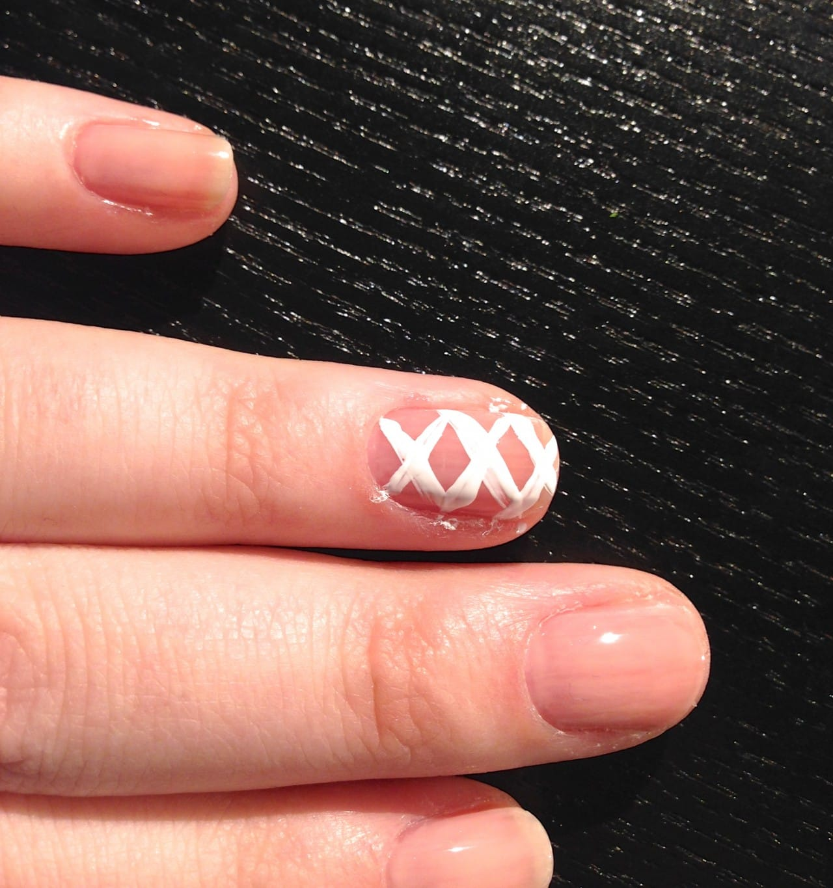
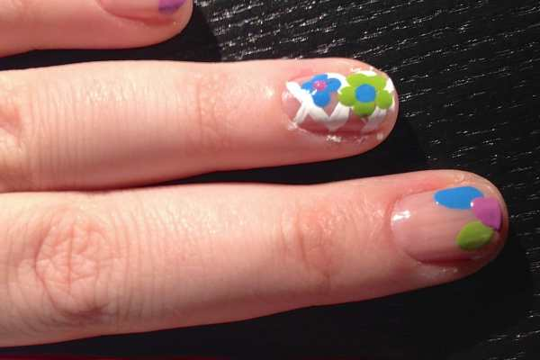
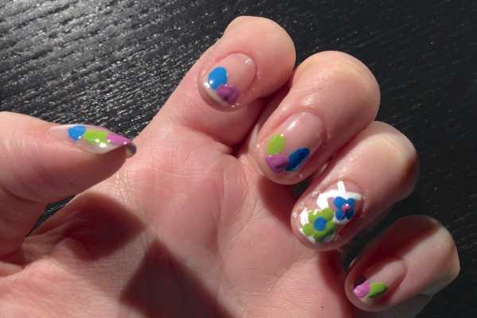
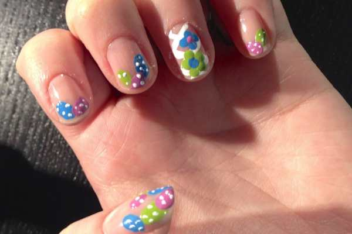
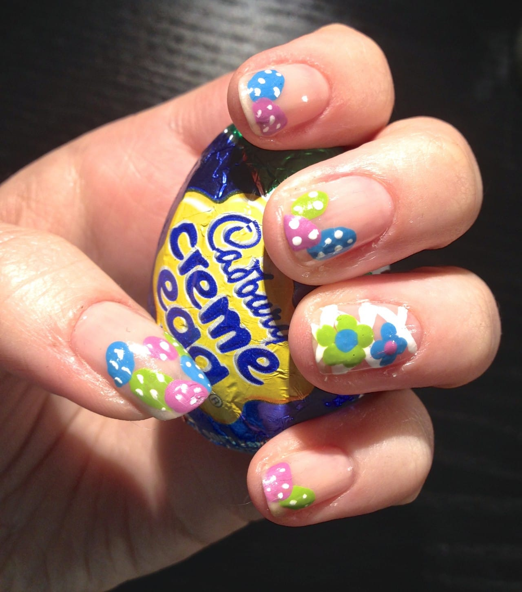

This week’s nail art design is perfect for Easter Sunday! It incorporates little speckled Easter eggs and a little lattice/basket weave accent nail with flowers. They are simple and easy and were fun to paint (even if they were a little hard to do on my left hand!)

## Materials:

- Clear base coat

- Sheer pink transparent nail polish

- Lime or bright green nail polish

- Orchid or lavender nail polish

- Blue nail polish

- White striper

- Dotting tools/bobby pins/toothpicks

## Instructions:

- Start out with clean dry nails.

- Do a coat of clear base coat and let it dry.

- Once dry, you’ll paint your first coat of the sheer pink transparent nail polish on. I picked the lightest shade from my

  [Physician’s Formula Trio “In The Nude.”](http://amzn.to/1peWyRe "Physician's Formula Trio: In The Nude")

  It’s a great set!

- After a first coat is dry, do a second if your polish is streaky. I may have even gone for a third with this one, but I was getting too impatient! You can see below that a second coat wasn’t even too noticeable!

- Next you can do your accent nail. I used a white striper to draw a criss-cross basket weave/lattice design on my ring fingers.

- Next, I used my dotting tool to make two flowers on each accent nail. I made five dots for the bigger flower, and four for the smaller. Use whatever colors you like for the petals! Just be sure the center of each flower is in a contrasting color!

- Now you can move on to the eggs! Make different sized, different colored eggs using your dotting tools on each nail. Play around with them! Put them wherever you like!

- Once all your eggs are in a row, it’s time to put speckles on them! I used the tip of my striper tool to do this, but you can use a dotting tool again!

- Put on a coat of clear top coat and you’re golden!

- Once your nails are totally 110% dry, gently scrap the excess polish off your skin while washing your hands.

Enjoy your new Easter egg and flower basket nails! Hope you like them! If you use this design, snap a pic and share it in the comments below!

