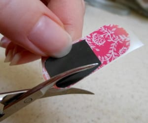
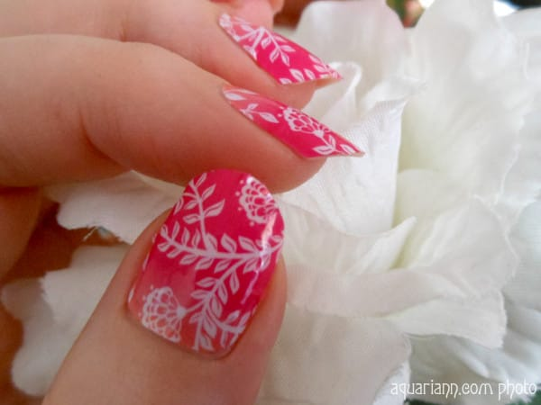

Nail Art: Jamberry Nail Wraps Trim Tip with Aquariann

_Hi guys! I’d like to introduce Kristin, our guest blogger for today! Her Manicure Monday post below will be sure to wow and inspire you! Enjoy!_

Messy mediums and I have never gotten along. I have the soul of an artist, but not a painter – I use colored pencils to draw my

[fantasy art](https://www.etsy.com/shop/aquariann)

. It’s surprising that it took me all these years to try something other than polish to beautify my naturally long fingernails. Since I discovered Jamberry nail wraps a few months ago, I’m making up for lost time!

Considering I didn’t have any experience applying nail art, my first jamicure went pretty well after following their

[official application video](http://kissmytips.jamberrynails.net/about/apply/)

, which everyone should watch before attempting. Each $15 sheet comes with 2 each of 9 differently sized wraps, as shown at the top in the

[Carmen Ombre](http://kissmytips.jamberrynails.net/product/carmen-ombre)

style. Each wrap can do 2 nails, sometimes more for short nails. They’re non-toxic and don’t dry out after opening the package like brands that are made from the same ingredients as nail polish. You can save the rest for at least another full manicure and pedicure, or accent nails galore.

The wraps are affixed to clear backing to help choose the size that best fits each nail, as shown below to the left. I applied the wraps as is the first time, not even considering that the bottom of my nail beds are not as round as the wrap’s shape. I didn’t notice how bad until I viewed Ogre’s pictures of my

[pirate nail art](http://blog.aquariann.com/2014/02/pirate-nail-art-skull-crossbones.html)

– that’s why I cropped out my thumbs in that photograph. My thumbnails start in almost a straight line!

For my second jamicure, I tried to trim the wraps after peeling them off the backing, but it was a bit awkward holding them in the air with a tweezers and they still weren’t perfect. By the third, it dawned on me that I should make nail shape templates for each finger first. On a whim, I cut them out of a magazine that happened to be sitting there, which is the black shape in the image above to the right. The flexibility of the glossy paper helped to size them perfectly, but now that I’ve used them a couple times, the ink is starting to crack. I suggest transferring to a sturdier cardstock after the draft templates are definitely the correct size.

Wow, applying my fourth set was so much easier! Trimming them while still on the backing gave me more control. I cut each wrap away from the sheet first and was careful to leave at least one side untrimmed so wrap could still be easily peeled from backing. If your nails don’t magically match the nail wrap shapes exactly, I definitely recommend taking the extra time to make those templates. It saves so much frustration in the long run.

I plan to travel many, many miles with Jamberry wraps on my nails – I have a wishlist of dozens of designs! Thank goodness they give their customers an affordable way to feed their obsessions. Not only are they currently offering a Buy 3, Get 1 Free deal, but you can even host your own party and earn free hostess rewards.

Don’t forget to hop by Manicure Monday on my blog to see the

[Easter bunny nail art](http://blog.aquariann.com/2014/04/jamberry-nails-easter-bunny-nail-art.html)

I added as an accent to this Carmen Ombre jamicure. I also welcome you to linky up your current manicure, too, wrapped or not! I may not like painting my own nails, but I love looking at all nail art.
