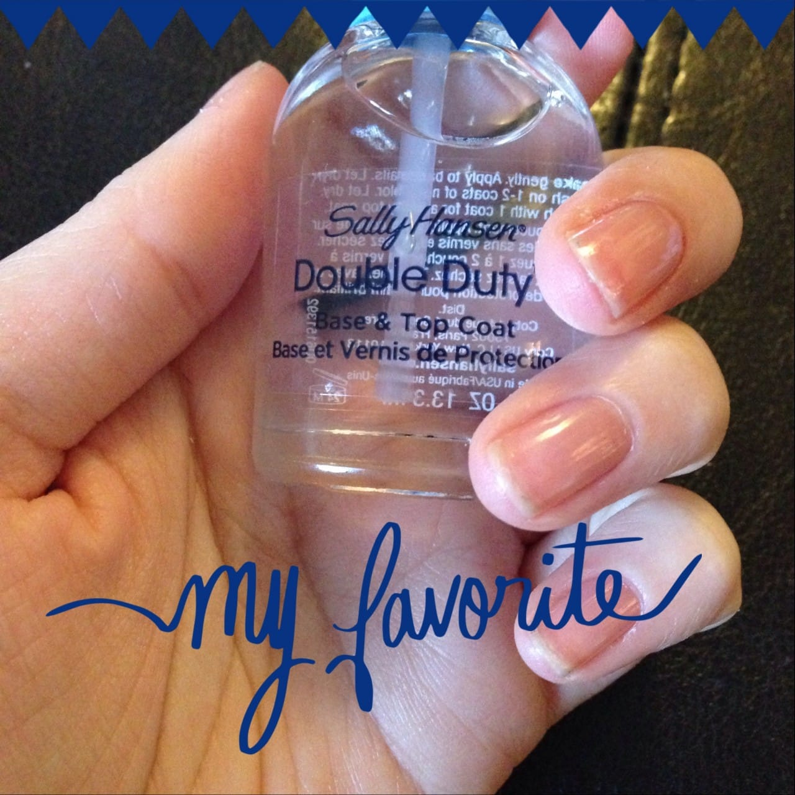
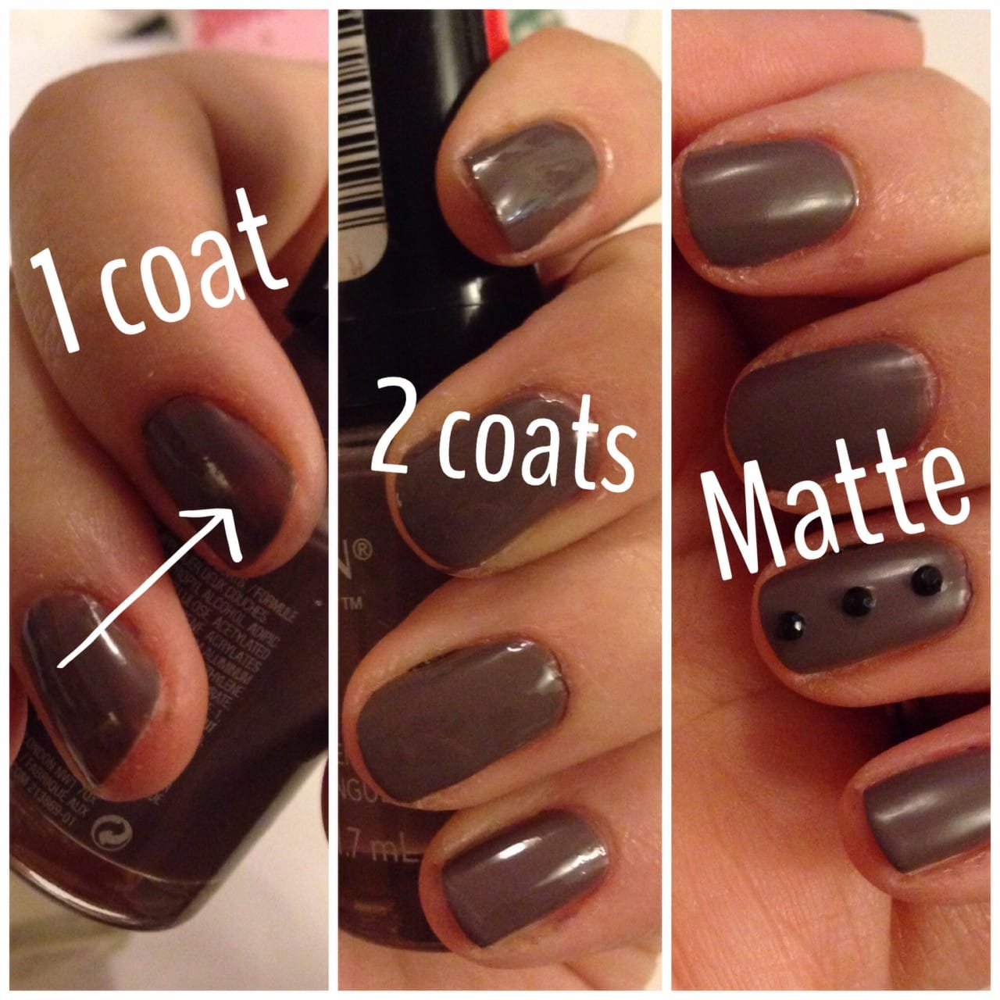
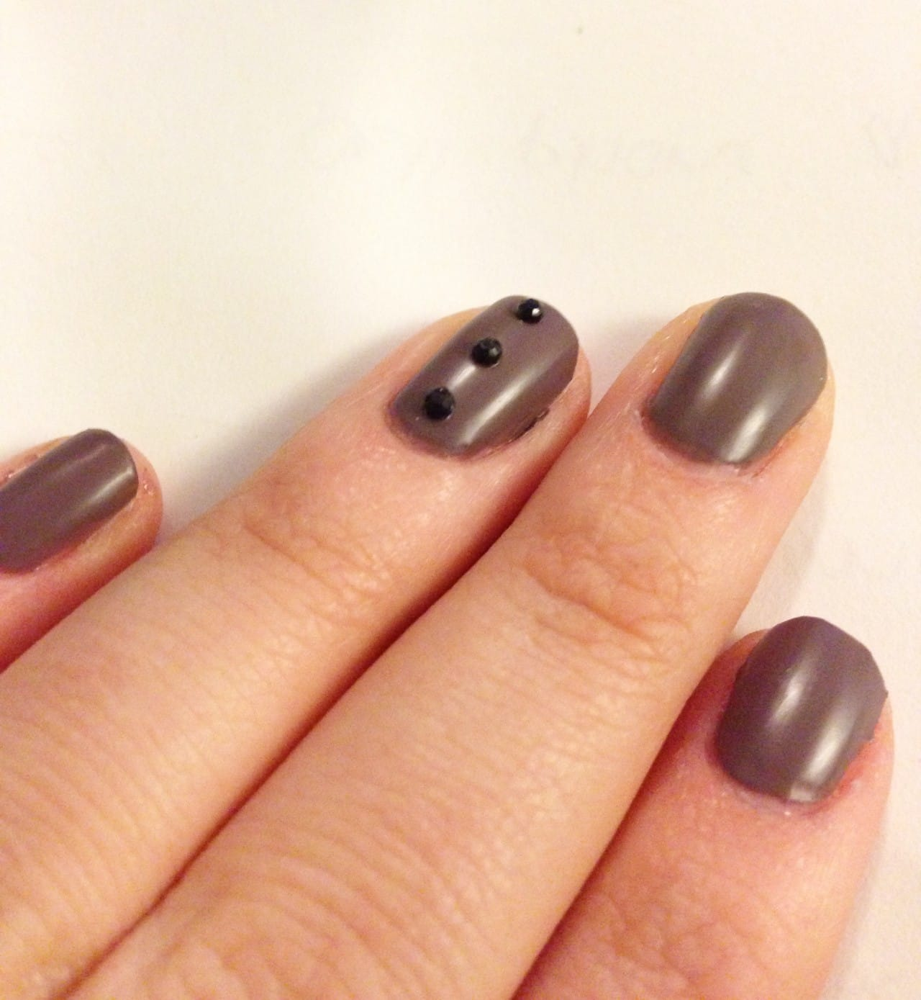

Project: Jury Duty Nail Art Design

Tomorrow morning, I have Jury Duty. Actually, by the time you read this I’ll have already been sitting in a stuffy room somewhere for 3 hours waiting for my name to be called (and inevitably mispronounced quite terribly). My navy nails were all chipped and awful looking, and while I don’t have an extravagantly elegant outfit planned to wear to my civic duty (read: sweater dress, tights, comfy boots), I thought I should at minimum remove the old polish from my nails and start fresh.

This nail design doesn’t have much of a resemblance to anything jury duty or court related- maybe I should have gone with little gavels- but it’s dull matte colors (which I happen to love, actually) pretty much fit the bill. I’m not exactly excited to spend my entire Friday in the courts of Philly, in case you couldn’t tell. Perhaps if I didn’t have such terrible anxiety it may be an interesting experience. But alas, I will do as I’m told and pray for an early dismissal whilst trying to not have a panic attack.

## Materials For Dull Sad (but actually awesome) Jury Duty Nails:

- Clear base coat

- Colorless color nail polish

- Matte top coat

- File and cuticle clippers to clean up

- Toothpick or bobby pin to attach gems

- Black nail art gems

## Instructions:

- As usual, consider cleaning up your nails and cuticles using the clippers and nail file. If you really don’t care because you’re in a terrible anxious mood, pretend you did this step but actually skip it.

- Start with a coat of top coat. I still really like

  [**Sally Hansen’s Double Duty**](http://amzn.to/1fzqv5d "Sally Hansen Double Duty")

  , and am therefore reusing a photo of it.

- Next, do one coat of your nail polish color of choice. I’m kind of in love with

  [**Revlon Colorstay’s color Stormy Night.**](http://amzn.to/1bQ72R9 "Revlon Colorstay in Stormy Night")

  \* It’s a gray lavender that is just so unique. I get compliments on the color every single time I wear it. Let the single coat dry. It will be streaky, as you can see below, so it will need a second coat.

_\*I don’t know who gets to grow up and have the job of naming nail polishes, but I’m forever envious._

- After the first coat is dry, and you’ve done your second coat (look how shiny two coats makes it look!), sit back and relax. You’ll want your polish to be dry before you do the matte top coat. Unlike regular top coats, the matte (at least, in my experience) likes to ruin the polish a little. If your nails aren’t at least mostly dry when you apply it, it starts to take off color and mess up the lovely job you’ve just done.

- Apply just one coat of matte top coat to make your nails a wonderful shade of dull and lifeless (see the difference above?) Last summer I was obsessed with matte nails and went on a several store hunt for top coat. Oddly, I had trouble finding it anywhere. There were plenty of matte colors, but I wanted a matte top coat so I could make my already existing collection of colors matte at my will. I finally found

  [**Nails Inc. Matte Effect Top Coat**](http://amzn.to/1nRLhAe "Nails Inc. Matte Top Coat")

  in color Westminster Bridge. It’s done the job pretty nicely!

- Let matte coat dry- this may take longer than normal. Use your toothpick or bobby pin and a smidge of the matte polish to affix the black gems in a line on your ring finger. Don’t have any? You can buy some from my

  [**Etsy Shop**](https://www.etsy.com/listing/129417251/25-2mm-acrylic-rhinestone-gems?ref=pr_shop "25 2mm acrylic rhinestone gems on Katie Craft's Etsy")

  ! How convenient! Let those dry too, and you’re finished.

- Clean up the nail polish from your skin when it’s all dry, like I haven’t done yet above. Enjoy, or don’t enjoy, your edgy jury duty nails!

## Tips:

- Matte nail polish has a

  **much**

  shorter life span than regular polish. If you normally get a week out of your regular manicure, expect just a couple days out of your matte one. The matte top coat doesn’t offer anything in the way of chip-resistance. It’s sad, but worth it for the great effect.

I’ll do another nail art design soon with dark matte nails and glossy french tips- I just love that look! For now, I hope your Friday is going better than mine!

If you are a matte top coat fan, what brand have you tried and liked? I’d love to test out more, or perhaps find a great DIY to make it myself.
