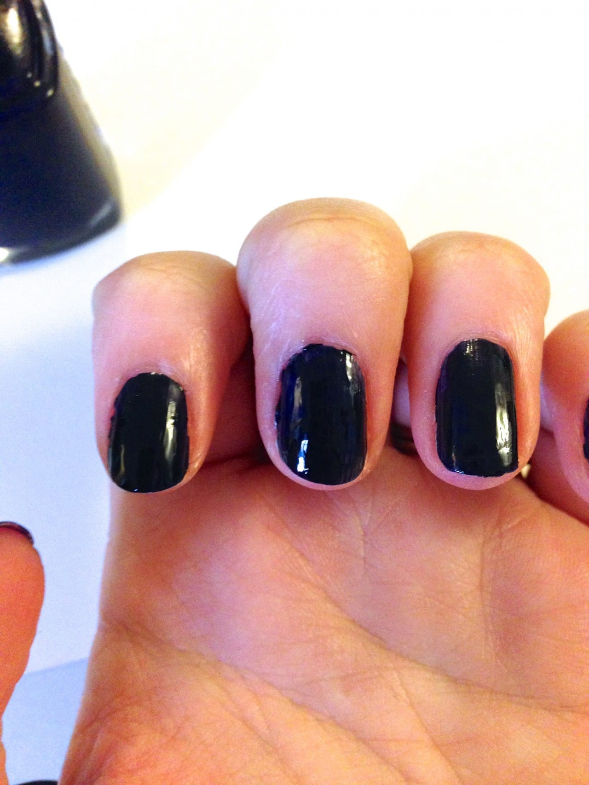

If you’re reading this, I’m still in New Orleans! I come back tonight, though (womp womp!) In the meantime, here is a simple little design I made in honor of my Katie Crafts logo! It’s got the navy, it’s got the pink, it’s got the stacked hearts. Maybe next time I’ll add the “K”! 😉

## Materials:

- Clear top and base coat

- Navy blue nail polish

- Dusty rose nail polish

- Toothpick or dotting tool

I used

[Essie’s After School Boy Blazer](http://amzn.to/1jQWr9O "Essie After School Boy Blazer")

for the blue polish, and

[Essie’s Sand Tropez](http://amzn.to/1l1jRax "Essie Sand Tropez")

for the pink.

## Instructions:

- Start with clean, manicured nails. Do one coat of clear base coat.

- When dry, do one to two coats of the blue nail polish. If it’s a thick/opaque polish, you may only need one coat! It will depend on your brand. Let them dry 100%!

- Using your dotting tool or toothpick, draw two small hearts on top of each other on each of your ring fingers.

- Let dry!

- Use a clear top coat to seal your nails. Let dry, and clean up any extra polish on the skin once dry.

That’s it for this mega easy Katie Crafts logo design nail art tutorial! Hope you liked it!
