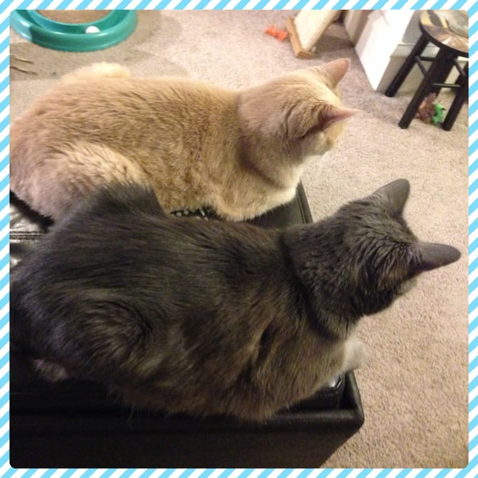
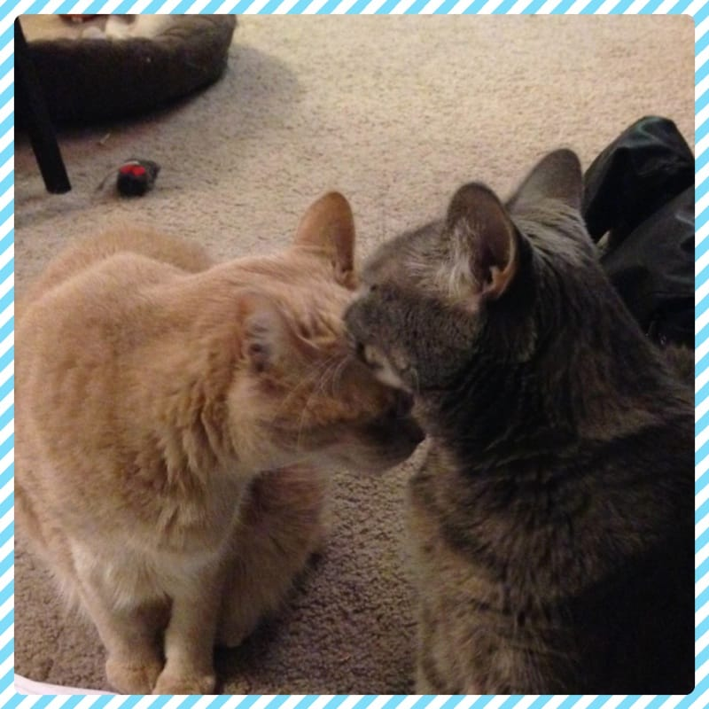

The month of June is

**National Adopt-A-Cat Month**

! Hosted by the

[American Humane Association](http://www.americanhumane.org/animals/programs/special-initiatives/adopt-a-cat-month/ "Adopt A Cat Month")

, Adopt-A-Cat Month is all about rescuing kitties that are stuck in shelters! The springtime is prime “kitten season,” which means thousands of new kittens are born without homes or people to take care of them. They will be collected and put in shelters with the millions of cats that are already waiting for their forever homes. That’s why adopting rather than breeding is so important (for cats and dogs alike!) In fact, both of our cats, Lucky and Mabel, are rescue cats!

The American Humane Association includes a great top ten list on their website for adopting a cat! Here’s what they suggest you take into consideration before adopting this month!

#### **“TOP TEN” CHECKLIST FOR ADOPTING A CAT**

If you’re thinking about adopting a cat, consider taking home two.

Cats require exercise, mental stimulation, and social interaction. Two cats can provide this for each other. Plus they’ll provide more benefits to you. Cats’ purring has been shown to soothe humans as well as themselves – and they have an uncanny ability to just make you smile. A great place to start your search is online. Sites like petfinder.com let you search numerous shelters in your area simultaneously to help narrow your search and more quickly find the match that’s right for you and your new feline friend.

Find a cat whose personality meshes with yours.

Just as we each have our own personality, so do cats. In general, cats with long hair and round heads and bodies are more easygoing than lean cats with narrow heads and short hair, who are typically more active. Adoption counselors can offer advice to help you match the cat’s personality with your own.

Pick out a veterinarian ahead of time and schedule a visit within the first few days following the adoption.

You’ll want to take any medical records you received from the adoption center on your first visit. Kittens in particular should accompany you to make the appointment – even before the exam itself – so staff can pet the cat and tell you that you’ve chosen the most beautiful one ever.

Make sure everyone in the house is prepared to have a cat before it comes home.

Visiting the shelter or animal control facility should be a family affair. When adopting a new cat with existing pets at home, discuss with the adoption facility how to make a proper introduction.

Budget for the short- and long-term costs of a cat.

Understand any pet is a responsibility and there’s a cost associated with that. A cat adopted from a shelter is a bargain; many facilities will have already provided spaying or neutering, initial vaccines, and a microchip for permanent identification.

Stock up on supplies before the cat arrives.

Be prepared so your new cat can start feeling at home right away. Your cat will need a litter box, cat litter, food and water bowls, food, scratching posts, safe and stimulating toys, a cushy bed, a brush for grooming, a toothbrush and nail clippers.

Cat-proof your home.

A new cat will quickly teach you not to leave things lying out. Food left on the kitchen counter will serve to teach your new friend to jump on counters for a possible lunch. Get rid of loose items your cat might chew on, watch to ensure the kitten isn’t chewing on electric cords, and pick up random items like paper clips (which kittens may swallow).

Go slowly when introducing your cat to new friends and family.

It can take several weeks for a cat to relax in a new environment. It’s a great idea to keep the new addition secluded to a single room (with a litter box, food and water, toys, and the cat carrier left out and open with bedding inside) until the cat is used to the new surroundings; this is particularly important if you have other pets. If you’ve adopted a kitten, socialization is very important. But remember – take it slow.

Be sure to include your new pet in your family’s emergency plan.

You probably have a plan in place for getting your family to safety in case of an emergency. Adjust this plan to include your pets. Add phone numbers for your veterinarian and closest 24-hour animal hospital to your “in-case-of-emergency” call list.

If you’re considering giving a cat as a gift, make sure the recipient is an active participant in the adoption process.

Though well-meaning, the surprise kitty gift doesn’t allow for a “get-to know-one-another” period. Remember, adopting a cat isn’t like purchasing a household appliance or a piece of jewelry – this is a real living, breathing, and emotional being.

I hope you consider adopting a cat this month from your local shelter! If you need help searching for one that fits your needs, you can check out

[Petfinder](https://www.petfinder.com/ "Petfinder")

. That’s how I found Lucky! You may only think about it as saving a furry life, but perhaps they will save yours too! Family is family- whether they are human or animal. 🙂 Besides, look how happy they are in our home instead of in a shelter!

