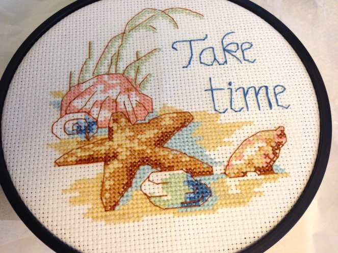

> FYI! TODAY IS “NATIONAL THREADING THE NEEDLE DAY”! What a perfect post for the occasion!

Hey guys, it’s Jess here with another round of needle art mysteries revealed! I know that I said in my

[last issue](/needle-art-mysteries-sewing/ "Needle Art Mysteries")

that I would be tackling knitting, however I found this needle art and thought it might be a good one to continue on from sewing. It’s the needle art of cross-stitching!

## Cross-Stitching

This needle art is one of the forms of embroidery (which I will be covering more about in another post) that you can do. This art is slightly different than sewing in that you follow a set pattern. There are two forms that you can do.

1. _Counted Cross-stitch_

   is when the pattern is on a piece of paper. In order to do this form, you must count the number of squares on the paper and then on your cloth that you will be using. This form is a bit more difficult to do.

2. The other form is called

   _Stamp Cross-stitching_

   , in which the pattern is imprinted right on the cloth for you. It is a much easier process to do.

Both forms use a needle, embroidery thread, and the evenweave fabric called aida cloth.

Katie, starting out a cross-stitch beach pattern for her mother-in-law’s birthday gift

Cross-stitching is one of the oldest forms of embroidery out there. There are artworks found all throughout the world. In folk museums that can be found in some parts of Europe and Asia, they still showcase many beautiful works of art. They used cross-stitching as a way to teach young girls the alphabet, by having them stitch it! It was also said that it would help the young women be prepared when they had to do household sewing.

Cross-stitching as defined by

[Merriam Webster Dictionary](http://www.merriam-webster.com/dictionary/cross-stitch "Cross Stitch")

Online is as follows: “A needlework stitch that forms an X.” You can’t get more succinct than that, right!?

Katie’s cross-stitch, completed, over 30 hours of work later!

Hope you learned something new about this needle art mystery! I know I did! See ya next time! 🙂
