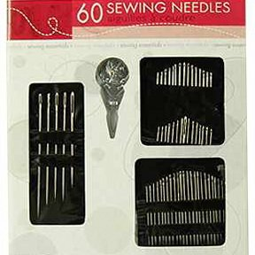
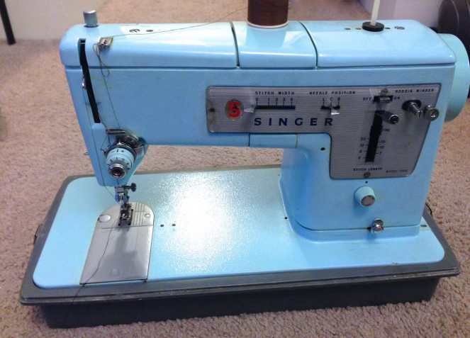

> _Note from Katie: My sister Jessica is going to blog weekly on the mysteries of needle art, revealed! It may be something you already know about, or something you’d like to learn more about. Coming from someone who isn’t as crafty, this series may be just the type of info you are looking for! As she learns new things for the blog, she’ll share her findings with you. First up in this Needle Art Mysteries series is one that I already love: sewing! Take a look at what Jess has to say on the topic below!_

If anyone read my debut post of

[Sunday Funday: Issue 19,](/sunday-funday-issue-19/ "Sunday Funday: Issue 19")

then they might remember I said I am not as crafty as my sister Katie. The world of crafts is more her domain then mine, seriously! If someone asked me what the difference between N’SYNC and Backstreet Boys are, I could give an encyclopedia worth of knowledge to answer the question. If you need to know about the difference between an American Cartoon like ‘My Little Pony: Friendship is Magic’ and Japanese Anime like ‘Bleach’, I’m the sister to go to. Information about anything crafty and I fall into the “um” and “uh” answers while desperately looking up definitions.

In situations like that, I usually defer my friends to Katie and try not to look embarrassed. Don’t get me wrong, I do know some things (like the fact that Play Doh and ceramic clay are in fact different things.) However, when it comes to needle arts, things tend to get fuzzy for me. I thought that everything was exactly the same, but boy was I wrong.

photo courtesy of sewaholic.net

I knew my sister did

[crocheting](/crash-course-in-crochet/ "Crash Course in Crochet")

, sewing and more, but I didn’t know there were other needle arts out there. When Katie mentioned cross stitching to me last weekend, before she did her

[Sunday Funday: Issue 20,](/sunday-funday-issue-20/ "Sunday Funday: Issue 20")

I thought she was talking in Greek. Then it hit me that I may not be the only one out there who needs the definitions. We decided this would be a great post for me to make for the blog! So here it is, for those of you who are like me, who are beginners or just curious about the world of needle art. All definitions can be found at

[Webster’s Online](http://www.merriam-webster.com/ "Merriam Webster online dicitonary.")

. When I started this I was going to do all of them, but then I thought it might be easier if I do one art each week. This week I am going to focus on Sewing to start with and then go to the next one next week.

## **Sewing**

Some of you may be wondering why I chose to go with this one to start off with. Sewing is a needle art that most of the world has heard about so it shouldn’t really need to be explained. While you may be thinking that, there are other needle arts that are based off this one that I will be talking about in upcoming posts. It also wouldn’t hurt to help a fledgling find their way in this art, right? First thing to know about sewing is the materials you would need. You can find a needle kit like

[this one on Amazon](http://amzn.to/1nldIW8 "Sewing Kit")

. You will also need some thread like

[this kit](http://amzn.to/1wiSuh2 "Singer Thread Kit")

that can also be found on Amazon. For more involved projects you would need a sewing machine, but these kits are good for repair jobs and simple hand stitching.

Needle Kit from Amazon

Sewing is defined from Webster’s dictionary as,

_“_

_the act or process of using a needle and thread to make or repair something (such as a piece of clothing)”_

You can create something

brand new, such a new tote bag or skirt. You can also repair something you already own that is old and fraying, such as a beloved teddy bear from childhood (my mother had to do this A LOT!), just to name a few things.

In the case of making something brand new, then using a sewing machine would be the best course of action since it is faster. Every sewing machine is different, so read the safety warnings and instruction manual of the one you have or want to buy before using.

Our grandmother’s old Singer from the 1960’s

In the case of repair jobs it’s something everyone should know, but can be tricky to do. First thing is to take out a needle and unravel a little bit of thread. Try to slip the thread into the eye (hole) of the needle. It can be really hard to do, so I tend to put the thread between my teeth and pull it out to make it tighter, but wetting you fingertips and the end of the thread can work too! Once you have the thread through the needle, pull out as much thread as you think you’ll need and cut it from the spool. Take the part that is through the needle and tie it to the side you just cut (so that the ends are together). I suggest three or four knots, but that is just me since I tend to worry about it coming undone! Once you have it tied off, you can then start on your repair job and it becomes simple from there.

Just start by grabbing the object you want to repair and holding it tight between your fingers. Then push the needle either from the top or bottom of area and let a good amount of thread come through. After that push it from the opposite direction right next to where you just did. So if you started from the top then push through the bottom and vice versa. Keep on repeating this until the repair job is to your satisfaction and nice and tight. Tie it off on the underside of the garment so the knot isn’t showing and you’re done! That is all there is to a repair job. It might not be perfect, but if you are happy with it then that is all that matters.

Well I hope that this post was able to help you guys out at least a little bit. Next week I will tackle knitting. I may not know all about it but I will research and let you guys know what I find! 🙂
