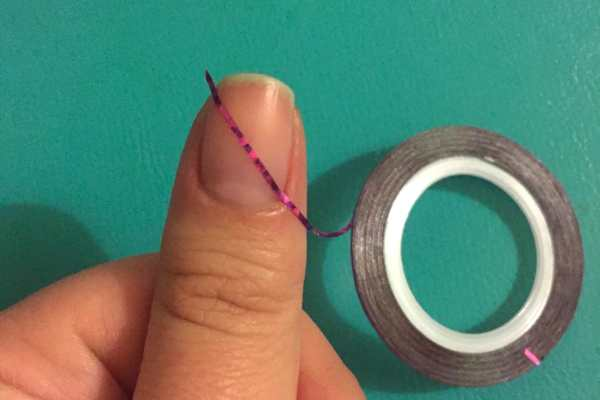
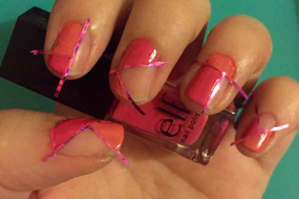
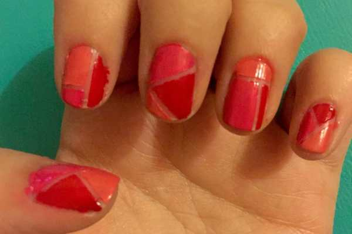
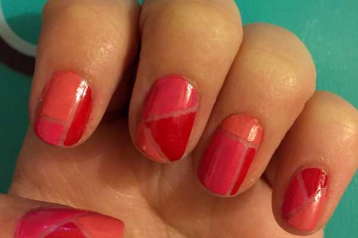
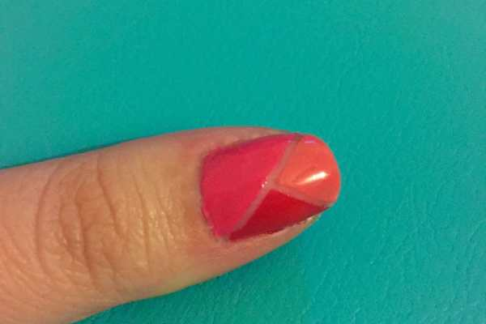
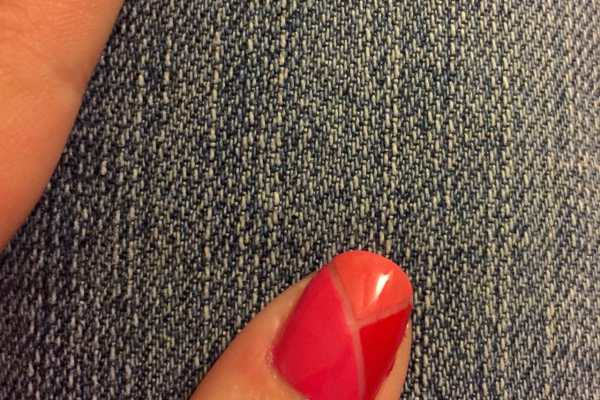
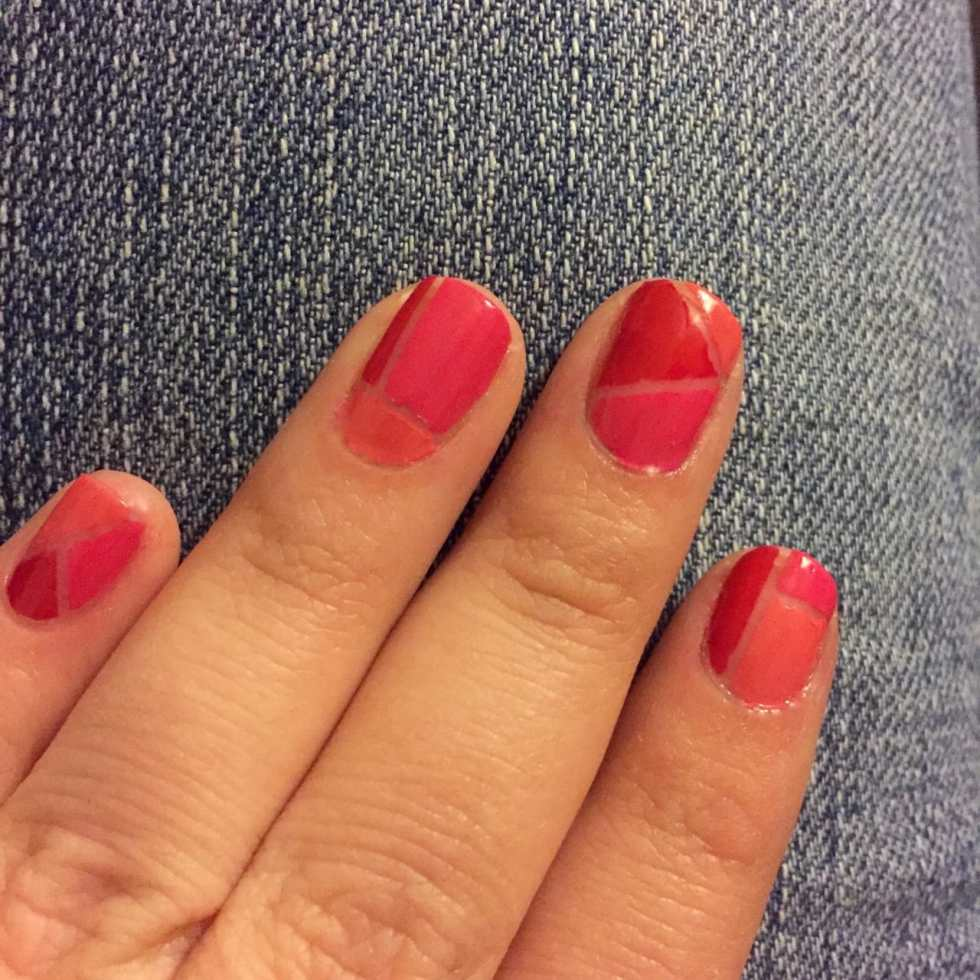
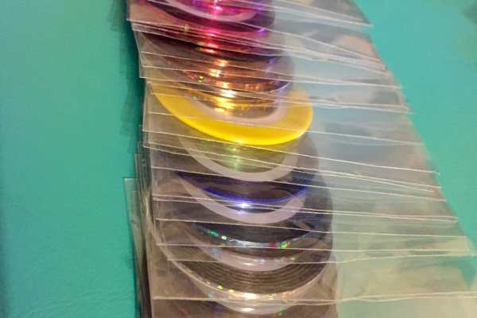

A couple weeks ago, I began a giveaway for a

[cuticle pen](/quick-spring-nail-art-giveaway/)

(congrats again on winning, May!) and asked readers to tell me what looks they wanted to see in the future. I had a few people mention geometric and simple designs. I thought it would be a perfect time to try out a negative space modern look using nail tape, and give away a few rolls of it too!

First, let’s tackle the nail art! I wanted something warm and summery, so I picked three complimentary shades of pink. I think they’re really great together!

## Materials:

- Nail polish, in any shade(s) you like\*

- Clear top coat

- Nail tape

- Nail clippers

\*If I’d chosen something darker (like blues or blacks) you would be able to see the negative space much better! However, I really wanted something bright this week! Additionally, you can use just one color, or as many as you want. Since I was breaking each nail in to three unique sections, I wanted to do three unique colors to make an almost mosaic look. You may pick whatever you please!

## Instructions:

- Starting with clean, dry nails, make designs with your nail tape. Use the nail clippers to cut it off the roll. Make sure the tape is pressed down firmly on your nail and skin a little, so there is less of a chance of the polish bleeding underneath.

* When you are satisfied with all your designs, pick your first color and get to painting! Paint one (or more) sections on each nail.

- Repeat with your second and third colors, or until all sections are painted.

- Quickly (and gently) peel off the nail tape to reveal your negative space lines. The faster you work, the more defined and perfect the lines will be. As the polish begins to dry, the lines become jagged! Mine started to do that because I was doing multiple colors AND stopping to take photos of everything. If you work paint and remove the tape quickly you will have much better luck!

- Do a coat of clear polish and let dry. Then do a second coat of clear and let dry. The second coat really helps smooth everything out and give your nails an even, glossy look! Check out the difference between one and two coats on my thumb below.

Enjoy your negative space nail art, and have fun coming up with really cool designs with the tape!!

## Tip:

- The nail tape is just one really long rolled up sticker, and is shiny and pretty already! Incorporate it in your nail art itself, too! Do a simple french manicure using whatever color you like for the tip, then adorn a strip of nail tape right underneath the tip to separate it from the base color. It will instantly add glam to your look. Seal in with a top coat!

Okay, now on to the giveaway!

**THREE**

readers will each win

**ONE roll of nail art tape**

, the color of their choosing (after you win I will give you the list of colors I have and let you pick! As you can see from above, there is a shimmering rainbow of choices!) This is a great giveaway to share with friends!

Raffle is open to anyone 18 or older, in the US and Canada. Ends at 11:59 PM ET on May 31st! Please read terms and conditions. Good luck! And I hope you enjoyed this Negative Space Nail Art Tutorial + Giveaway!

[a Rafflecopter giveaway](http://www.rafflecopter.com/rafl/display/64ecfabc27/)
