Husband took off of work on Friday for his birthday, so we took a day trip to New Hope, Pennsylvania! I hadn’t been there since I was little and went with my parents and sister, and Husband had never been at all. It was just as I remember it- the cutest little quaintest town ever. We popped in and out of shops selling adorable crafts and vintage pieces for way less than they should be selling them (or at least way less than I’ve seen similar things sold here in Phila!), and had lunch and ice cream.. three times.

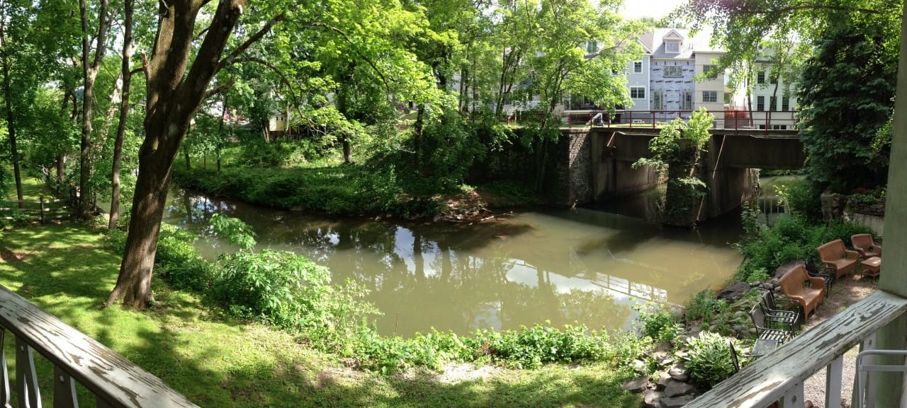

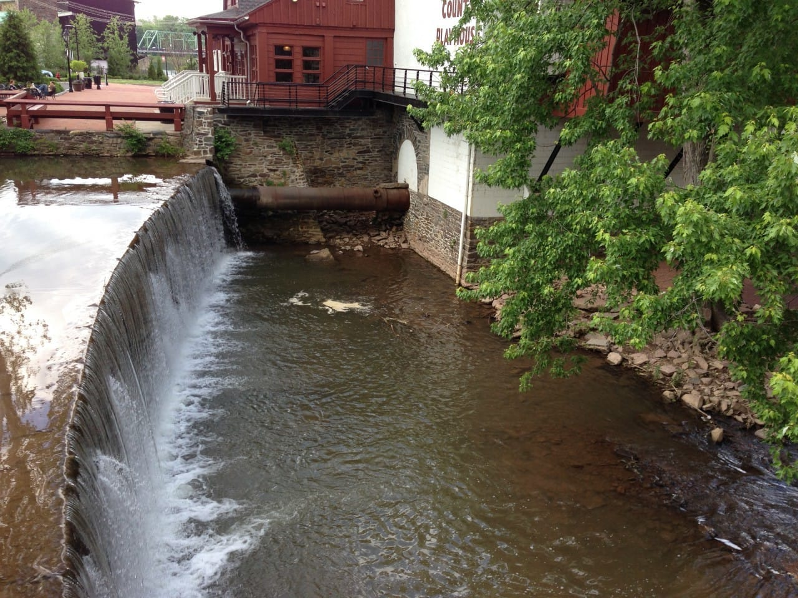

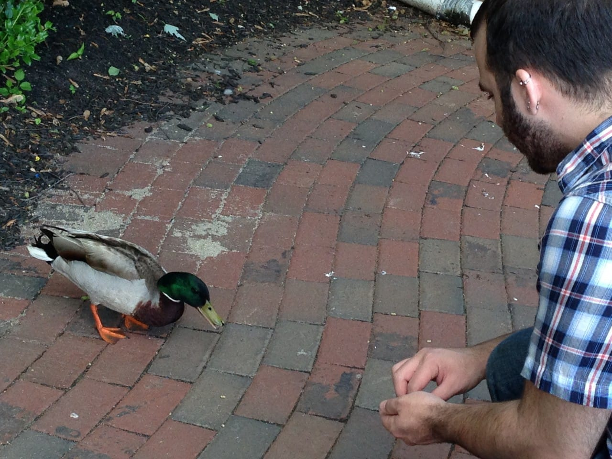

After walking around for awhile, I started to get a little overheated. While seeking shade to hide under for a bit, we found some benches by the water and bought some food for the ducks! We made a few friends while there. This one mama was especially starving, and would have eaten out of our hands if we let her. She followed me around quacking SO loudly waiting for more food. The babies bobbing around in the water were just as cute as she was!

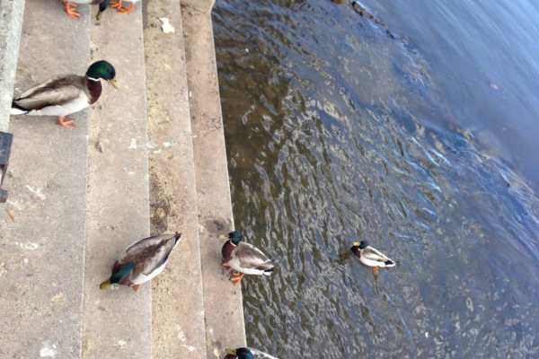

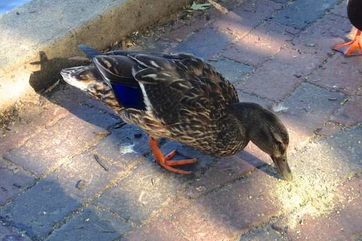

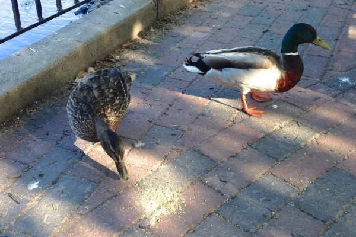

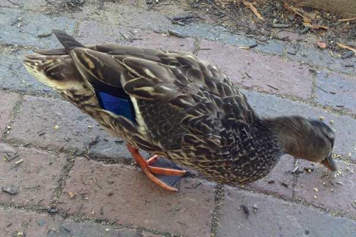

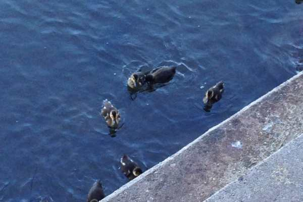

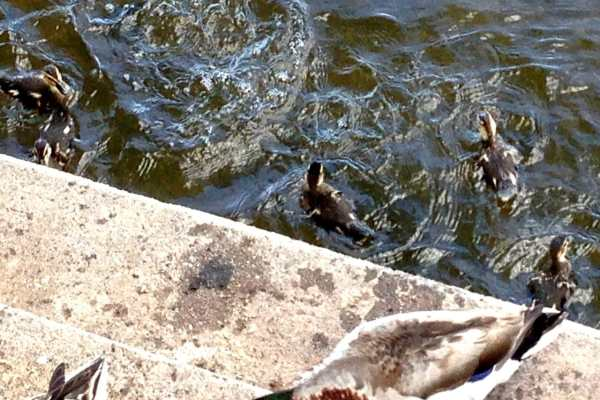

Look how close she was to us!

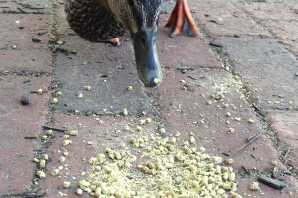

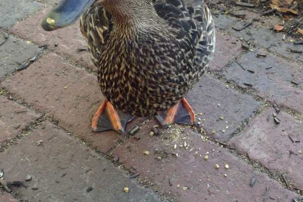

After feeding the ducks (and getting ice cream for the second time), we headed to the car- but we weren’t quite ready to leave. There was a bench and lookout over the water next to our parking lot, so we sat down and read our books for awhile admiring the scenery and soaking in the sun! We finally had to leave when the sun started going down.

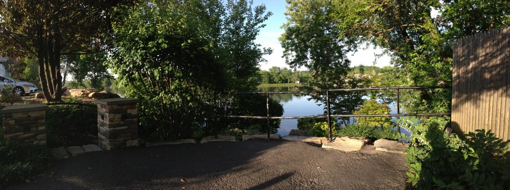

On the way home, we stopped for a birthday dinner of sushi and hibachi… and fried green tea ice cream!

All in all, it was a pretty great day- despite all the drama that happened with our car in the hours before 1PM!

Here is one of the several goodies I bought while we shopped in the cutest boutiques there! It’s from an artist that also sells on Etsy called

[Oh Hello Deer](https://www.etsy.com/shop/OhHelloDeer?ref=shopinfo_shophome_leftnav "Oh Hello Deer on Etsy")

! Be sure to check it out, because the items are so adorable! I’m big in to anchors right now for whatever reason (I guess because the summer is creeping up on us!) and was thrilled to find this piece. It’s already hanging in our hallway by the front door. Love it! The funniest part is I saw this same shop at

[Art Star Bazaar](/sunday-funday-issue-12/ "Sunday Funday: Issue 12")

in Philly a few weeks ago and was admiring the items but I didn’t even realize it was the same place til I saw them online after buying the anchor! Small world, right?

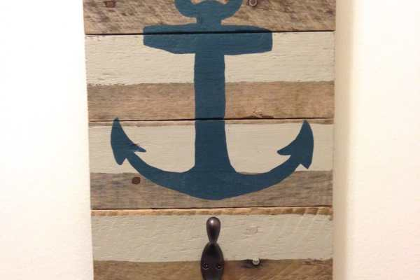

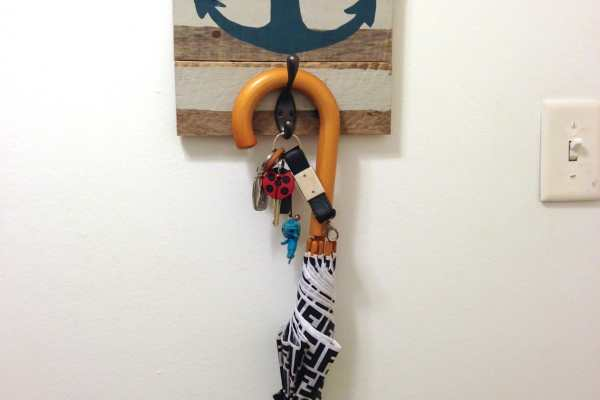

Well, that’s my recap of our trip to New Hope, PA! How was your weekend? Do anything fun and relaxing?
