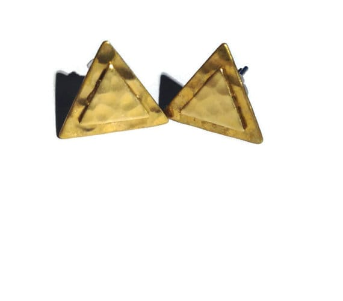
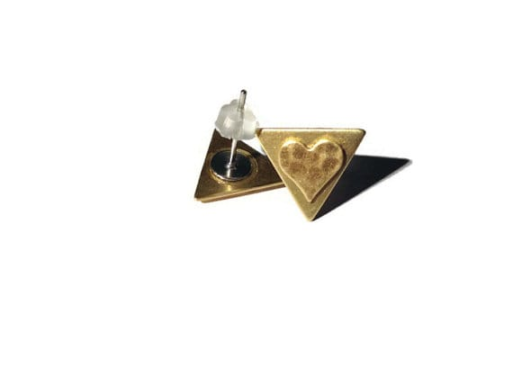
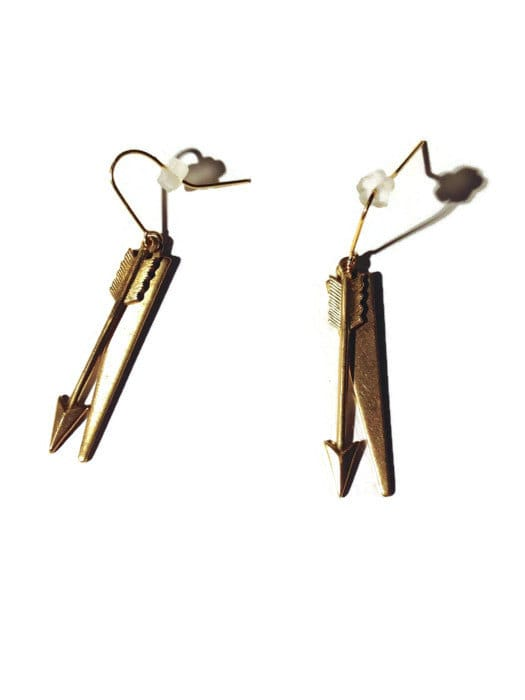
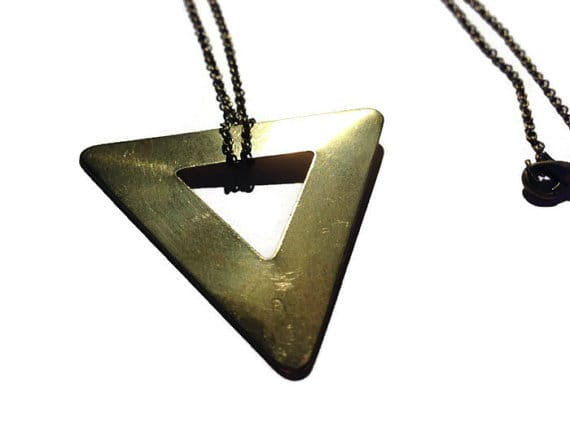
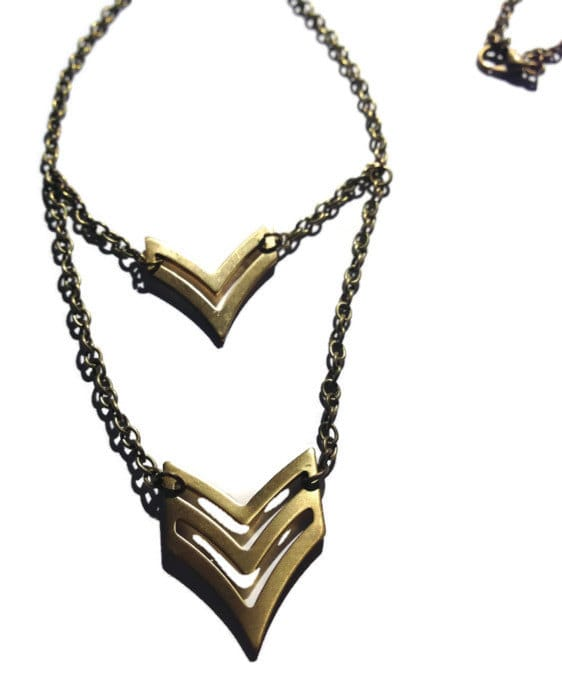
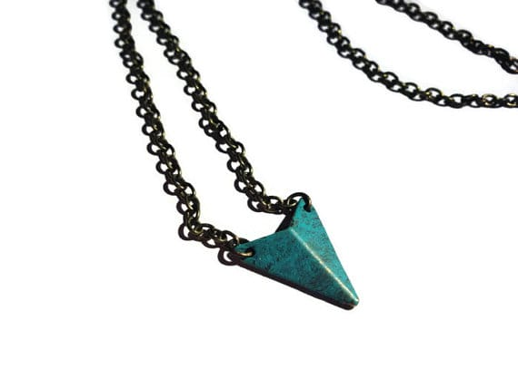

It’s almost Summer! Yippee! I have a

_**brand new**_

Summer jewelry line in the works just for the occasion. Simple, modern, geometric and minimalistic items are now available in my

[**Katie Crafts Etsy shop**](https://www.etsy.com/shop/katiecrafts "Katie Crafts on Etsy")

– and more will be added soon! Take a look below at what I have in the store so far. Hope you like them!

Many items are made with raw brass charms. Naturally shiny with a golden hue, the imperfections in raw brass make them totally unique and handmade looking! I just adore them and I think you will too!

First up are some really cute

[**arrowhead earrings**](https://www.etsy.com/listing/192748299/arrowhead-earrings-geometric-simplistic?ref=shop_home_active_1 "Arrowhead Earrings by Katie Crafts on Etsy")

! I love the bohemian look these posts have.

Next are what inspired this line to begin with! I was looking for tiny simple

[**triangle earrings**](https://www.etsy.com/listing/192750689/triangle-earrings-geometric-simplistic?ref=listing-shop-header-0 "Triangle Earrings by Katie Crafts on Etsy")

, and decided (like most things!) to make them myself. I layered these hammered charms to have a pretty little 3D geometric look!

Another pair of triangle double layered earrings I made are

[**flat triangles with hammered hearts**](https://www.etsy.com/listing/192751751/heart-triangle-earrings-geometric "Heart Triangle Earrings by Katie Crafts on Etsy")

!

Now for something different! These

[**arrow dangle earrings**](https://www.etsy.com/listing/192752931/arrow-dangle-earrings-geometric "Arrow Dangle Earrings by Katie Crafts on Etsy")

are so much fun, with an arrow and a pointy flat charm hanging from each earring. Perfect for the summer!

On to the necklaces! I’ve made several so far and each new one I make is my instant favorite, but here are just three of them!

[**Large raw brass triangle**](https://www.etsy.com/listing/192744678/large-triangle-necklace-geometric "Large Triangle Necklace by Katie Crafts on Etsy")

with a long antiqued bronze chain is a great combo!

For a double layered look, here are

[**two chevron arrows**](https://www.etsy.com/listing/192755407/double-chevron-necklace-geometric "Double Chevron Necklace by Katie Crafts on Etsy")

adorned to an antiqued bronze chain!

Lastly, here is another chevron piece, but this time it’s colorful! This

[**turquoise bronze chevron necklace**](https://www.etsy.com/listing/192746072/turquoise-chevron-necklace-geometric "Turquoise Chevron Necklace by Katie Crafts on Etsy")

will look great no matter what you are wearing this summer- and is even prettier in person!

Like I said, these are just a sampling of my new Simple Summer line! Check back on

[**my Etsy shop**](https://www.etsy.com/shop/katiecrafts "Katie Crafts on Etsy")

often to see what else gets added! Hope you liked them all! Which was your favorite? What other pieces should I make?
