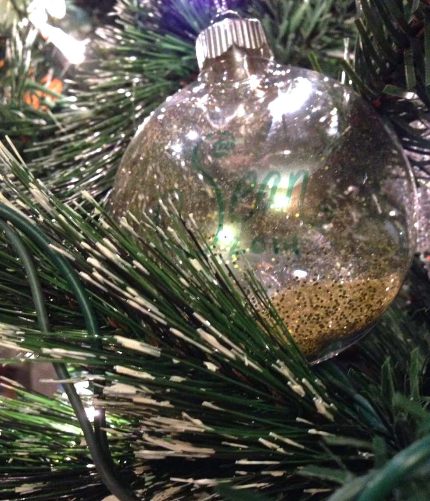
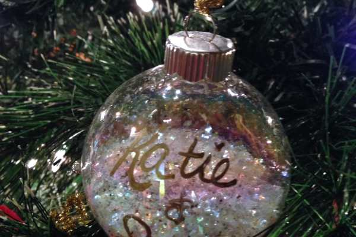

_♫ On the ninth day of Christmas, Katie Crafts gave to me- an ornament that’s super sparkly! ♫_

Today’s DIY craft is the easiest ornament you will ever make, requires no sewing, no gluing, no thinking, and basically no time at all! Let’s get started!

This tutorial really is easy, so it goes pretty quickly! The white one pictured above I made for Husband and I, along with a ton of other people one year as little gifts. I probably spent an hour making a dozen of them. This tutorial shows you how to make the red and gold glitter ones in plastic ornaments (the white one is a glass bulb), but you can use whatever glitter you like best! The look will be totally unique to you and your materials!

## Materials:

- Glass or plastic clear ornament (available at any craft store)

- Glitter of your choice

- Marker (paint marker works best, but Sharpie will do in a pinch)

- Sheet of paper (not pictured)

## Instructions:

- First off, you’ll need to personalize (or decorate!) your ornaments. Practice what you want the ornament to say on a sheet of paper before drawing it directly on the ornament. As stated before (and as pictured in the main image), paint markers work the best! All I had on hand was a Sharpie so you can see what that looks like below.

* While the marker is drying, fold your sheet of paper in half and dump some glitter in the middle of it. However much you want to use! In the white ornament I filled the ornament up halfway. The gold and red ones I did less. It’s all up to you!

* Use the folded sheet of paper as a funnel of sorts, and pour it in to the ornament.

- Put the top back on the ornament, making sure it is secure, and give it a shake! This will make the little flecks of glitter stick to the sides of the ornament.

- That’s it! You’re done! Repeat for any other ornaments you may have.

- Use a pretty ribbon or an ornament hook and hang them on your tree. Enjoy!

This is a great project to do for large groups of people, at parties for favors or with kids! Just make sure you lay down some paper or a table cloth- it may get messy with all that glitter! Merry Christmas!

What would your personalized ornament say?
