Last weekend, I took a lovely 4 night trip to Louisiana with the Husband and our two friends. I’d never been to New Orleans before and was quite looking forward to it. We had a great time walking around, taking in the sites and eating pretty much every couple hours! (We couldn’t resist- the food was just amazing!) Check out the handful of photos I managed to take while there!

See my skirt? I’ll have a tutorial on how to make it next week!

In the days before we left for our trip, our friend tore his Achilles tendon! This meant he had to hobble around on crutches the whole time as well as rent a wheelchair. It didn’t really deter us too much- we still explored the city and went on a bunch of walking ghost tours (where I took the opportunity to rest my feet and sit in the wheelchair!)

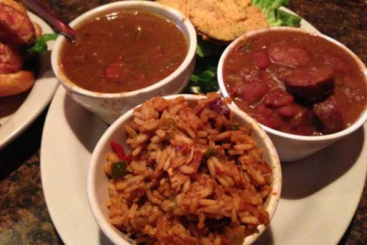

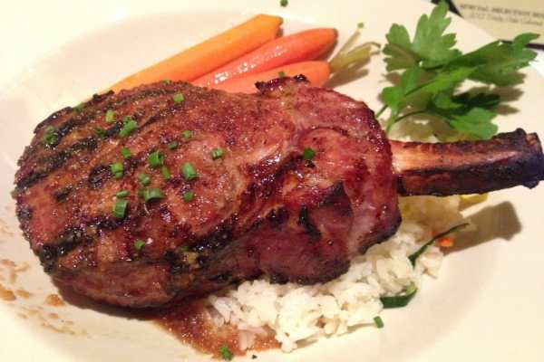

Our first night there, the Husband got a Gator Po’boy (ew) and I got a New Orleans trio of gumbo, red beans and rice and jambalaya! It was a-mazing! Our last night there I ate the best pork chop ever, and felt the need to take a pic of that too… even if it wasn’t exactly southern. Not pictured: the several beignets we ate while there! MMMM!

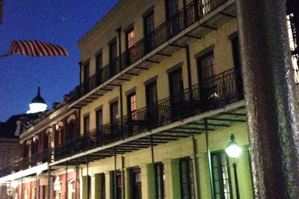

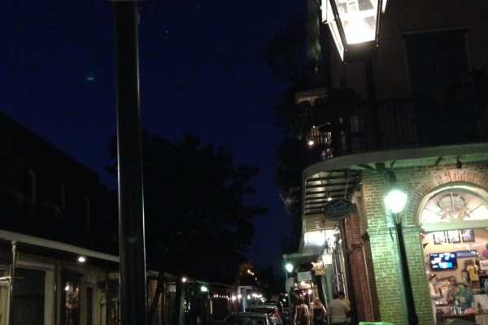

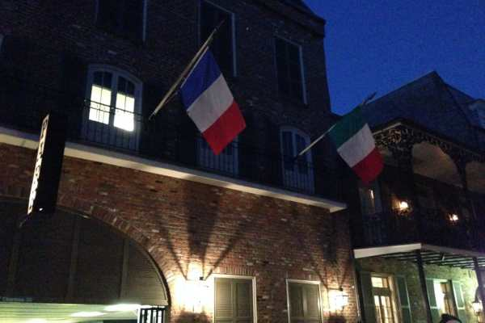

Creepy haunted places were everywhere!

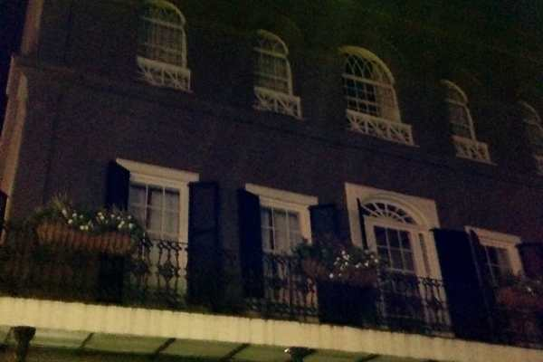

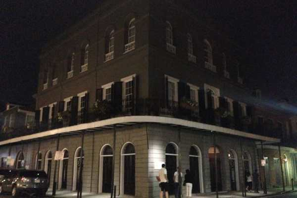

On both tours, we visited Delphine LaLaurie’s house. If you are an American Horror Story fan, you already know the stories of her torture. Eerie to stand in front of it.

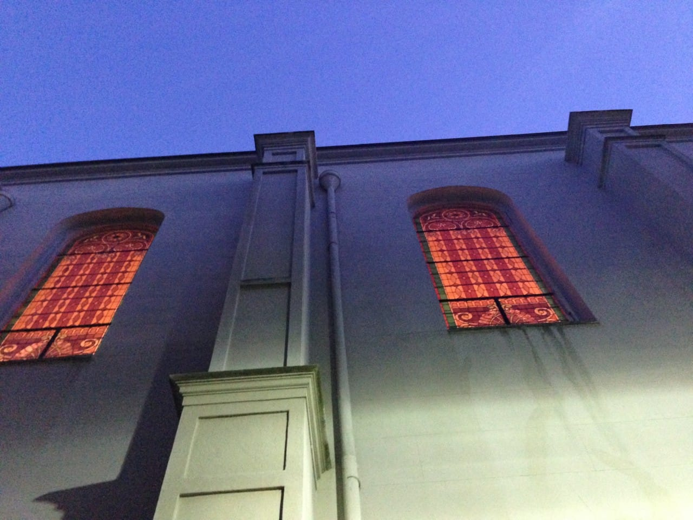

Herding around the tour guide to try to hear the stories.

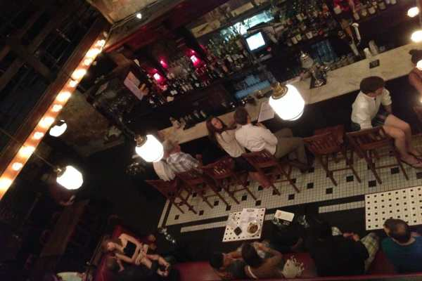

We wandered in to this fun old timey bar where they were dancing one night. The next night on a ghost tour, they brought us to the same place, telling us it’s one of the most haunted places!

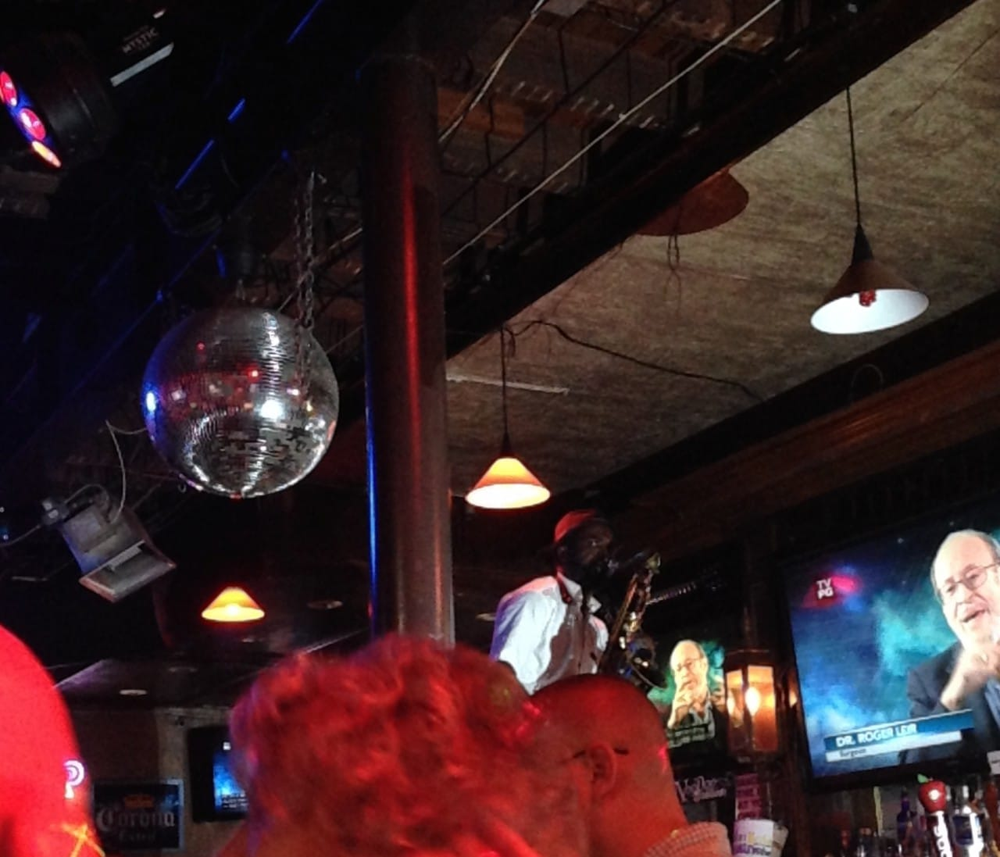

We found some fun live music to listen to each night we were there. This particular musician danced on the bar with his sax for everyone. He was awesome.

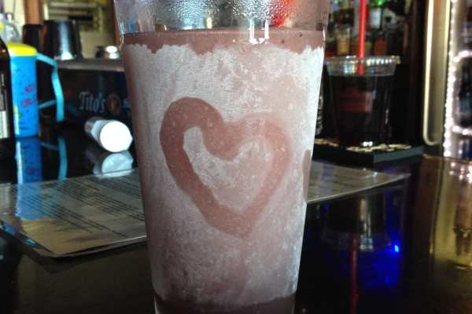

While we mostly drank Hurricanes while we were there, we also tried some Louisiana Lemonade and a strawberry basil concoction that was insanely delicious and way too strong.

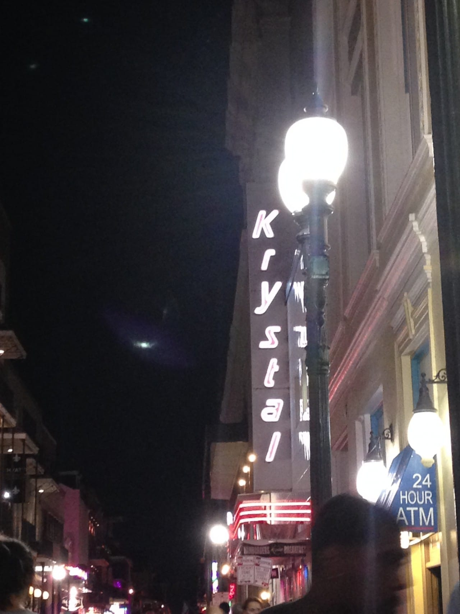

I took this photo specifically to send to my friend, Krystal!

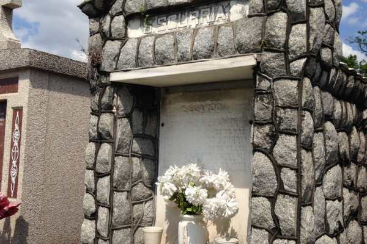

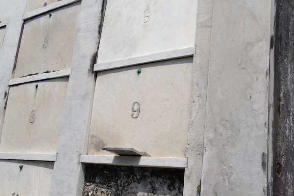

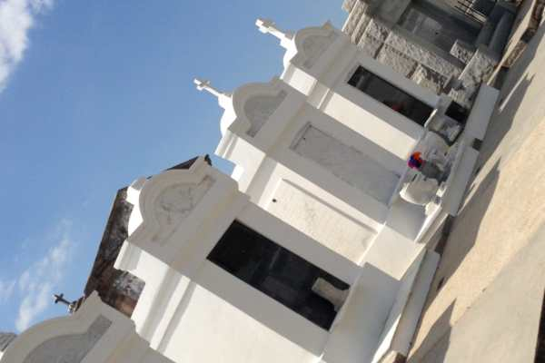

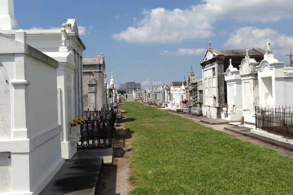

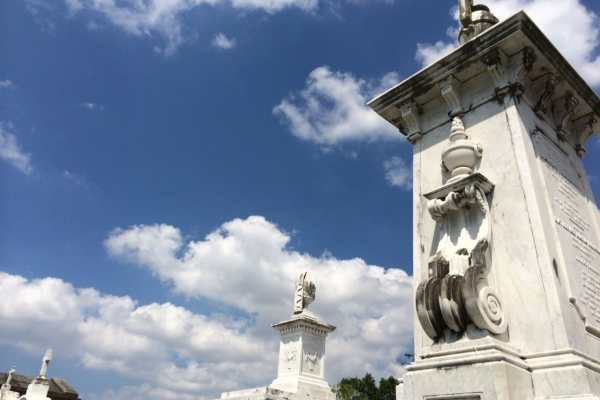

My fave photos are from one of the cemeteries! They were so beautiful and spooky at the same time. We got the chance to walk around one during a bus tour. We also drove through the Garden District which was gorgeous!

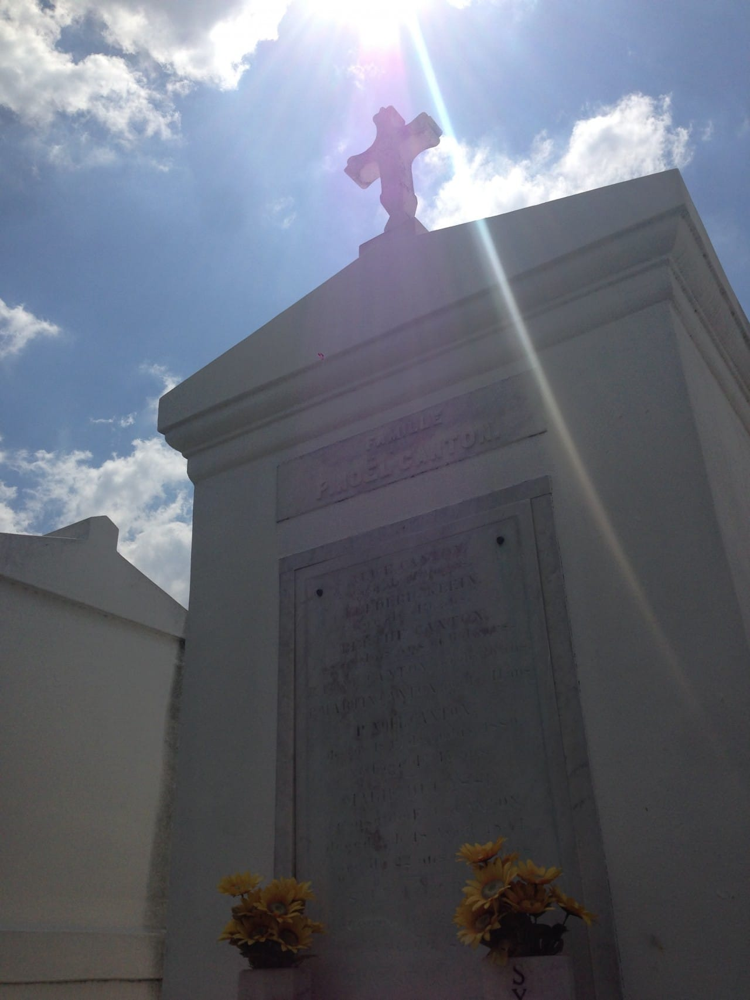

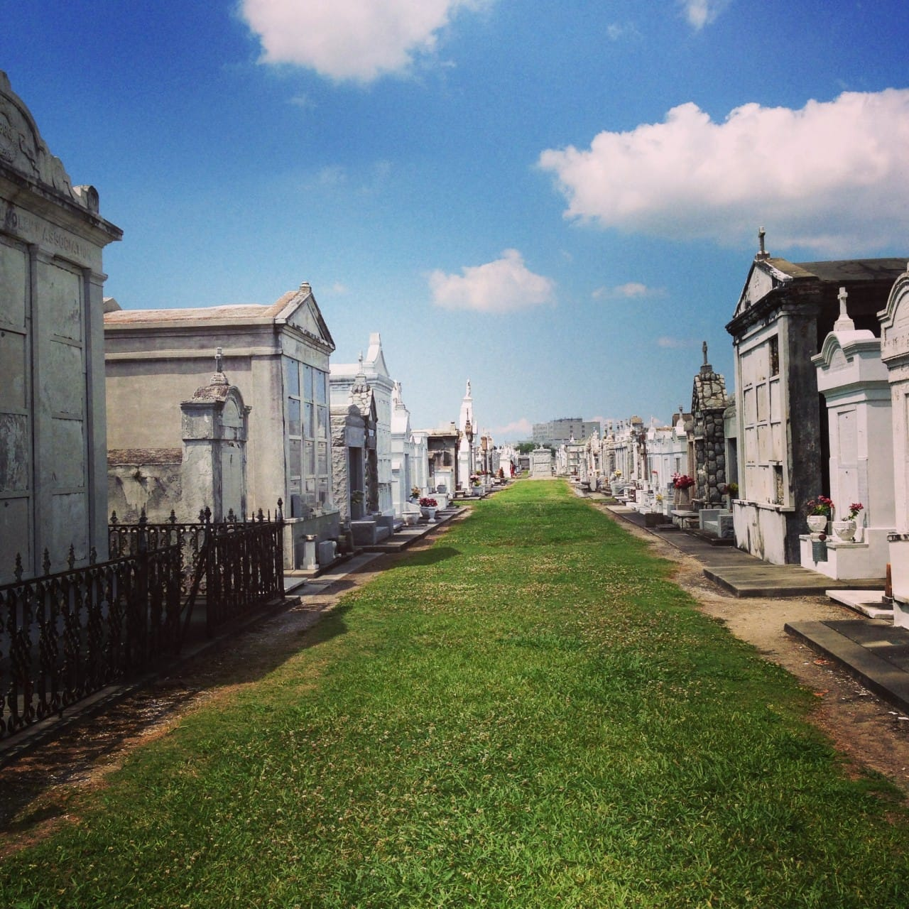

This tomb is for a woman and her dog. That is ALL that resides inside.

We stayed right outside the French Quarter, which was just perfect! Everyone hanging their art around it every day, all the people wandering around enjoying the beautiful weather- I just adored it!

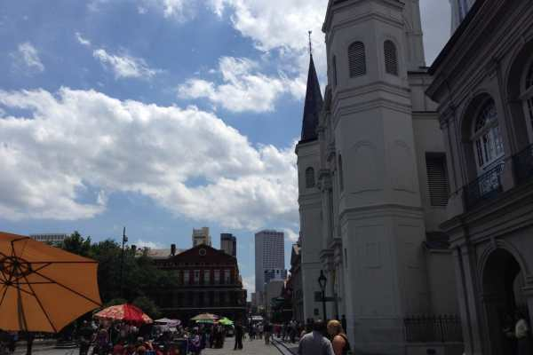

Me & Hubs

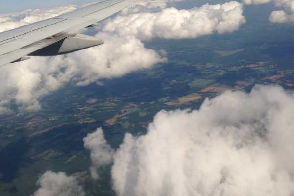

Good bye, NOLA. Hello, Phila!

Hope you liked my photos! Have you ever visited New Orleans? What was your favorite part?
