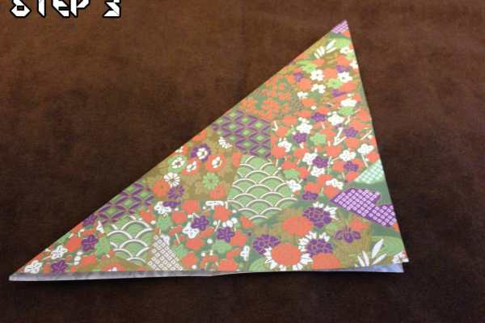
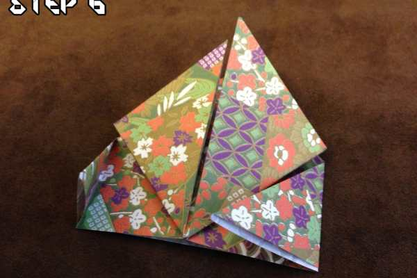
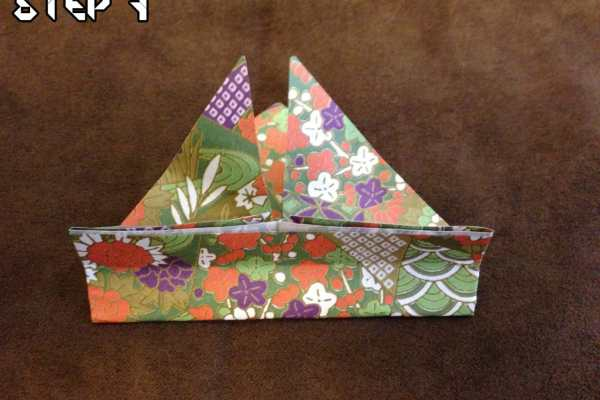
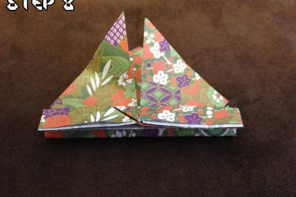
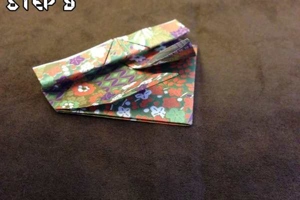

Project: Origami Easy Jumping Frog Tutorial

I’m back again with a really cool Origami project that I really think you guys will love! My desk has been looking a bit bare lately and I wanted some sort of critter to spice things up — this time around we’re going to make an Origami Jumping Frog!

I decided to start with an easy version that is incredibly kid-friendly. Anyone will be able to make one of these little frogs! Once everyone gets the hang of these, I have a more complicated version that I hope to post about in the future. Enough of my rambling, lets get started!

## How to make an Origami Jumping Frog

### Step 1

Start with a square piece of origami paper, any pattern will look absolutely great (look how fabulous my frog is!). If you really want to make it extra froggy, you can use the green shiny paper.

### Step 2

Fold your piece of paper in half and make sure the seam is crisp. Just like last time, this part is really important — it’ll make the paper much easier to fold later on! This is called a

**Mountain Fold**

.

_Note: In the_

_[Origami Ninja Star Tutorial](/husband-origami-ninja-star/ "Origami with the Husband: Ninja Star"), we used a book fold. This is different because instead of leaving the folded paper closed (like a book), we’re opening the paper back up again with the new crease._

### Step 3

Take your piece of paper and fold it diagonally. You can also fold it diagonally the other direction to prepare for the next step — it will make the fold easier to do.

### Step 4

I KNOW this part looks kind of confusing at first glance. It’s really not that bad though, promise! We’re going to do what is called a

**Double Triangle Fold**

. Make sure your piece of paper is unfolded and then start to fold it in half from the top towards the bottom. Halfway there, stop and bring the sides in, collapsing the top half on to the bottom half. It should look just like two triangles sitting on top of one another.

### Step 5

Take the two corners of the top triangle and fold them up towards the top, aligning them together.

### Step 6

Do not flip the frog over just yet! Take the two corners of the bottom triangle and fold them up, aligning them with the ends folded up in the last step.

### Step 7

Fold about 40% of the paper up on to itself, and crease it so that you get a crisp edge. This is the start of the little frog’s feet. You can also curl the top two triangles towards you a bit — these are his front legs and curling them will make him sit up a bit more.

### Step 8

Fold the top half of the bottom you just folded back on to itself. This will create his legs so that when you push on the frog’s back he’ll be able to jump!

### Step 9

Push the frog flat or let something heavy sit on him for a little bit. This will help keep the frog-like shape.

### Step 10

Draw a face! I drew a somewhat worried face — fitting since he’ll be getting chased by my plant-zombie soon!

If you want to make your frog jump, just slide your finger down his back and push down a bit as you get to the end. This will cause the paper to snap back in to position and your froggy will hop right along the table! That’s it, you’re all done!

If you have any tips or things that you did differently, definitely let me and everyone else know in the comments!
