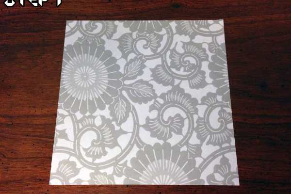
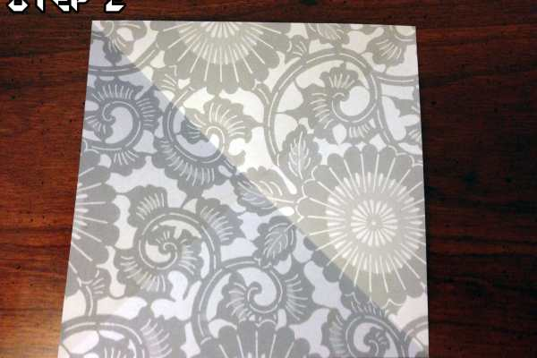
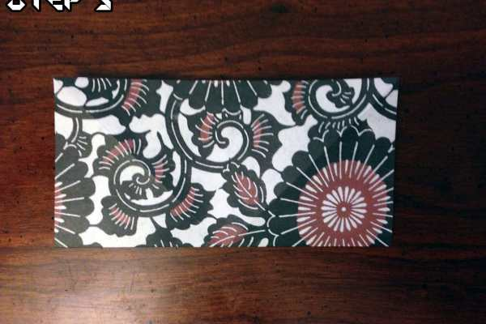
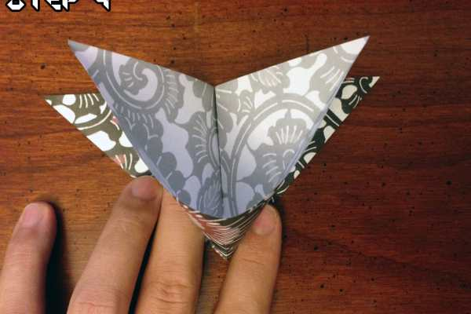
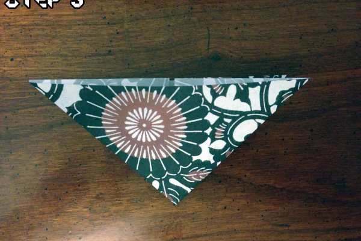
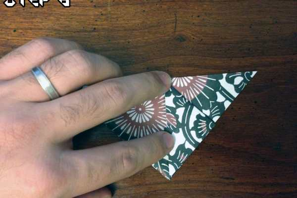
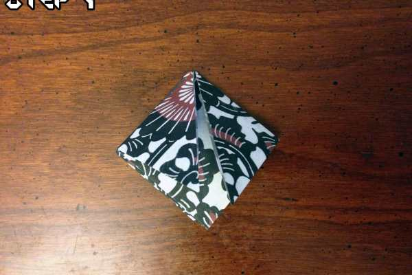
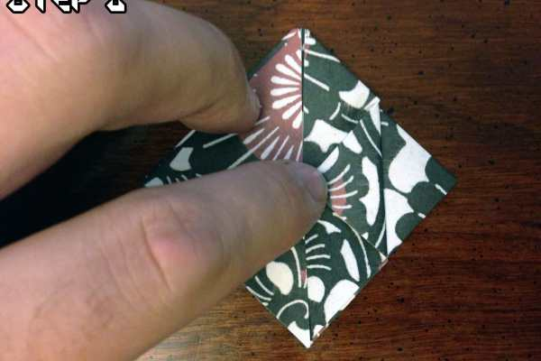
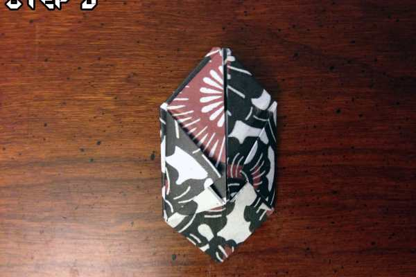
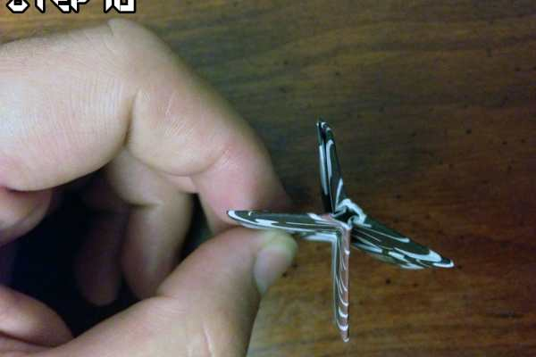

Project: Origami Easy Traditional Origami Balloon

Hey everyone! Husband here with another Origami project for you to try your hand at! Even though Katie and I are in the midst of moving, I still managed to create something I think you’ll really enjoy.

I’ve mentioned before that I liked to goof off in school by making all manner of things out of paper and this project is no different. I’m going to show you how to make a neat little Origami Balloon! They’re great to toss around, cats love them and everyone will totally think you’re the COOLEST. Just kidding, I wasn’t cool at all 🙁

That said, I’ll still show you how to make one… Onwards!

### Step 1

Start with a piece of square paper (pretty paper if you have it, otherwise this is going to be one boring balloon)!

### Step 2

Fold the paper diagonally from the top right to the bottom left and make sure to press on the crease. Do the same thing from top left to the bottom right. You’ll end up with what looks like an X in the paper.

### Step 3

Fold the paper in half (like a book!) and make sure the crease is tight.

### Step 4

This part is a little tricky. We’re making what’s called a

**Balloon Base**

. On the paper, take the top right corner and start to fold it down to the bottom left. When you are halfway there, push the middle of the right side down (forming a triangle on the bottom right) and then fold the top right corner down on to the bottom right corner instead. You’ll end up with a triangle folded in on itself. Do the same thing to the top left corner.

Alternate Method:

If you get stuck, you can do this a different way; take the folded paper and make sure it’s face down. Take the middle of the right hand side and the middle of the left hand side and collapse them towards each other. As you’re doing that, the four corners should touch forming the triangle shape we’re looking for.

### Step 5

This is what the completed fold will look like from Step 4.

### Step 6

Make sure the triangle is pointing down and take the right corner. Fold it down to the middle of the bottom point. Do the same with all four sides.

### Step 7

Once your finished with Step 6, your balloon-in-the-making should look like a diamond!

### Step 8

With each point on the left and right on each side, fold them in until the point touches the middle. Do this with all 4 points. This will be used later to secure the balloon.

### Step 9

On the bottom of the diamond are little flaps, 2 per side; one on the left and one on the right. Fold these flaps up and tuck them in to the pockets directly above them. You’ll end up with something that looks just like the photo. Make sure to do this to all 4 flaps.

### Step 10

Once you’re finished with the previous step, locate the end of the balloon where there is a hole. Grip the sides of the balloon so it doesn’t move, and blow directly in to the hole so it fills up with air!

### Step 11

If you did all of the previous steps correctly and didn’t blow your poor little balloon away, you’ll end up with a cute little ball of air! That wasn’t so bad, was it?

Now that you’ve made you very own Origami Balloon, what do you think? Love it? Hate it? Don’t care?! Either way, let me know in the comments! I want to see those balloons!
