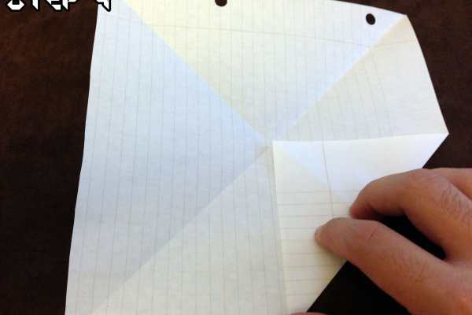
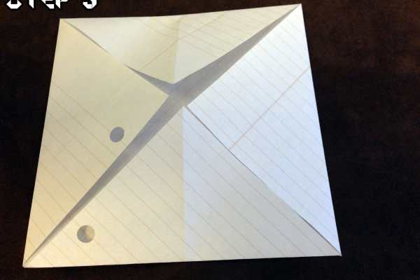
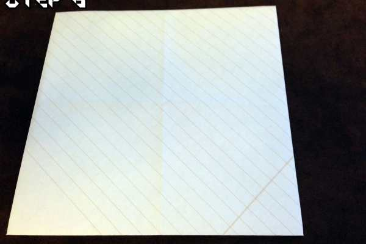
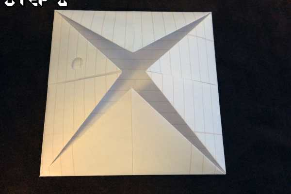
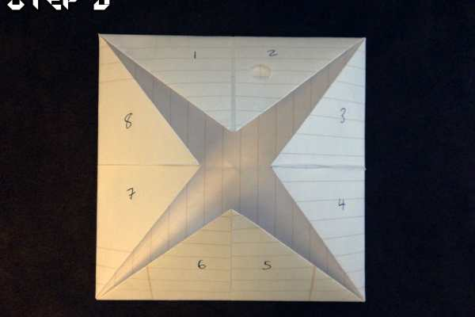
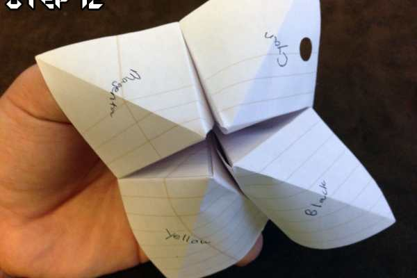

Project: Origami Fortune Teller Tutorial

Hey guys– since it’s Thursday, I wanted to do a throwback of sorts! I’m not sure how many of you remember these little guys, but Origami Fortune Tellers were ALL over school when I was a kid. There is even one featured in the intro to the show, Community (bonus points if you knew that already). If you’ve ever wanted to make your own, now’s the time to learn and I’ll be more than happy to share my secrets!

### Step 1

Start with a full sheet of lined paper (just for that extra throwback feel).

### Step 2

Fold the top corner down until the sides meet and you have a triangle, then trim off any extra from the bottom. You want to end up with a perfect square of paper when it’s unfolded.

### Step 3

Make sure your edges are crisp. This will make lining up everything in the next parts much, much easier.

### Step 4

Completely unfold the paper and fold each corner in until it reaches the center of the paper.

### Step 5

Once all four corners are folded in, press the paper flat to help your folds stay put.

### Step 6

Flip the paper over!

### Step 7

Repeat the same process as before, folding every corner in to the middle of the paper.

### Step 8

Once all four corners are folded in, press the paper flat to help your folds stay put.

### Step 9

On each of the segments, write a number from 1 through 8. This will be the one of the sections you can flip up to find out your fortune!

### Step 10

Flip up each number one at a time and write a fortune (or a DARE if you’re feeling saucy!) until each one is filled in. I’m partial to my choices personally– who doesn’t want a basket of kittens or a bucket of puppies? Once finished, make sure to put the pieces back in place!

### Step 11

Flip the paper over again and this time write a color on each of the flaps. These will be your starting point in having your fortune told!

### Step 12

I know it’s a bit of a jump here, but it’s really not too bad. See those flaps? Fold the paper in half and slip your fingers under them. With a little wiggling, the paper should fold in on itself and hold it’s new shape!

And there we have it, your very own origami fortune teller!

## How to Play

Here’s a quick breakdown on how to tell someone’s fortune if you’ve never done it before:

1. Begin with the thumb and index finger from each hand under the flaps on each side.

2. Have the person pick a color.

3. Using the color they picked, spell it out while alternating a pinching and pulling motion with the Fortune Teller. For instance, if they picked green you would do G-R-E-E-N which means you would open and close the Fortune Teller 5 times.

4. Once you’ve finished counting, have them pick a number (1 through 8). Using the number, do the same thing as before, going through the pinching and pulling motions– one for each LETTER in the word of the number. For Instance, if they picked the number 6, you would count 1-2-3-4-5-6- and open and close the Fortune Teller 6 times.

5. Have the person pick another number.

6. Flip the flap up and tell their fortune!

That’s it! Have fun telling EVERYONE’S fortunes! What colors did you end up using on the outside and what fun fortunes did you put under the flaps? Let me know in the comments!
