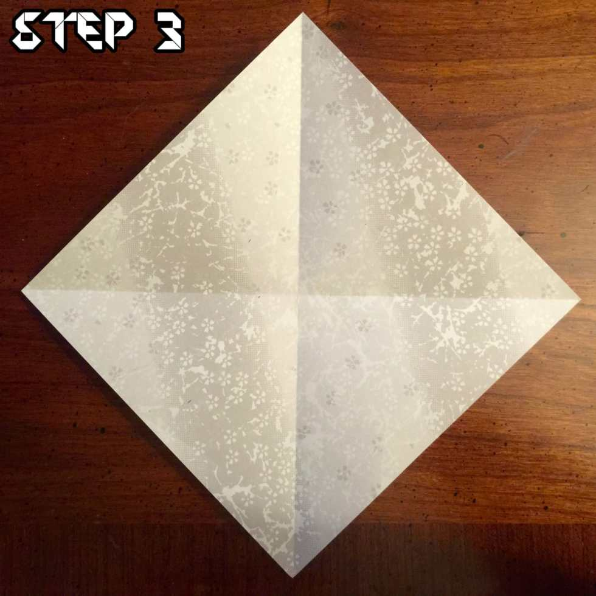
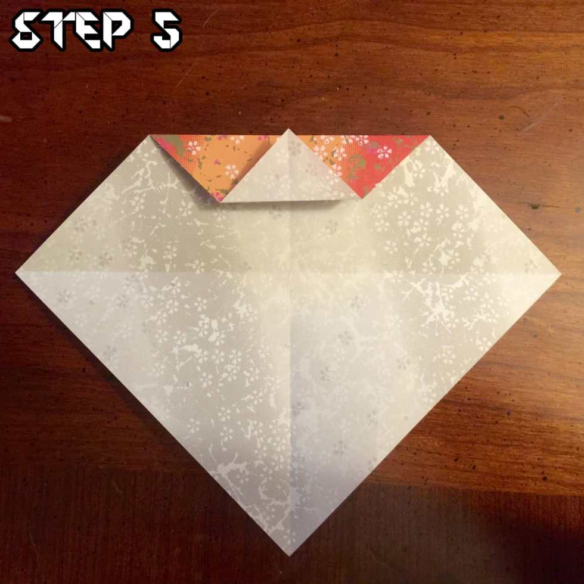
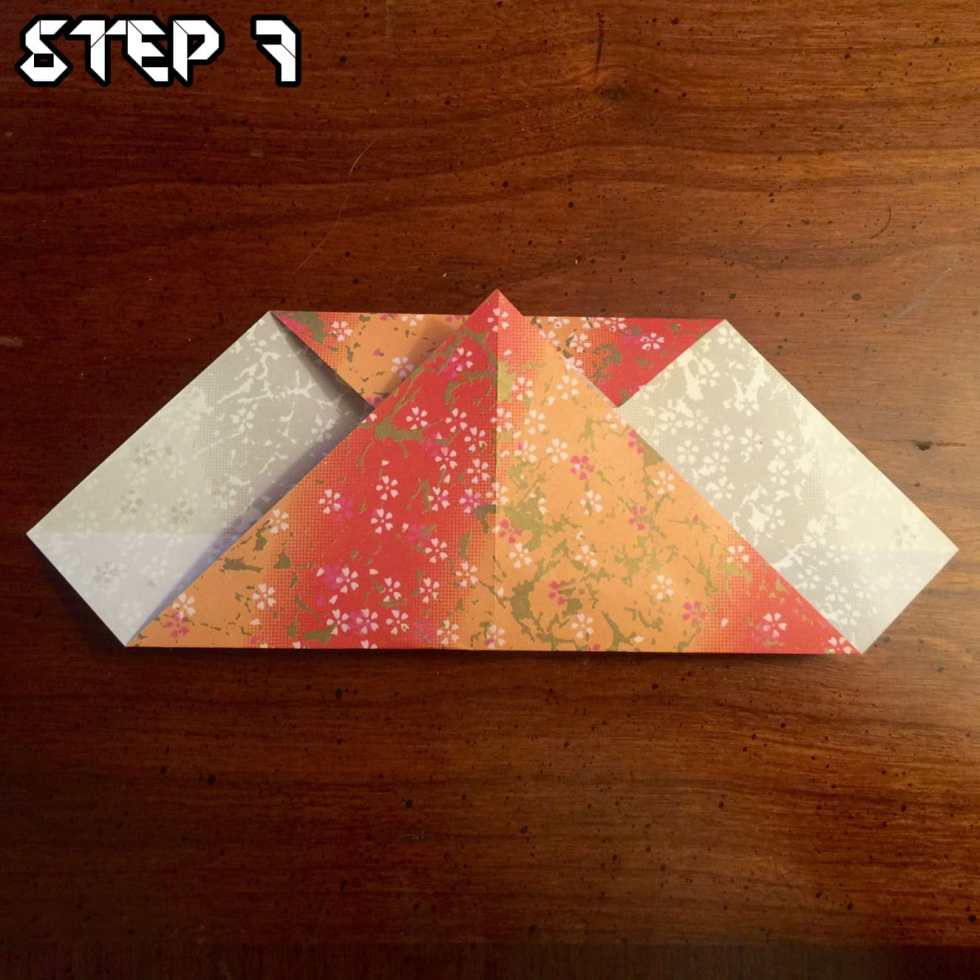
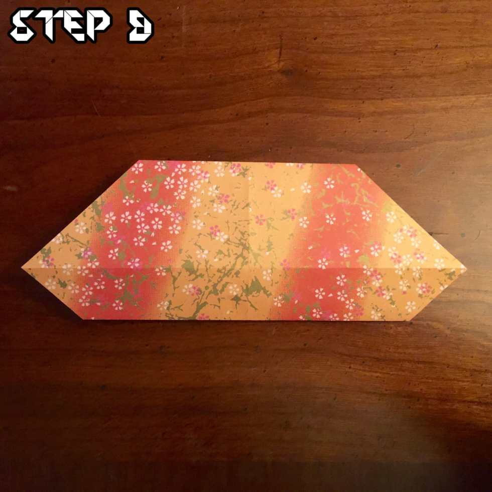
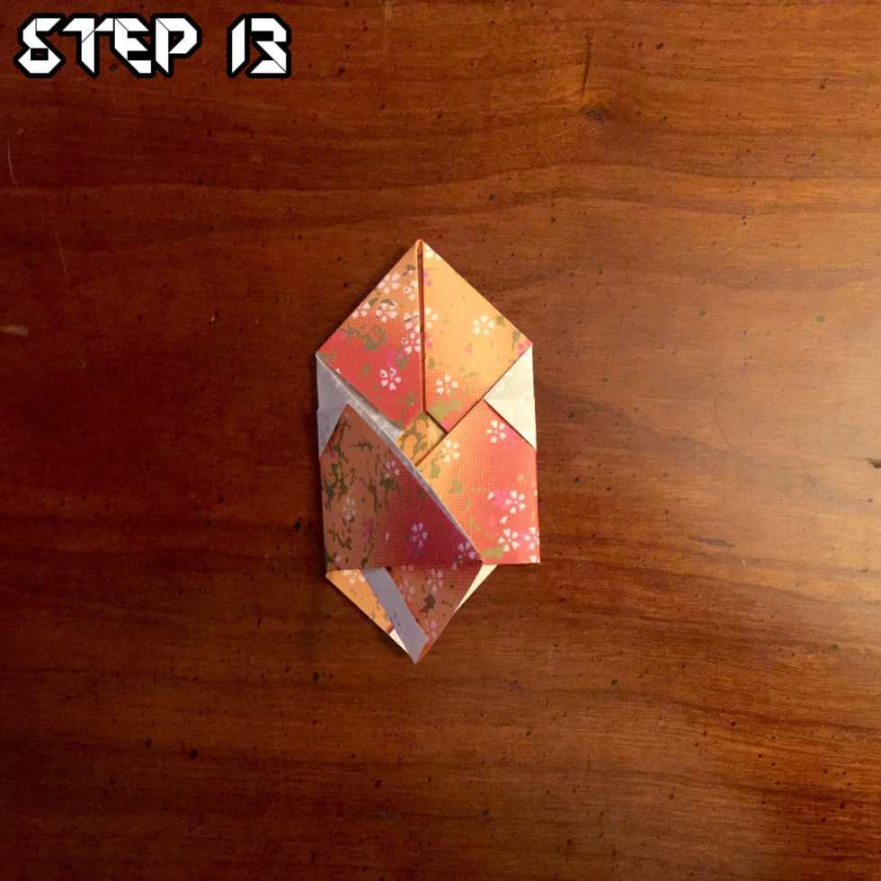
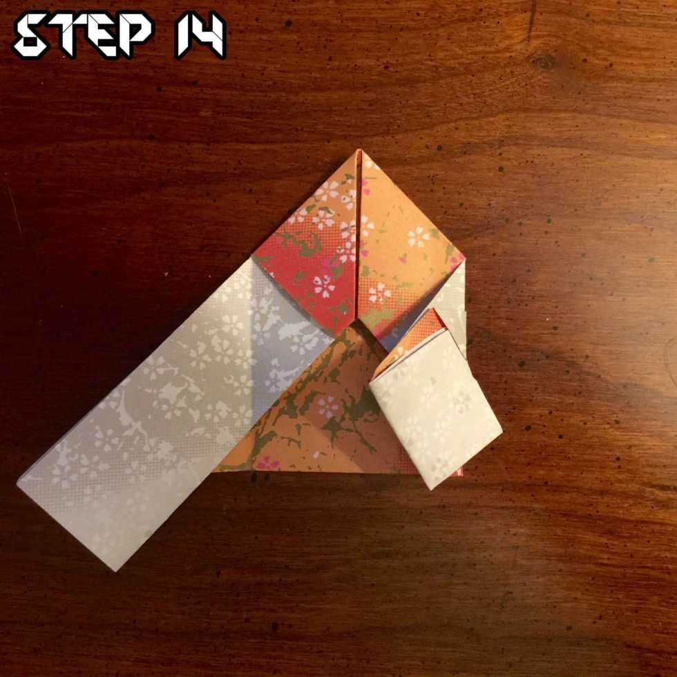
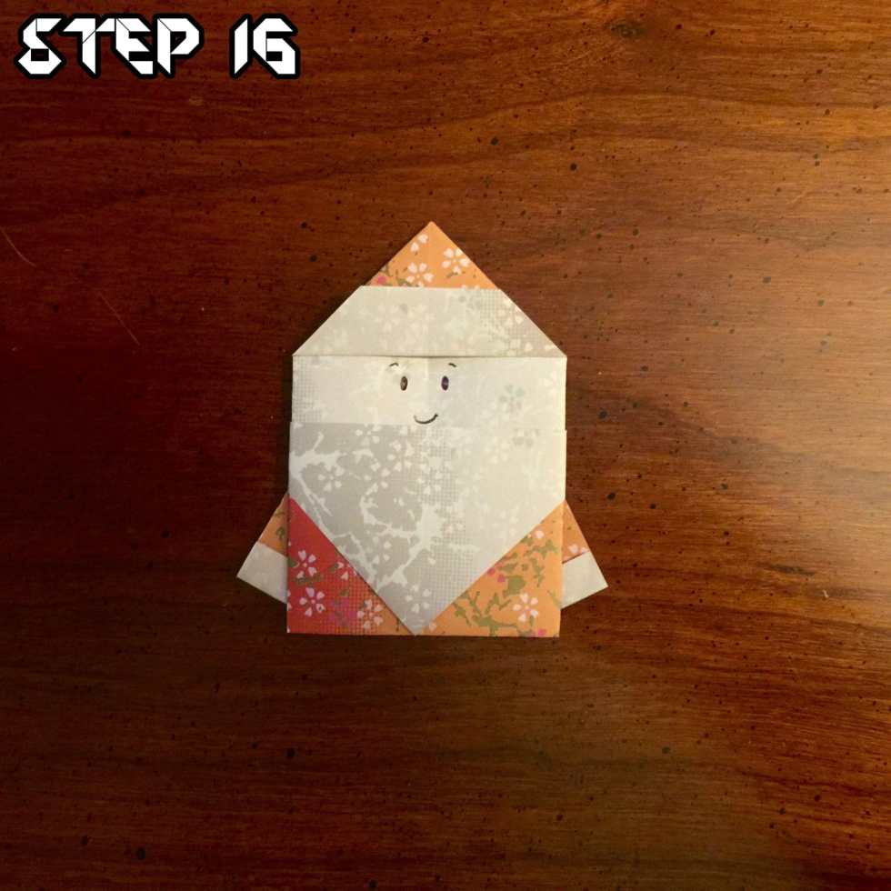

_?On the ninth day of Christmas, Katie Crafts gave to me…?_

> _A cute origami Santa post from Husband! Check it out below!_

Hey everyone, Husband here! Christmas is right around the corner and this time of year Katie and I really like making all sorts of stuff. We cook a ton, decorate a bunch and even dress up the cats. Last year, Mabel was a christmas tree and she LOVED it. With all the creativity flying around, I thought it quite prudent that I make a holiday themed origami for you to try your hand at (read: Katie bullied me).

This little guy is a little more complicated than some of the previous tutorials we’ve done, but I believe in you. Let’s do this!

### Step 1

Start with a square of origami paper with the white side up with a pointed side up. Red will work best for Santa’s outfit, but any color will do. Green would be great for an elf!

### Step 2

Pull the bottom part of the paper up and crease the line.

### Step 3

Fold the paper again side to side and crease that fold as well. Doing that will make the next few folds much easier.

### Step 4

Take the top point and fold it down to the middle of the square where the creases meet.

### Step 5

Grab the point from the piece you just folded and drag it halfway up, then crease the fold.

### Step 6

Now take the very top of the point and fold it under itself, tucking the point below the most recent fold.

### Step 7

Fold the bottom point up until the tip meets the edge of the paper. It looks a little off here, but that’s just the angle of the photo. The point should be touching the top edge of your crease.

### Step 8

Just like we did for the top, fold the bottom point down until it meets the edge of the crease.

### Step 9

Flip the paper over and make sure the longer edges are on top.

### Step 10

Fold the left and right edges in about 1/8th of an inch so that it matches mine.

### Step 11

Take the top right corner and fold it in towards the middle of the paper (almost as if you’re making a paper airplane). Do the same for the top left corner.

### Step 12

Take the right wing and fold it in. Make sure that it lines up with the edge where the color meets the white part of the paper.

### Step 13

Repeat step 12 with the left wing, making sure it lines up and then press the crease.

### Step 14

Unfold the wings and take the bottom of the right wing. Fold it up and tuck it in to the little paper pocket that was formed from step 12.

### Step 15

Repeat step 14 for the lefthand side, making sure to tuck the wing in to the little pocket.

### Step 16

Flip the paper over and draw a little face on it! Hello Santa (or little elf, if you went with the green)!

That’s all there is to it! I really hope you enjoyed making your very own little Santa Claus. Post a picture of yours in the comments and let Katie and I know how they came out!
