Project: Traditional Standing Bird Origami Tutorial

Hey again, everyone! I decided to keep up my origami creature theme and try my hand (talon?) at making a bird! I decided on something slightly easier (and more kid-friendly!) than your typical crane, so we’re just going to make a traditional standing bird this time around. It uses one piece of paper and is pretty darn easy to make!

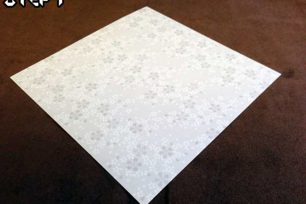

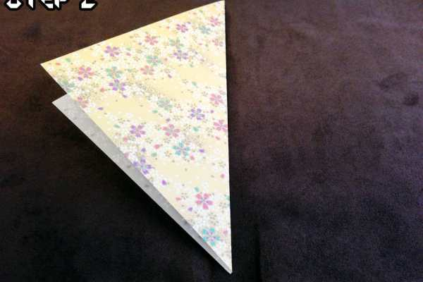

### Step 1

Start with a square piece of origami paper, any pattern will work. Keep in mind, the front AND back will both be visible on your bird’s head and body.

### Step 2

Fold your piece of paper in half diagonally and make sure the seam is crisp.

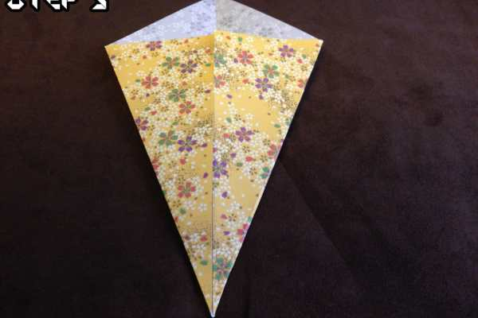

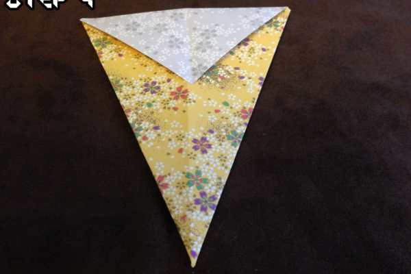

### Step 3

Fold each corner in towards the middle, so that your paper ends up looking kind of like an arrowhead.

### Step 4

See that little flap on top? Fold that backwards and make sure the seam is crisp. If it’s easier for you, feel free to flip the whole paper over and do it that way — just remember to flip it back! It’s really easy to lose track of which step you’re on!

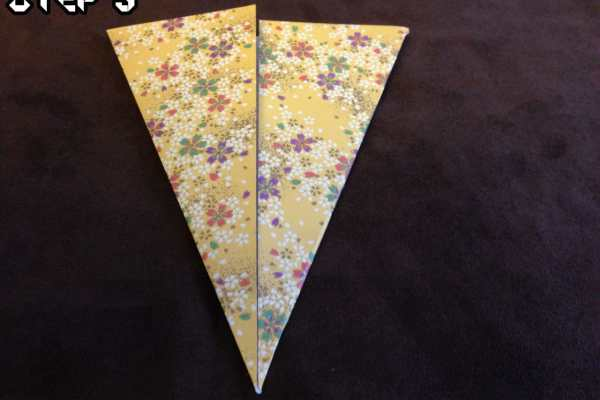

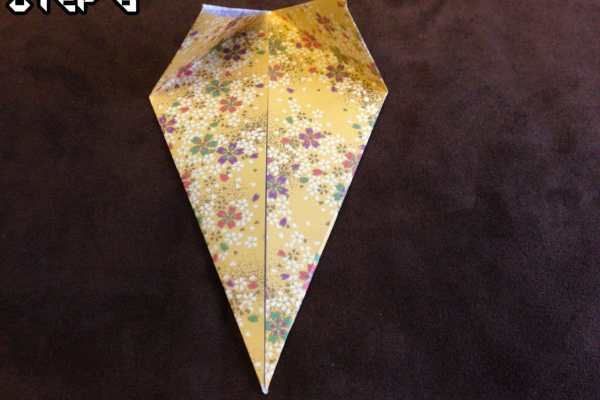

### Step 5

Take the top corners of the arrowhead and make a diagonal fold towards the middle.

### Step 6

Let the corners start to rise back up on their own. These next steps are a little complicated. I’ll try my best to explain it thoroughly so that you’re able to follow along.

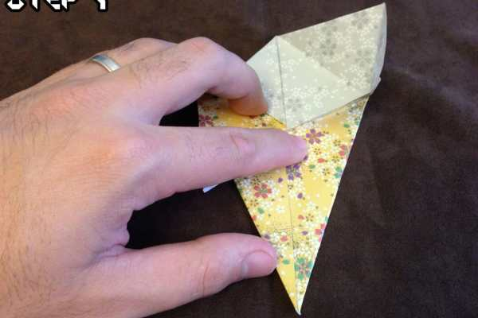

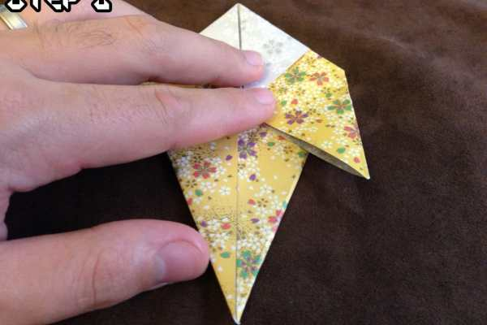

### Step 7

Start by unfolding the top right corner. Then, take the middle right flap and start to unfold the righthand side. Keep your finger in the middle (where my finger is) to help hold the shape.

### Step 8

Take the point from the top right and fold it back to the middle of the paper. You’ll end up with a shape that looks similar but now has an extra flap pointing down, just like the picture!

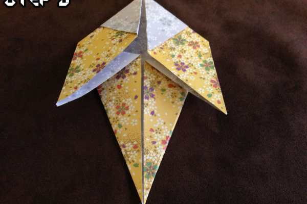

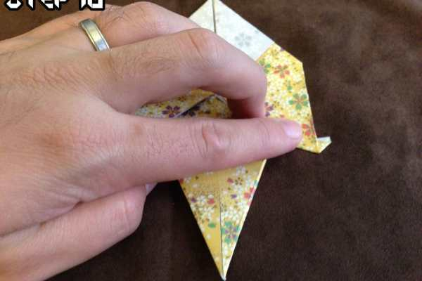

### Step 9

Repeat step 8 but this time do everything to the left side.

### Step 10

Do a back fold on the tips of both of the new flaps. These will end up being the feet so try and make sure they stay even!

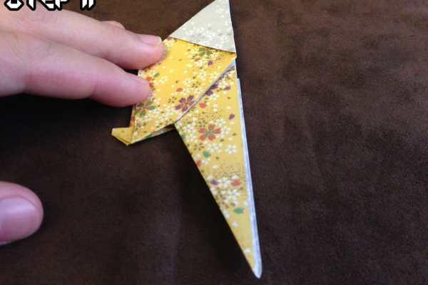

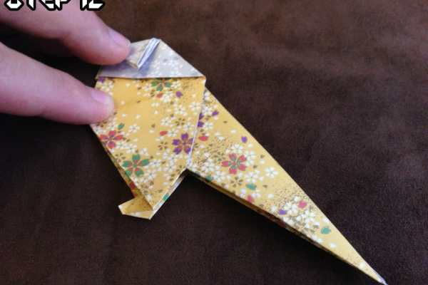

### Step 11

Do a mountain fold (fold backwards) on the entire paper, folding it back on to itself. Both sides should be an exact mirror of one another.

### Step 12

You can eyeball this part. Just fold the top part of the paper down to get a crease going. This is going to be the bird’s beak. You can make it as large or as small as you like!

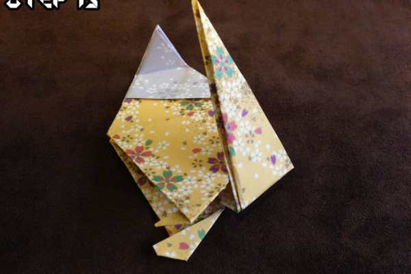

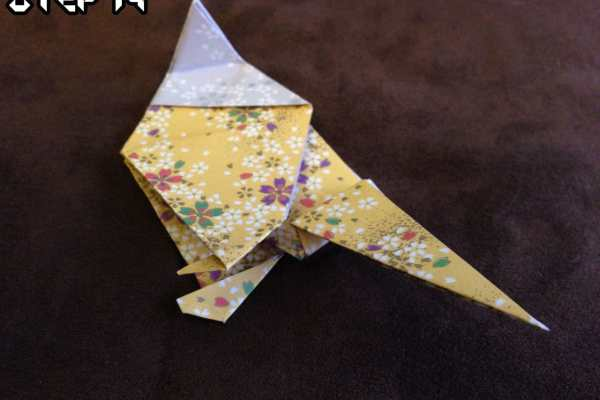

### Step 13

Fold the tail upwards to start a crease.

### Step 14

Fold the tail down, back on to itself. These two creases will make the reverse fold on the tail much, much easier.

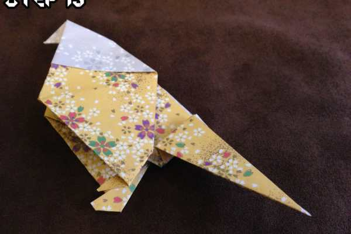

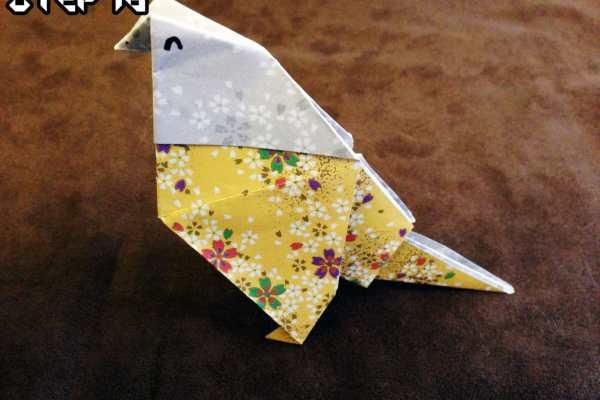

### Step 15

Open the top part of the paper and pull the tip down, between the two sides. This will form the beak the rest of the way.

### Step 16

Unfold the tail and fold it inside of itself. It will look just like it does in the picture. The two creases will just invert when you push the paper back on to itself. The better you creased in the previous steps, the easier this part will be. If you want to give your creation some life, draw some eyes!

Taa-daa! There you have it! You’re now the proud owner of your very own baby bird! Peep peep! If you make one (or many?!) post a picture in the comments so we can see!
