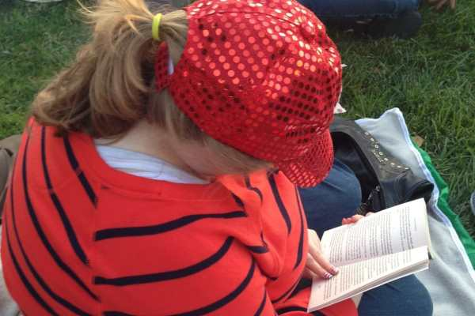
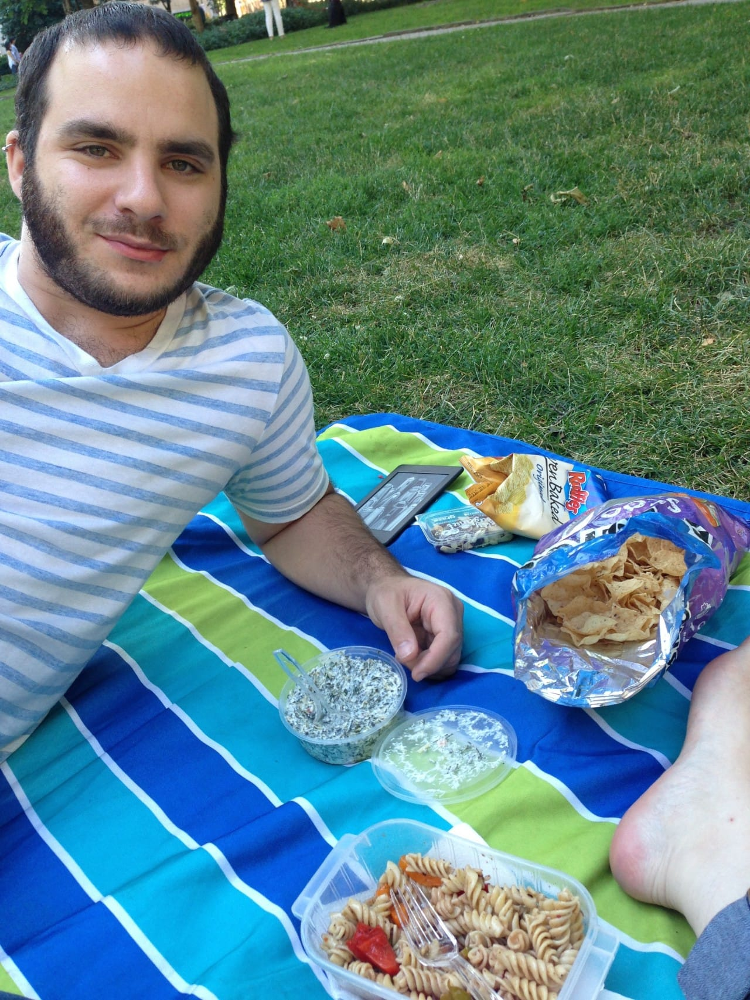

You already know about our fun picnic on Fourth of July! Everyone brought delicious nibbles and we had a great time! I made spinach dip and pasta salad which I make every year. This year, I tried out a different dressing for it- one I’ve been using on all my salads lately and am kind of obsessed with! I thought I’d share it with you guys too, in case you wanted a good pasta salad recipe, or just wanted to try the vinaigrette on your leafy greens.

The dressing actually has some red wine in it, so don’t feed it to your babies, I guess. I dunno. It’s not a ton. Maybe your babies like red wine. It’s your call! The pasta salad recipe is for one tray, using a whole box of pasta. You can alter it if you don’t need that much, but it’s the perfect size to bring to a picnic! Make it the day before, because it’s always better the second day when it’s nice and cold. Bonus: this pasta salad is chock full of veggies, so you won’t feel too terrible eating it!

## Ingredients for Pasta Salad:

- 1 pound cooked, cooled pasta (I like rotini, ziti or bowties the best!)

- 3 roasted peppers, chopped (I used one green, one red and one orange to make it colorful!)

- 1 package of grape tomatoes, halved

- 1/2 a red onion, chopped

- 2 small cucumbers, peeled and chopped

- fresh basil

- dressing (recipe below)

## Directions:

- Wash all veggies.

- Roast peppers over stove top. I place them directly on the flame, turning them with a tong every couple of minutes until the outside begins to get charred. Let cool before cutting.

- Peel cucumbers.

- Chop all veggies to desired size.

- Rip basil leaves in to small pieces.

- Add all to bowl, topping with a little of the dressing. Toss and set aside.

- Cook pasta and let it cool

  _completely_

  .

- Add all ingredients together, top with dressing, mix and place in refrigerator until ready to eat! Best if given at least a few hours to get cold and let the dressing sink in.

Veggies marinating in dressing while waiting for the pasta to cool!

The following ingredients for dressing will give you one bottle’s worth, which is more than you need for the pasta salad itself- but I like having leftovers because the pasta salad tends to dry out after in the fridge for a couple days. It always helps to add the extra dressing later to give it life again!

## Ingredients for Dressing:

- 1 packet of Good Seasons Zesty Italian Dressing mix

- 3/4 cup of extra virgin olive oil

- 1/4 cup of red wine vinegar

- 1/4 cup of balsamic vinegar

- 1/4 cup of water

- 1/3 cup of red wine (can add more if you want- I used a tasty Bordeaux in mine)

## Directions:

- If you are using a shaker, add all wet ingredients first, then add packet of mix. If you are using a bowl and a whisk, it won’t matter.

- Stir or whisk completely, until well blended and no clumps of dry mix are left.

- Refrigerate til use. Shake again right before serving/using.

- Use about 3/4 of it to cover the pasta salad.

I don’t have any pics of us eating the pasta salad, but here are a few shots of our picnic! If you make the pasta salad or dressing and love it too, tell me in the comments!

Oh, I lied! I found a pic of Husband and I having a “leftovers” picnic the next day, where we are having some pasta salad! Isn’t he handsome? 🙂

