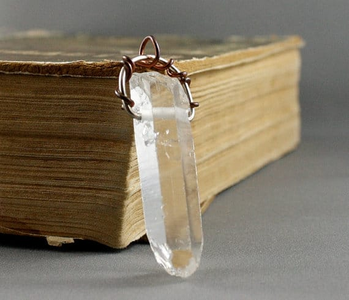

_?On the second day of Christmas, Katie Crafts gave to me…?_

Freshwater Pearl Earrings from

**[Natalia’s Jewellry](http://www.etsy.com/ca/shop/nataliasjewellery)**

! Natalia Khon is one of my favorite handmade artisans on Etsy! Her jewelry is absolutely stunning and I’m thrilled she’s sponsoring another giveaway on Katie Crafts! Check out her interview below, spy some of her other works and enter to win today!

What is your name, your shop’s name and where are you located?

_My name is Natalia Khon, My shop is called_

_[Natalia’s Jewellery](http://www.etsy.com/ca/shop/nataliasjewellery), it is located in Vancouver, Canada._

photo from Natalia Khon

Tell me about the process behind your craft and what inspires you to create.

_I like working with my hands and creating beautiful wearable art. If a piece of jewelry turns out to my satisfaction, it is usually because I have spent a few days creating it. Sometimes it takes more than one attempt to create a piece that satisfies me as well as catches the attention of others._

_My work always starts with a sketch. After several sketches, I choose my favorite ones and give them dimension with watercolors. Then I narrow it down to one design and begin working with either wax or metal, whichever material best fits the design. Silver is my favorite material because it gives endless opportunities to metal artists. It is not limited to size and is very versatile; it can be tarnished, colored or polished and can sustain a shape or be flexible and dynamic. My favorite tool is a saw-frame as it is the best for shaping intricate and ornamental pieces that I believe best compliment the natural beauty of a woman._

photo from Natalia Khon

Share a photo of your favorite item you’ve ever made!

_This is my favorite piece that I ever made._

What is your favorite part of the holiday season?

_I love the spirit of Christmas everywhere. I love the Christmas music and songs, and all the decorations and preparing surprises and looking for the best gifts ever for everybody. I love the Christmas trees. I am happy that we start the holiday preparations long before the actual day of Christmas 🙂 I wish everybody a Merry Christmas and good luck in the giveaway!_

photo from Natalia Khon

Thanks for sharing those wonderful answers Natalia! Now, on to the giveaway! One lucky winner will receive:

- The pictured pair of earrings, made of sterling silver, natural fresh water pearls and gray Swarovski pearls.

Raffle open Worldwide! Must be 18 or older to enter. No bots or fake accounts. All entries are verified. Please read Rafflecopter terms and conditions.

Giveaway ends at 11:59 PM ET on 12/12/15! Good luck! And don’t forget to enter for

[yesterday’s giveaway](/blog/elf-haul-giveaway/)

… and come back tomorrow for

_another giveaway!_

[a Rafflecopter giveaway](http://www.rafflecopter.com/rafl/display/64ecfabc29/)
