Last week, Husband and I went on a guided tour of the

[**Philadelphia’s Magic Gardens**](http://www.phillymagicgardens.org/ "Philly Magic Gardens")

. I’ve passed it probably a thousand times in the many years I’ve lived here, but somehow never visited. What a shame! The mosaics were SO awesome, and I can’t wait to go back and explore on my own to get more photos. Still, the hundred pics we took during the tour will probably do for now. 🙂

One man- award-winning artist Isaiah Zagar- is responsible for over 200 mosaic walls in Philly and around the world. While on the tour, Isaiah dropped by and said hello to everyone, which was pretty awesome. His mosaics are truly spectacular, and not your typical tile! There are dishes, bicycle wheels, broken down mirrors and more within the walls. Check out some of the artist’s works below, and make sure you read up on Isaiah and his Magic Gardens!

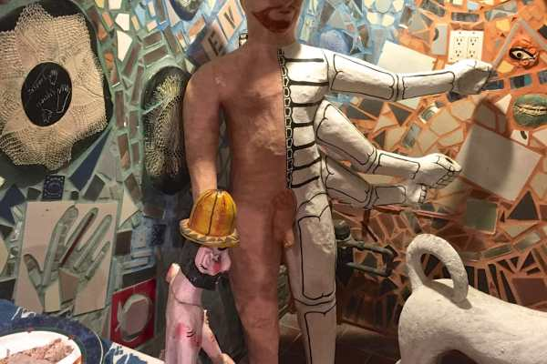

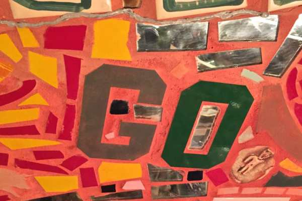

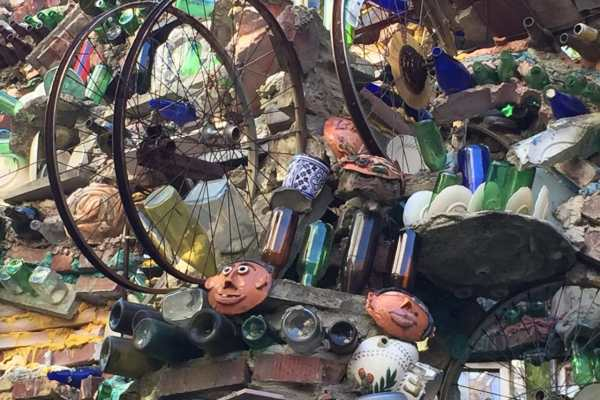

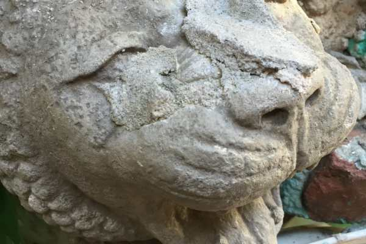

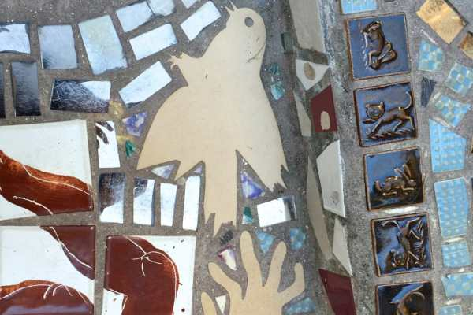

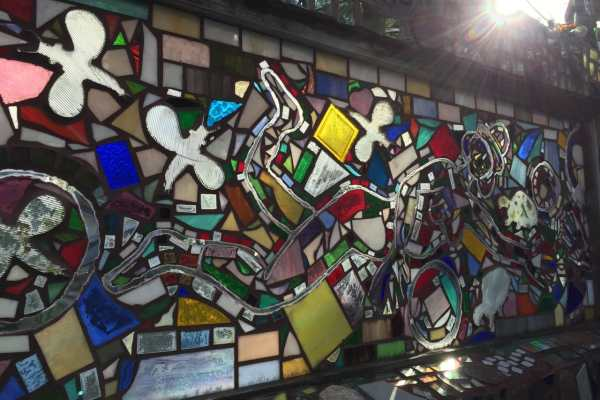

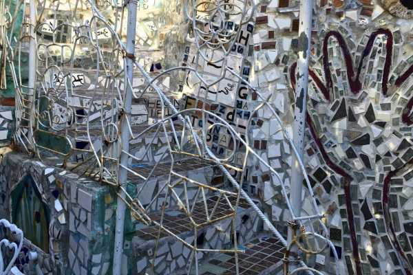

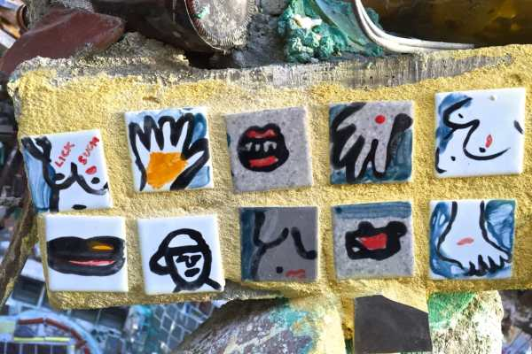

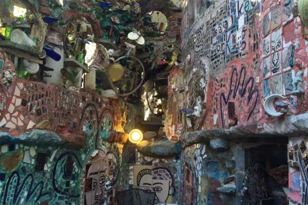

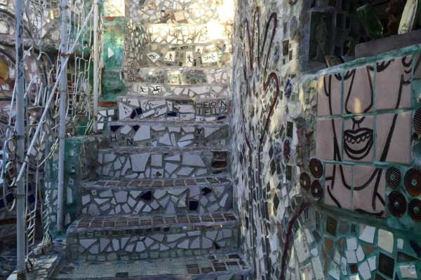

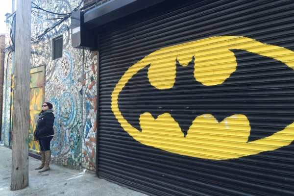

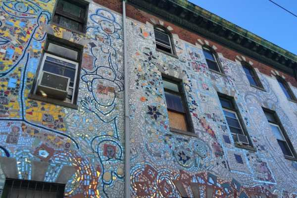

The mosaic archway that says “Picture” with the fully mosaic’d wall behind it is probably my favorite pic, though they are all amazing. And these photos are only a small fraction of what is there! I can’t wait to go back, and bring some friends and family with me next time!

Have you ever been to the Philly Magic Gardens?
