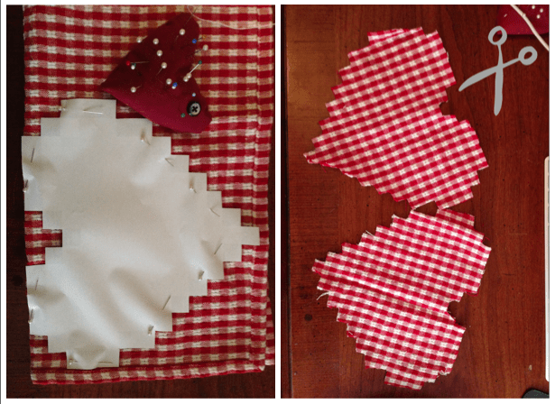
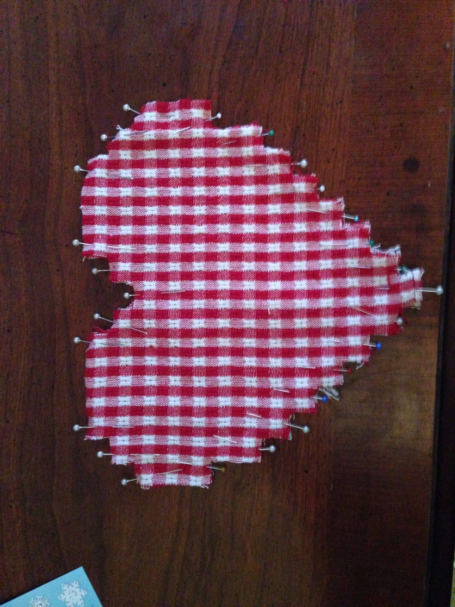
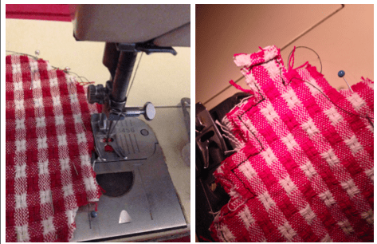
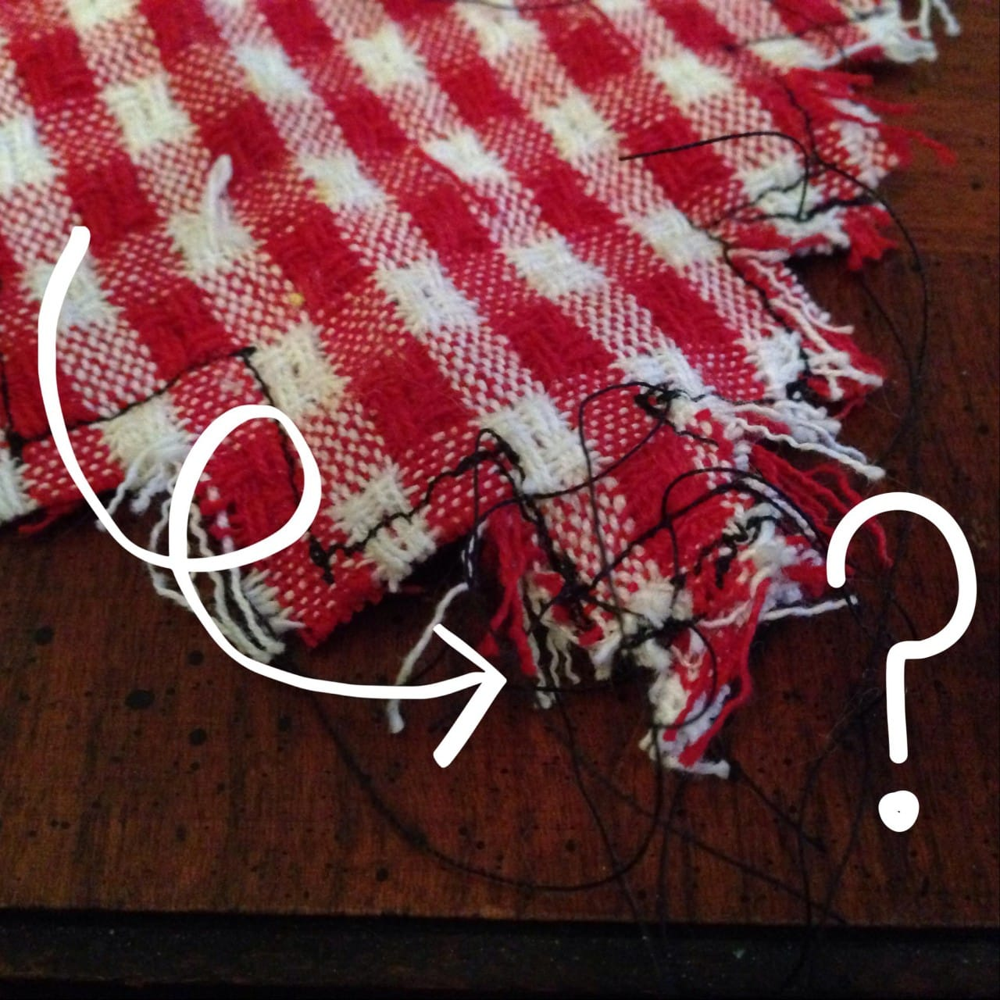
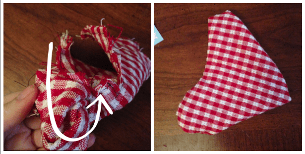
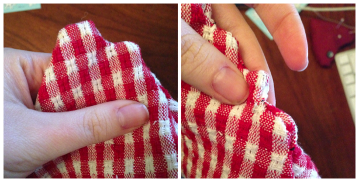
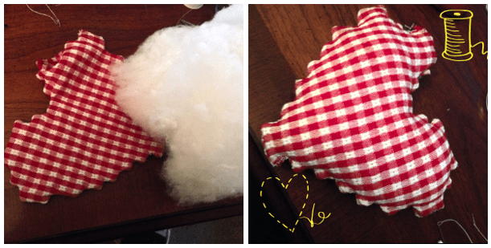
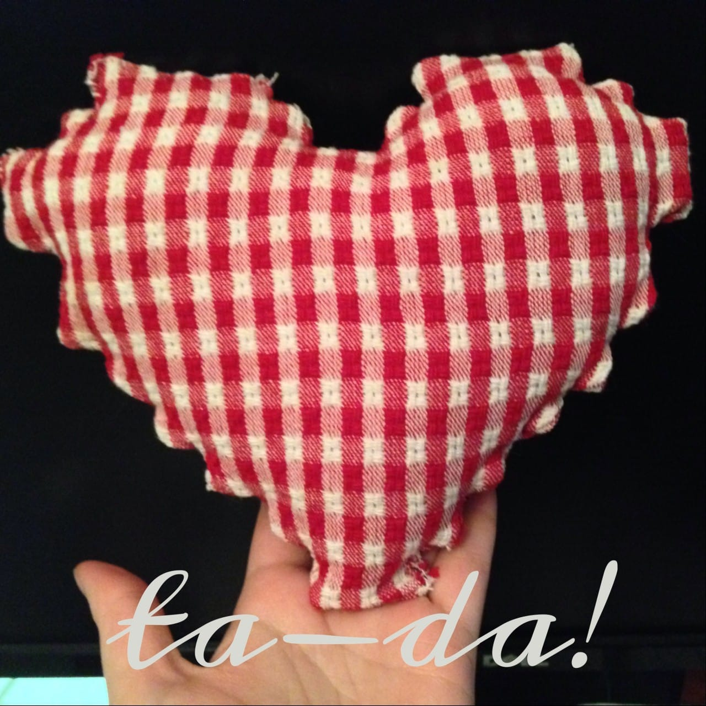

Project: Pixel Heart Pillow

**\&#xA;**

Happy Valentine’s Day!

After a week of celebrating heart shaped projects, the day is finally here. The Husband and I are keeping it simple: dinner at our favorite Italian restaurant up the street and a bottle or two of wine. I made him a very special (and delicious!) Valentine’s treat that I’ll disclose the recipe for tomorrow morning, along with this super cute pixel heart pillow!

With his love of old school pixel art video games in mind, I had an idea in my head to make the Husband a pixel-y heart something or other for Valentine’s Day. I found a pixel heart graphic online, manipulated it, printed it, cut it, and used it as my makeshift pattern. I’ve had a set of red and white napkins that have been staring at me for awhile now, and I decided to sacrifice one of them for the sake of the project. After all, it made the perfect pixel design! Here’s what I used for the project:

## **Materials:**

- Pattern, (

  [download here](/wp-content/uploads/2014/02/KC-Pixel-Heart.pdf)

  )

- Fabric, enough for two hearts (one fat quarter is more than enough)

- Sewing Machine

- Fiberfill

- Pins

- Scissors

- Needle & thread

- Pencil or something else to push out fabric

## **Instructions:**

Download and print pattern. Cut out pixel heart. Fold fabric in half and pin heart, making sure pins go through both layers of fabric.

Cut the pattern out in your fabric carefully. If still folded on top, cut apart to make two hearts.

With right sides facing each other, match up the edges and pin all the way around.

Head over to your sewing machine. Using matching thread (I’ve used black just to make it visible for photos), use the pixel edges as guides and go all the way around. Be patient. You’ll need to start, back stitch, continue forward, lower needle in to fabric, lift pressure foot, turn fabric, lower presser foot, forward and back stitch again for each and every pixel side. The first whole side of the heart went slowly be very easily. For whatever reason, things all wonky when I got to the other side, and I had to completely remove and restart a few times. Go all the way around, leaving about a

**three inch gap**

at the top. This is where you’ll turn the fabric inside out and fill.

The napkin fabric I used was quite hard to work with, so all the imperfections are very visible but make it look extra homemade. I expect using a regular cotton fabric will render much cleaner results, as well as an easier time with the sewing machine.

WHAT is going on here?!

Don’t worry about seriously crazy threads and hanging strings. They are going to be inside the pillow hidden away, anyway.

Next, turn the fabric inside out gently. Then, using the eraser end of a pencil (or something similar), push out each little corner to form your cute tiny pixels. If you see wrinkles, now is the time to steam them out before you fill it!

On to the filling! Take small amounts at a time and gently squish it in the pillow until you’re happy it’s fat enough. Be sure to push it down a bit by the opening so it’s not popping out. I use

[**Morning Glory Premium Polyester Fiberfill**](http://amzn.to/1fzvyTl "Morning Glory Premium Polyester")

. It came in a gigantic 5 pound box, so I’ll be using it for quite awhile. If you have a brand you love even more, please share! I’d love to hear other opinions on different brands.

Lastly, fold over the opening on top (make sure it’s even with the other side of the heart!), pin it together and hand stitch it shut!

I left the pillow on the Husband’s keyboard while he was at work, and when he returned he found it. He thinks it’s super cute, though I can already see the cat eying it up as well. Guess it will be hers soon.

## **Other ideas for this project:**

- If you have batting on hand, you can put that in the middle of your hearts instead of filling, add a little loop, and make a pot holder.

- Leave the top of the pixel heart not sewn, sewing only around the sides and bottom, and add some straps to make a cute mini pixel heart purse.

Hope you enjoyed my last Valentine’s project! Just because the holiday is over, don’t expect there not to be love-centric projects in the future. You never do know! 🙂
