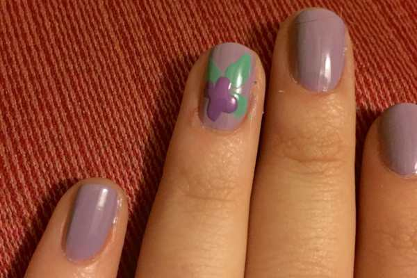
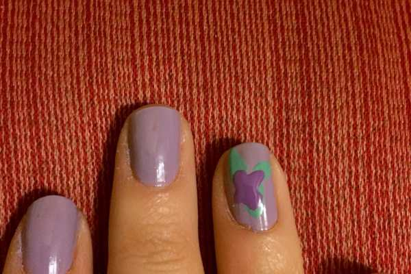
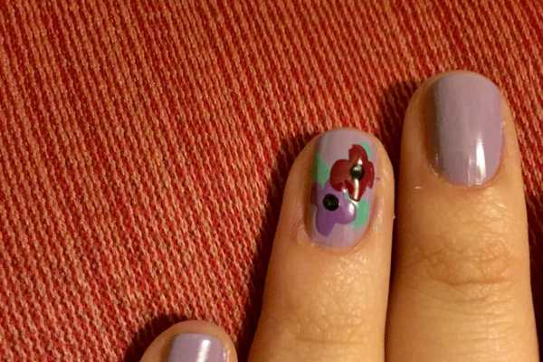
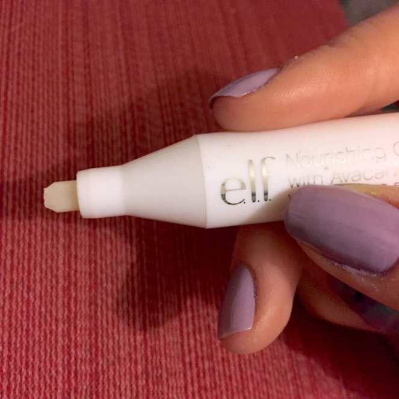
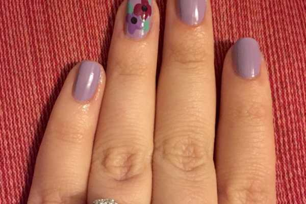

Even though the Winter is over, my cuticles are still mega dry. I have a bad habit of picking at them too, which makes things even worse. I was excited to get several fun new nail polishes as well as an awesome cuticle pen with my recent e.l.f. haul. I decided to use them for a quick Spring nail art design and to give away one additional cuticle pen to a lucky reader!

This nail art design is super fast and easy, making it great for the Spring or any time, really! I didn’t use the cuticle pen until after the nail art was finished, so you’ll see just how dry they are in the first set of pics!

## Materials:

- Lavender nail polish

- Purple nail polish

- Raspberry nail polish

- Mint green nail polish

- Black nail polish

- Clear top/base coat

- Dotting tool or toothpick

## Instructions:

- Begin with clean, dry nails. Do two coats of lavender nail polish on each nail and let them dry.

- Make three little leaves with your green nail polish on each accent finger where you wish to have flowers! Let dry.

* Next, take the purple polish and make four little petals on top of the green leaves to create a flower. Let dry.

- Make four more little petals with the raspberry polish to create a new flower, layered on top of the others.

- Dip the small end of your dotting tool or toothpick in to black nail polish and make tiny centers to your flowers.

- Seal in look with clear top coat and let dry!

Such a cute design! But look at those horribly dry cuticles!

I used the

**[e.l.f. Nourishing Cuticle Pen](http://amzn.to/1OW7fQ9)**

to help fix my crying cuticles, and it worked so great! It goes on like an oil, but is non-greasy and dries very quickly. Use it a few days in a row to heal dry sad cuticles!

The formula in the felt-tip pen contains Vitamins E, A C, Pro-Vitamin B5 and Aloe to help nourish your skin. It also has Avocado and Almond oils to condition the cuticles and make them softer. I love this pen so much, and will be sure to buy more as soon as this one runs out! Just don’t push down on the tip too hard, as it will get stuck inside the pen. Use it gently and you’ll be good to go!

All right, on to the giveaway!

If you’d like a chance to win your own

_e.l.f. Nourishing Cuticle Pen_

, enter my giveaway below!

_Entry is open to US & Canada residents only. Must be 18 or older to enter. All entries will be verified so if you did not follow instructions or are a bot, you will be disqualified. Raffle ends Friday, May 15th at 11:59PM._

**_\&#xA;_**\
\
[a Rafflecopter giveaway](http://www.rafflecopter.com/rafl/display/64ecfabc26/)
