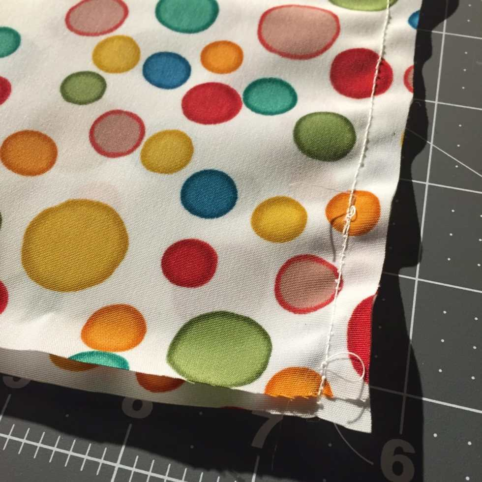
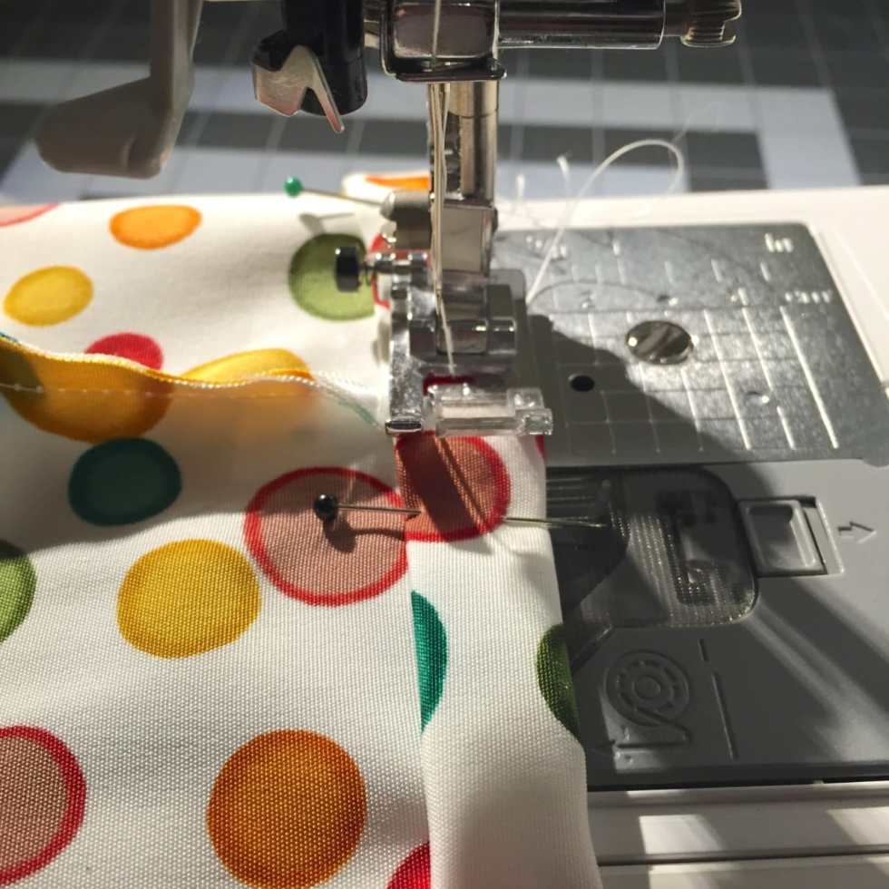
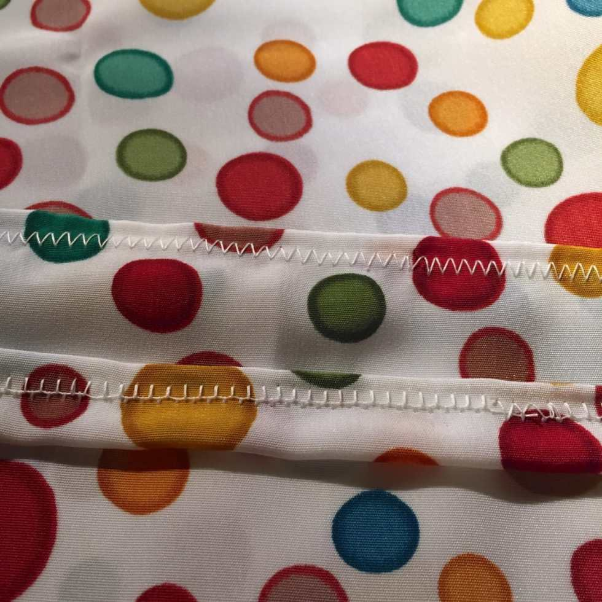
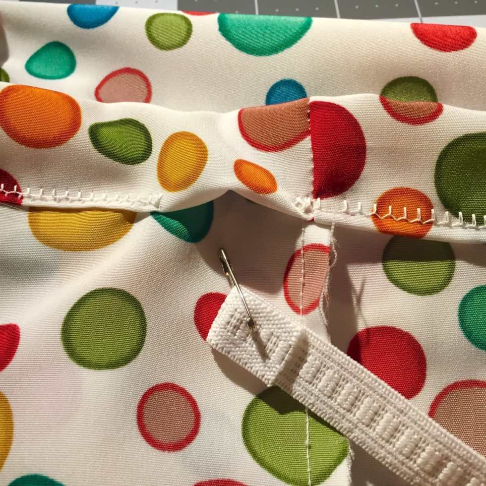
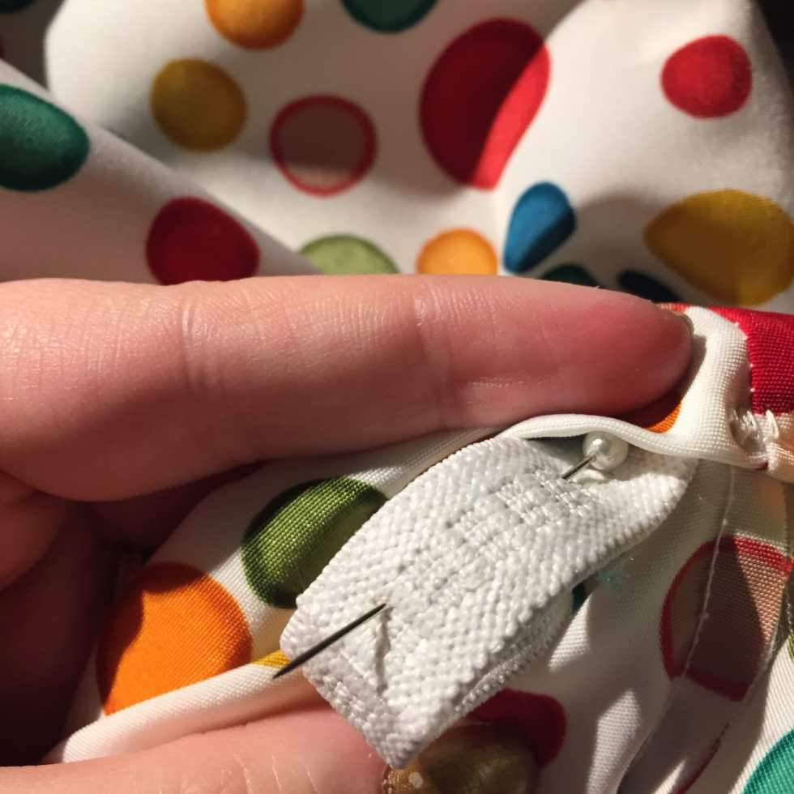
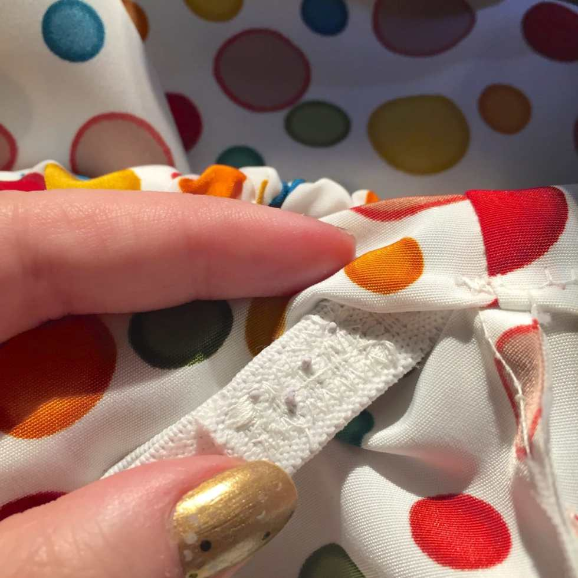
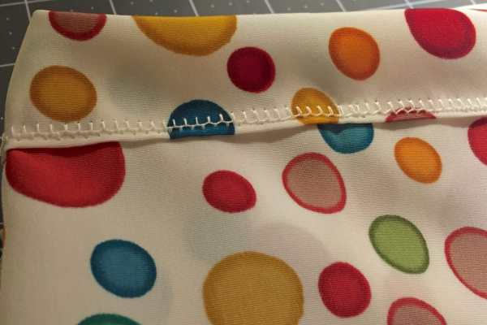
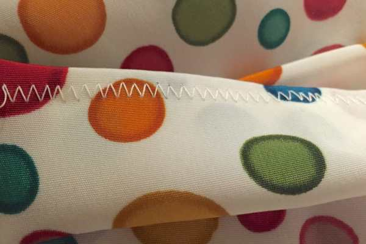
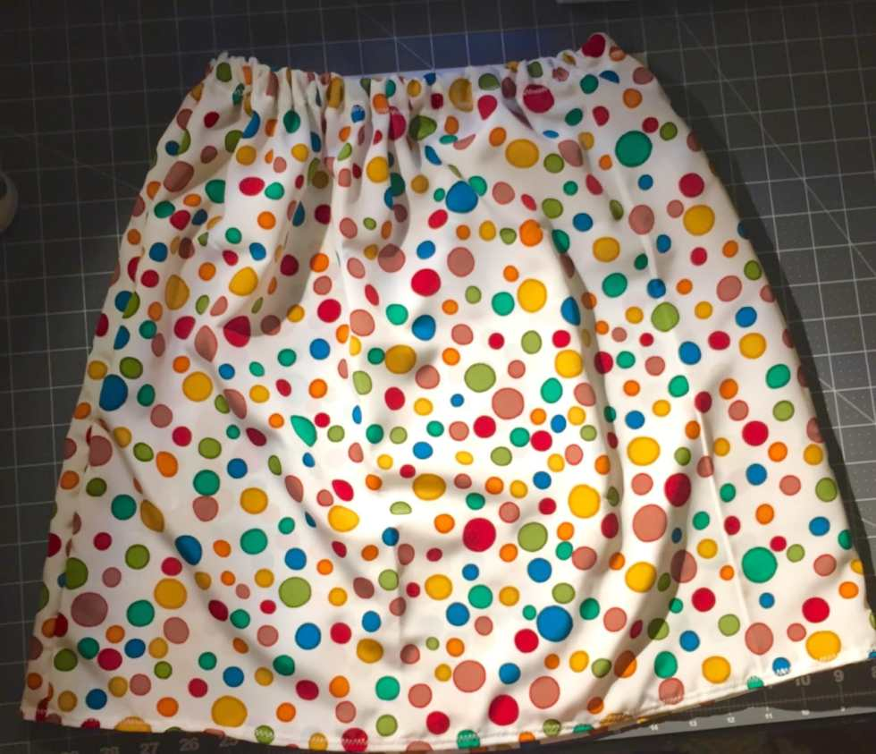

Project: Quick Summer Skirt Tutorial

This weekend was gorgeous! It wasn’t quite skirt weather, but almost! New dresses and skirts are always the first thing I want to buy when the weather gets warm, but if you have the fabric and a little bit of time, why not make your own?

This skirt works up very quickly (we’re talking under an hour!) and requires almost no measuring- that’s because you are going to use an existing slip or skirt as your pattern. Make a bunch of them before the Summer and enjoy a new wardrobe!

## Materials:

- 2 yards of fabric

- slip or elastic waist skirt

- 1/2″ non-roll elastic

- sewing basics: sewing machine, matching thread, pins, scissors, safety pin, measuring tape

## Instructions:

Normally, you’d measure your waist, taking measurements this way and that for the perfect fit. That takes more time, obviously, so we’re skipping all of that for this quick tutorial and using something you already own as a pattern. I wrote to have 2 yards of fabric on hand, but you may need more or less depending on your waist size and how tight/loose or short/long you want the skirt.

If you want to be more accurate, you can measure during the beginning steps as I have, but it isn’t totally necessary. It really depends on how much you trust your guesstimating skills!

- Lay your fabric right side down in front of you.

- Lay the slip/skirt flat on top of it.

* Using a measuring tape, figure out length of slip. Add 3 inches to that number. (e.g. A slip that measures 19″ long will have a new length of 22″)

  _\*\*NOTE: If you plan on wearing your actual slip UNDER this new skirt you are making, be sure to add at least two extra inches to the length, or else your slip will be showing!_

* Stretch out the elastic top of the slip til it lines up with the bottom of the slip forming a square, and measure the width as well. Add 2 inches to that number. (e.g. A slip that measures 22″ wide will have a new width of 24″)

* Cut two squares of fabric length x width (e.g. 22″ x 24″)

* **Alternatively,**

  if you

  **do not want to measure**

  at all: Line the slip up against the edge of the fabric that it is laid out on. Stretch the elastic until the skirt forms a square (like above) and mark the spot on the fabric. Mark the length of the fabric as well. Then eyeball the extra two inches of width and three inches of length and sketch it on to the fabric, using the slip as a guide. Cut out the two square panels.

* Face the squares of fabric right sides facing each other and pin up both length sides of the skirt.

I used a 100% polyester fabric with cute polka dots! Polyester is a little hard to work with because it’s slippery, so I had to go very slowly while sewing and probably should have used a zig zag stitch the entire time, rather than a straight stitch for this next step. If you’re just using a cotton fabric, a straight stitch will do just fine for all the steps!

See how problematic the straight stitch can be on 100% polyester?

- Sew together (remembering to back stitch) using a 1/2″ seam allowance to create a large square tube and trim any excess from seams.

- With the wrong sides still facing, fold the bottom of the fabric up a half inch, and then up on itself a half inch again to create a nice neat hem. Pin all the way around.

- Sew with a zig zag stitch (if using polyester) all the way around.

- For top of skirt, fold fabric down one inch, then fold it again another inch on top of itself- just like for the hem. Pin all the way around. Put the elastic next to the tube to make sure it’s large enough to pass through!

- Sew around all but an inch or two.

- Stretch your elastic comfortably over your waist (or wherever your skirt will be sitting) to see how much to use and add one inch to that number, then cut elastic that long.

- Using a safety pin, wriggle your elastic through the gap you left open in the top of the skirt tube, pushing and gathering as you go so the elastic doesn’t disappear inside all the way.

- When you get to the end, remove the safety pin and overlap the elastic that extra inch. Pin to hold it in place until you can get it on your machine.

- Use many zig zag stitches to sew the overlapping elastic together. Make sure it’s nice and reinforced and strong!

- Push elastic back inside skirt and sew the gap closed.

Enjoy your brand new Summer skirt that took you basically no time to make!

Because I’ve never worked with 100% Polyester before (because I was avoiding it!!), it took me much longer to do this project than it normally would. I had to sew on my slowest setting so the fabric would feed through my machine. With a cotton skirt, I could sew at a much faster rate making the only “slow” part of this project the pinning (and isn’t that always the most tedious part?)

I can’t wait to make more skirts for the Summer months, and I hope you make some and share your photos in the comments below! I’d love to see what you create!
