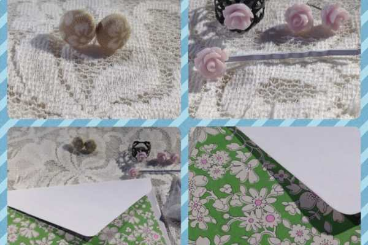
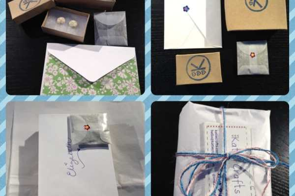
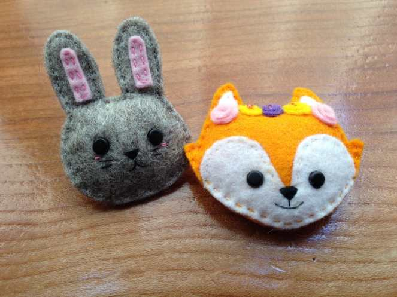
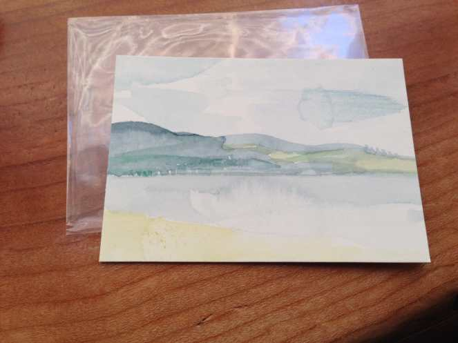
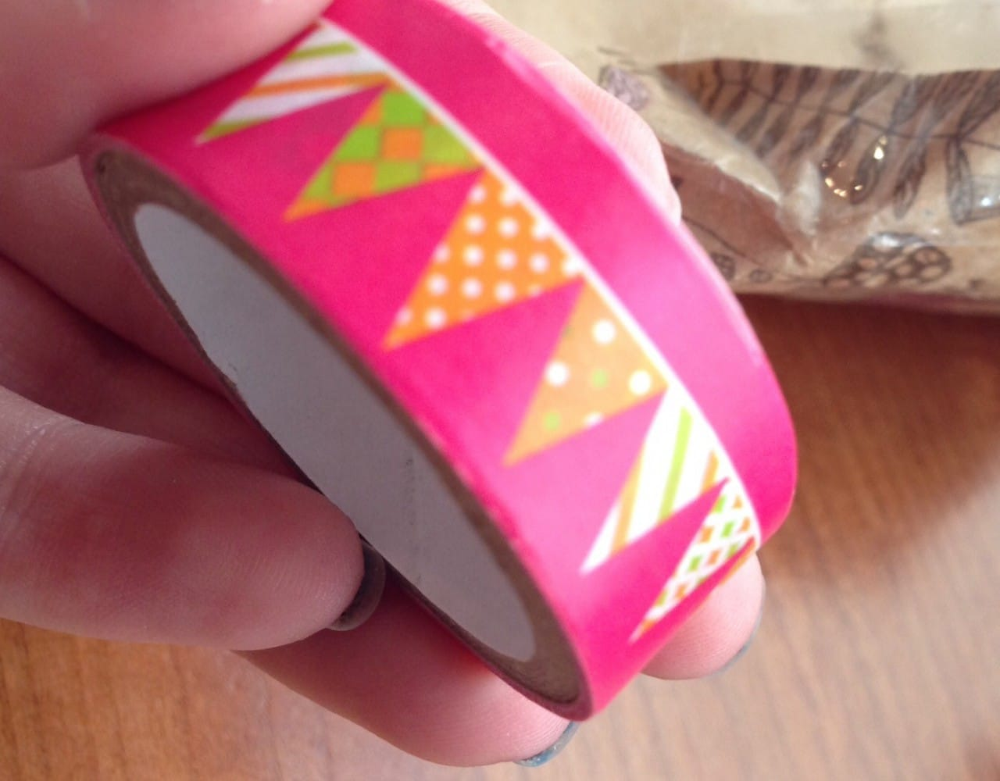
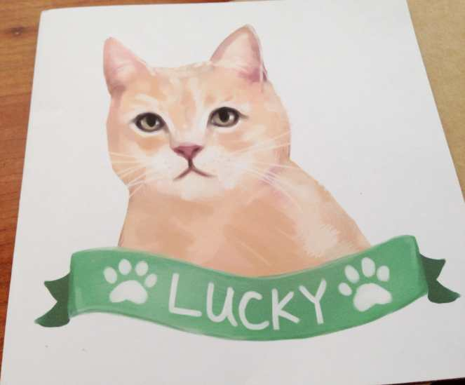

**Recap: First Handmade Swap (Spring Themed!)**

Back in April, Katie Crafts hosted it’s

[first handmade swap](/blog/first-handmade-swap/ "First Handmade Swap on Katie Crafts")

! The theme was Spring, and a handful of fun crafty girls participated. I put everyone’s names in a hat, gave it a shake, and handed out a different name to each person. It was a blast! Here is what I made for the person whose name I drew, and what I received from the person who drew me!

For the swap, I drew my friend’s adorable mom, Elizabeth. Since the theme was Spring, I was tasked at including at least one item that reminded me of the season. I went a step further, making every item some type of floral- so the whole care package was Spring-y!

I made Elizabeth a pair of covered button earrings, using a beige fabric with little white flowers on it. I also made her a matching jewelry set consisting of a filigree ring with a tiny lilac rose on it, little rose earrings and a filigree rose hairpin. Lastly, I included a small satchet of dried lavender (my favorite!) because it smells like Spring to me! I wrapped it all up in jewelry boxes, tissue paper and twine. I included a handwritten card that carried the flowery theme. I hope she liked everything I sent!

The person who drew my name happens to also be someone I featured before:

[Hannah from Hannahdoodle!](/blog/first-handmade-swap/ "Featured Etsy Shop: Hannahdoodle")

Hannah made me the cutest EVERYTHING! Even her wrapping (pictured above) was adorable!

First was a sweet little fox-wearing-a-floral-headband magnet and a little gray bunny brooch, both of which I am totally obsessed with. They are the cutest little guys I have ever seen!

Next up was a tiny painting of Rhyl Beach. I put it right on my bulletin board and it lo

oks so cute there!

Hannah also included a roll of washi tape that has colorful bunting on it that reminds her of Spring. I just used it on a card I sent out because it’s so cute!

Her handwritten card for me was even handmade- the front of it was a print of MY CAT that she painted! How thoughtful, to paint Lucky for me! I currently have it hanging right above my art desk so I can look at it every day as I craft. Isn’t it adorable?! If you want to check out more of Hannah’s creations, you should check out

[Handmade by Hannahdoodle on Etsy.](https://www.etsy.com/shop/hannahdoodle "Handmade by Hannahdoodle on Etsy")

If you haven’t received your care package from your swap partner yet, please let me know so I can reach out to them! In a couple of days I will announce the second swap, so stay tuned if you’d like to participate in it! I’m just trying to figure out a theme for it- have any suggestions? 🙂
