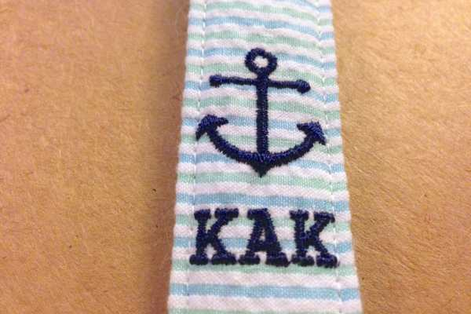
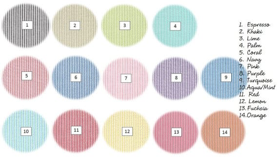

Review of Jade Journey on Etsy

A couple of weeks ago, I revealed my total obsession with all things anchors! In my

[**“Anchors Away”**](/anchors-away-etsy-picks/ "Anchor’s Away: My Etsy Picks")

Etsy treasury, I included this really adorable Key Fob by a shop named

[**Jade Journey**](https://www.etsy.com/listing/111253605/seersucker-anchor-monogram-wristlet-key "Anchor Key Fob by Jade Journey")

. As a ‘thank you’ for including her, the shop owner, Dawn, sent me my very own personalized fob!

First of all, this is the very first thing with my new initials on it! As you may know, I was married back in October. However, I didn’t officially change my last name until just a few weeks ago. When Dawn asked me what initials I wanted for the monogram, I was quite excited to be able to use my brand new ones!

She also asked me what color seersucker I wanted. She had a bunch to choose from, but I inevitably went with the mint/aqua duo (#10)- since mint is my current favorite color. I think with the navy lettering it looks completely perfect together!

photo credit: jade journey

The fob is nice and sturdy and definitely very well made. I know I’ll be using it for quite a long time- and it’s much easier to find my keys in my gigantic Summer bag now, too. 😉 This would be such a great gift idea for a gaggle of bridesmaids or matching family ones in different colors!

Pop on in to

[**Jade Journey on Etsy**](https://www.etsy.com/shop/jadejourney "Jade Journey on Etsy")

to see more of her monogrammed key fobs as well as wristlets, clutches, belts and more! And thanks again, Dawn! It was so very sweet of you to send me such a great gift!
