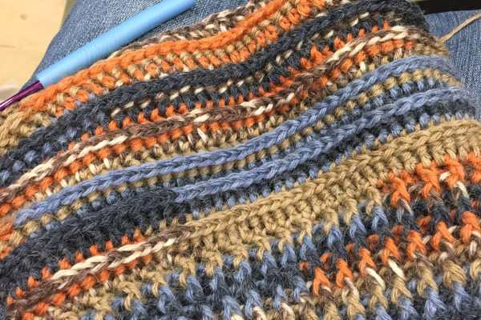
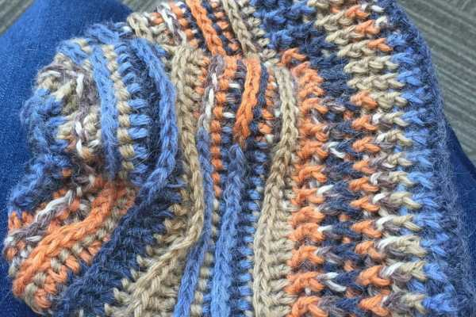
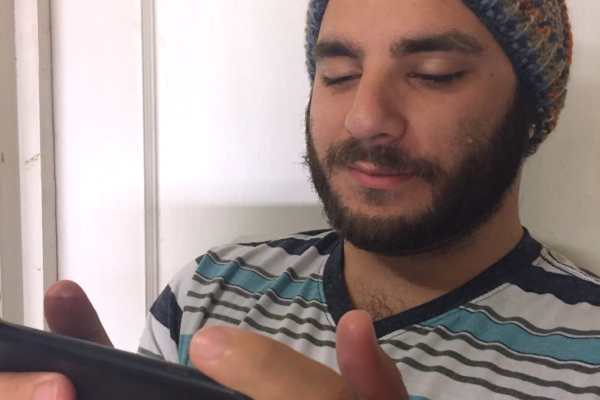

It isn’t quite cold enough for our Winter hats yet (

[we’ve only worn them but a few times](/fall-nail-art/)

), but it’s definitely not too early to start making your own! While I have several I already wear, my Husband only has one, and he wanted a new one! He picked out a skein of yarn at Hobby Lobby and found this amazing free pattern online for the

[Riptide Slouch Hat by Meladora’s Creations](http://www.meladorascreations.com/riptide-slouch-hat-free-crochet-pattern-2/)

.

Hubs picked out a skein of Yarn Bee’s Fair Isle in Blue/Orange Multi which is 3.5 oz/252 yds. It’s a color combo I never would have chosen for myself, so I was pretty excited to see how it came out. I have to say, I really love it! And more importantly- he really loves it!

The pattern was super easy to follow, even if it looks like a complicated hat. I only made two small changes to the original pattern. First, my Husband’s head is gigantic, so I had to chain extra!! As long as you chain an even number, it’s fine. The second change I made was the hook. You are supposed to go up a hook size when you begin the beanie part, but I kept the same hook throughout. He likes a little slouch but not SUPER slouch so I wanted to make it a little smaller, thus the smaller hook.

It came out beautifully. So beautifully, that I already made another in blue, and bought two more skeins of the Fair Isle in different colors for Christmas present hats! Hobby Lobby’s website says that all Fair Isle yarns have been discontinued (!! 🙁 !!) but as of two weeks ago there were still a bunch in the store itself. I’ll try to get there this week and stock up before it’s too late! It’s really wonderful yarn for this pattern!

It’s blue, not grey- I swear.

Watch how to make the Riptide hat below on

[Meladora’s Creations YouTube Channel](https://www.youtube.com/watch?v=naxfSFLw1p0)

, and be sure to follow along with the

[written pattern right here](http://www.meladorascreations.com/riptide-slouch-hat-free-crochet-pattern-2/)

!

Lots of thanks to my very handsome model, who purposely tried to ignore me as I took photos! <3

Have you tried this crochet pattern before? What is your fave crochet hat pattern? Share it below and maybe I’ll feature it too!
