> _?On the seventh day of Christmas, Katie Crafts gave to me…?_
>
> _A super cute Santa nail art tutorial! Today’s guest post is written by May from_
>
> _[La Vie en May](http://www.lavieenmay.com/). She is sharing a DIY on how to score the cutest Santa nails this side of the North Pole! Check it out below!_

I don’t know about you, but all the holiday decorations and the Christmas music is really getting me in the holiday spirit! I was so inspired this weekend that I created these santa nails to show my personal cheer. I want to spread the cheer and share this fun tutorial with you. If you’re a nail art noob, don’t be scared! It just takes time and really really good tools (that you can get off of Amazon for cheap) to create very beautiful nail art.

**Here’s what you’ll need**

:

Red glitter nail polish (shown: Toggle to the Top by Essie)

Red nail polish (shown: A List by Essie)

Neutral nail polish (shown: Tea & Crumpets by Essie)

White nail polish (shown: White Page by Essie)

Black nail polish (shown: Licorice by Essie)

Top Coat nail polish (shown: Good to Go by Essie)

Gold nail polish (shown: Good as Gold by Essie)

Small nail dotter tool

Small nail art brush

Scotch tape

To start, paint your nails in this pattern (starting with your thumb): white, red, neutral, red, white. I applied two coats each so the color would stand out more. Wait 15-20 minutes for your nails to completely dry. They might feel dry before that, but it doesn’t mean they’re completely dry. If you put scotch tape on wet nail polish, it will attach to the nail polish and rip your polish off when you peel the tape. So resist the temptation!

Now we’re going to look at each nail individually, starting with the pinky. Cut thin strips of scotch tape and apply it diagonally upward (from left to right). If you have nail art tape, that works too. Then, paint red nail polish over the nail. Wait 15-20 minutes and peel the tape off.

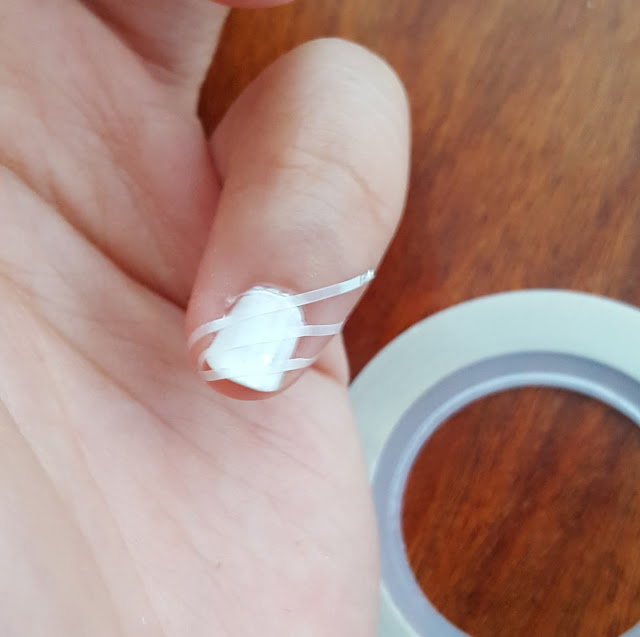

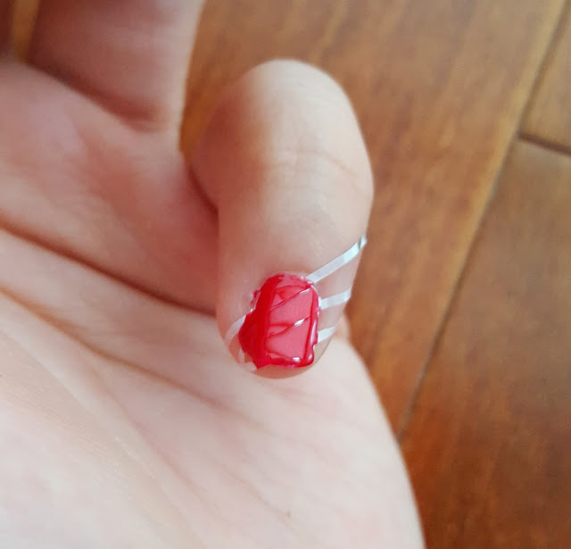

While your pinky dries, we can move on to the ring finger. I love adding some sparkle and glitter in my nail art, usually on my ring finger. For this nail, I applied two coats of the red glitter nail polish.

Now, I’m sure you’re wondering, ‘Why did she paint this nail red if she was just going to paint it with red glitter polish later on?’ Great question! Glitter nail polish is a b\*\*ch to take off because it sticks to the nail. It really sticks and you’re going to have to use a lot of remover and elbow grease to get it off. To avoid that, I put a coat of regular polish on before I apply the glitter polish. That way the glitter sticks to the regular polish and not my nail, making it easier to remove. #nailhack

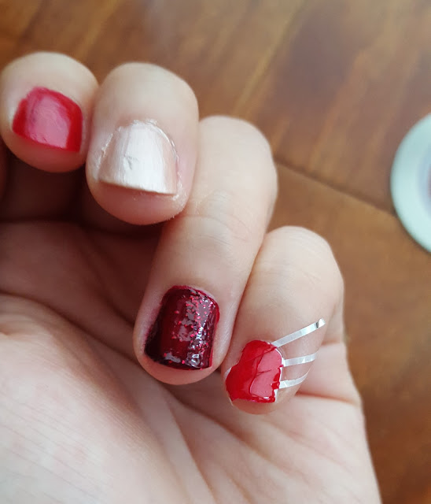

Now we’ll move onto the middle finger. This will be Santa’s face. First, we’re going to paint the hat on. Taking your nail art tape or scotch tape, apply it on the bottom part of your nail, leaving some space between the tape and the cuticle. Take the white nail polish and carefully paint within that small space. This will be santa’s hat.

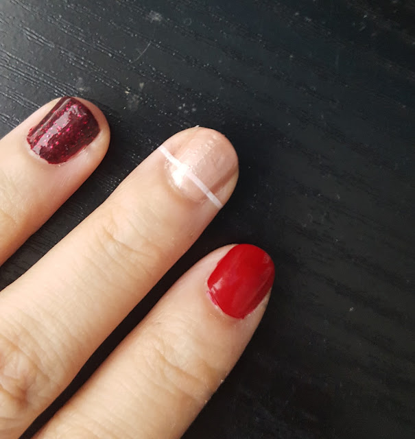

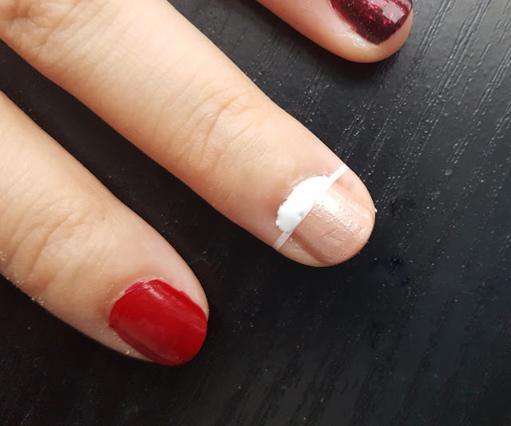

We’ll wait for that to dry before we start on the rest of the face. For now, let’s move on to the pointer finger. This one will have the “ho, ho” written on it as if santa is saying it. We’re going to draw a little speech bubble first. I did this freehand using a small nail art brush. Fill in the bubble with white nail polish. This should only take 5 minutes to dry. We only need the surface to dry before we add on the letters. To draw the letters on the speech bubble, dip the same nail art brush in black nail polish and carefully trace the word “ho” out.

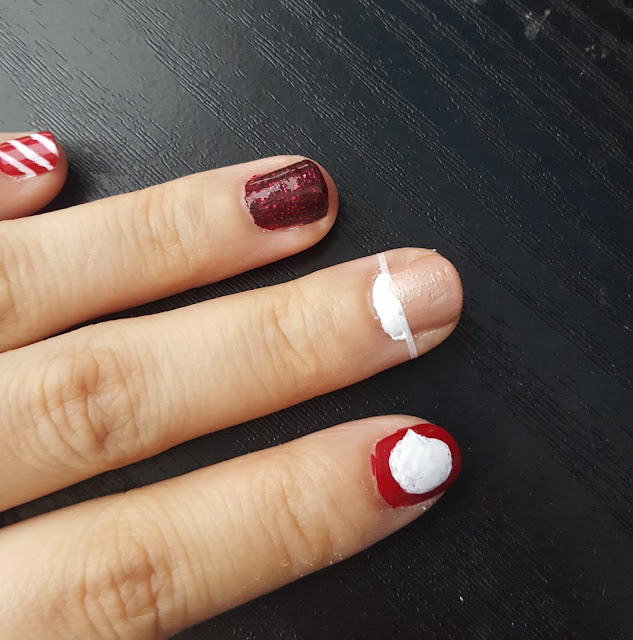

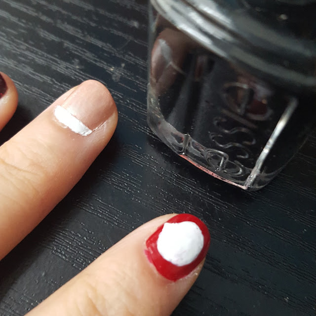

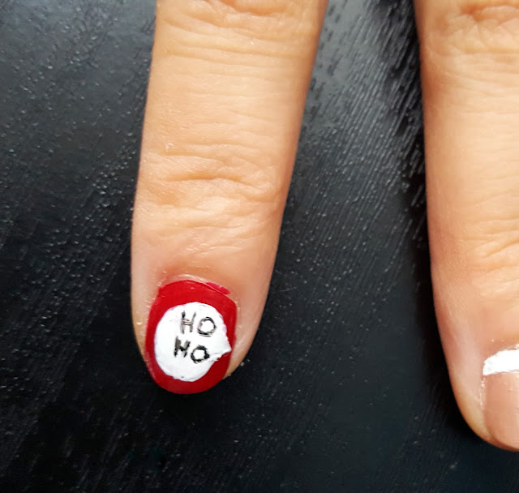

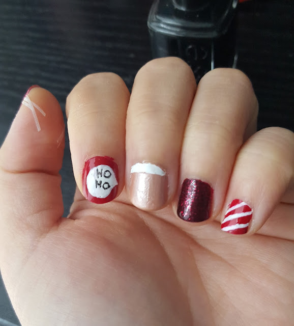

We’re going to jump back onto the santa face nail now. The white nail polish should be dry now. You can remove the tape. For the beard, we’re going to use our handy dandy nail art brush again. Start in the middle of the face. It’s easier to draw the bell curve of the mustache first and then curve it up and out. After that, fill in the beard with white nail polish. If it’s easier, you can use the nail polish brush to fill in the color since it’s much bigger. Use a nail dotter tool to create the eyes.

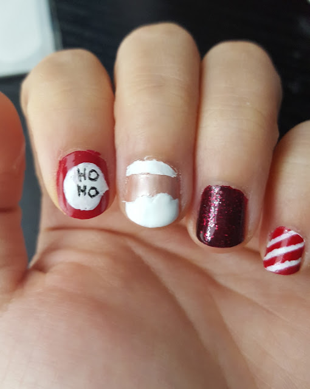

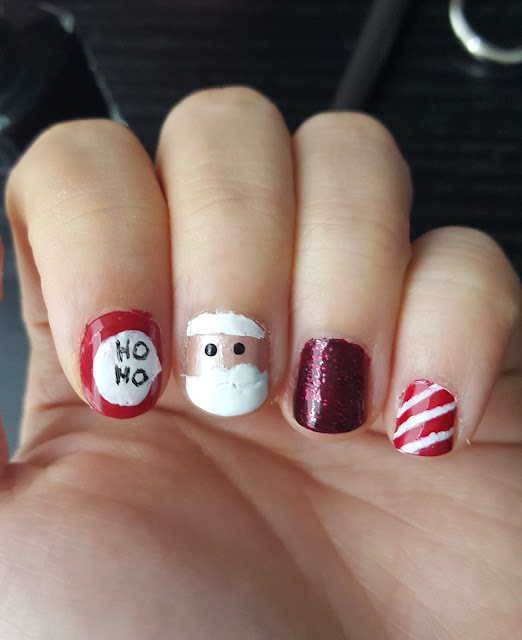

We’re almost done, we only have the thumb to go! Using scotch tape, mark the area where you want the belt to be. I put tape on the upper part of my nail, but you can position the belt wherever you’d like. Paint over the tape and the white polish with red nail polish. Let dry for about 10-15 minutes.

Then, peel the tape off and throw away. Now we’re going to add the buttons onto the santa suit. Take the dotter tool you used earlier to make the buttons. Add the gold buckle in the middle of the white line as the last finishing touch.

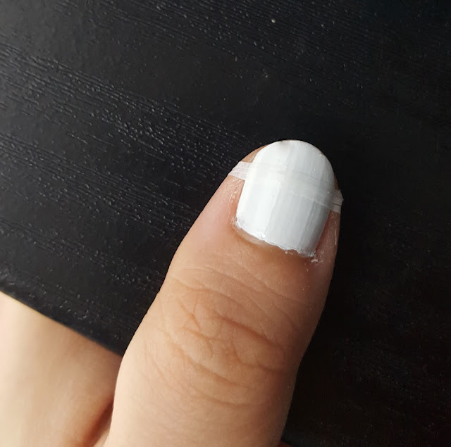

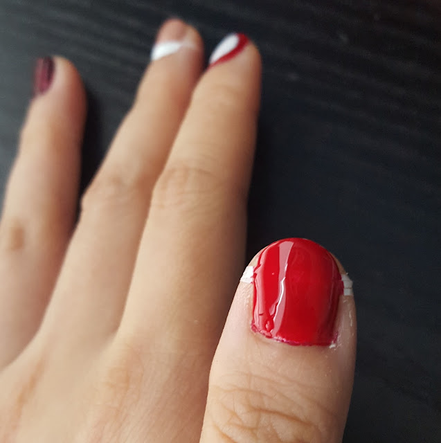

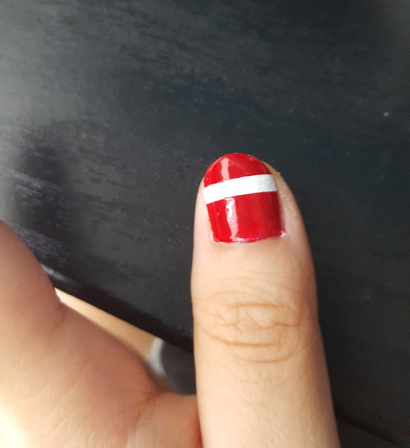

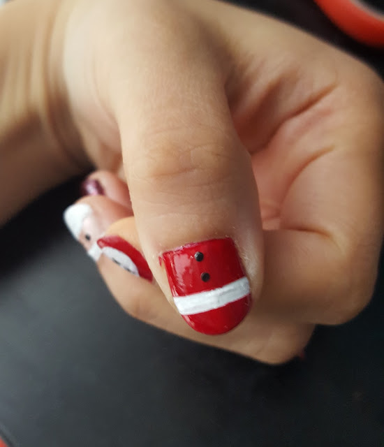

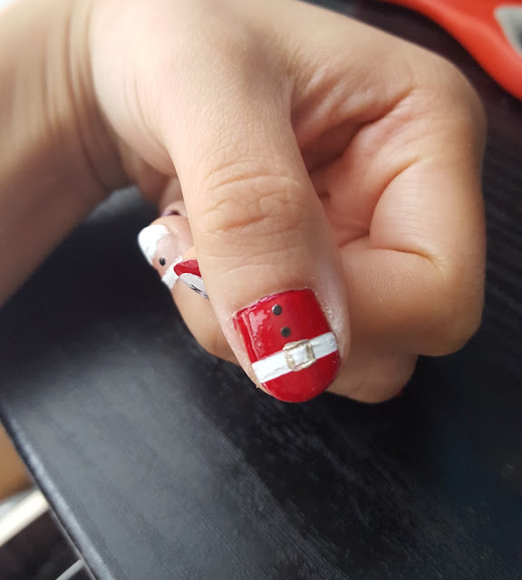

You’re done with the hard part! Just apply a top coat on your nails and voila, you have gorgeous Santa nails for the holiday! I hope you guys enjoyed the tutorial today. I have many, many more

**[nail art tutorials](http://www.lavieenmay.com/search/?q=nail+art)**

on my blog, be sure to check it out.

Follow me:

[Bloglovin](http://www.bloglovin.com/blogs/la-vie-en-may-3321102)

‘|

[G+](https://plus.google.com/+LavieenmayBlogspot/posts)

|

[Twitter](http://www.twitter.com/lavieenmay)

|

[Instagram](http://www.instagram.com/lavieenmay)

|

[Pinterest](http://www.pinterest.com/lavieenmay)

|

[Facebook](http://www.facebook.com/lavieenmay)
