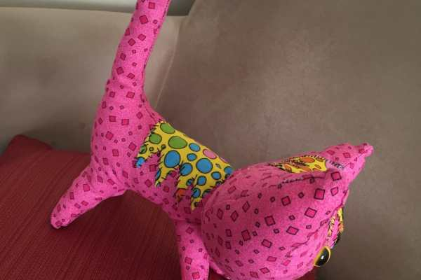
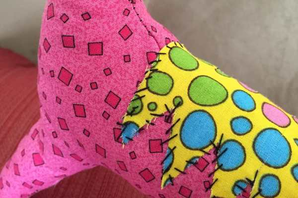
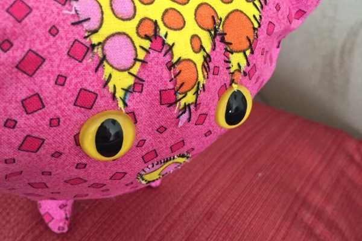

Meet Scrappy! He’s a curious little kitty with a giant tilted head and stitches all over who likes to sit in his chair and stare at me while I work. He is my Husband’s spirit animal. The original pattern comes from

**[Wee Wonderfuls by Hillary Lang](http://weewonderfuls.typepad.com/wee_wonderfuls/store/pointykitty.html)**

and is called the

_Pointy Kitty Pattern_

.

The pattern is free and includes all the pattern pieces you need to complete the project, so head on over to her website and print it out!

I’m going to make another kitty, name to be determined after she is made, that has a smaller head, perfect stitching, eyelashes and is a bit classier. Then the kits will sit next to each other on our bed. They’re going to be so cute together! I’ll be sure to

**[Instagram](https://instagram.com/imkatiecrafts/)**

her when she’s finished.

Have you made Wee Wonderfuls’ Pointy Kitty before? Share a photo below!
