Seaside Nail Art Design

I may not have had the chance to get myself to a beach yet this summer (I really hope I do soon!), but that won’t stop me from dreaming about it! This week, I decided to give myself a beachy manicure in honor of the season. Hope you like it!

## Materials:

- [Essie “Sand Tropez”](http://amzn.to/1jshZwd "Essie Sand Tropez")

  or another sandy colored polish

- [Essie “Come Here!”](http://amzn.to/1mi1eTK "Essie ")

  or another coral colored polish

- [Essie “Fashion Playground”](http://amzn.to/1w3OpNB "Essie ")

  or another mint/sea colored polish

- White nail polish

- Clear top coat

- Dotting tool

- Makeup sponge

## Instructions:

- Starting with clean nails, paint one coat of Sand Tropez on your nails and let it dry completely.

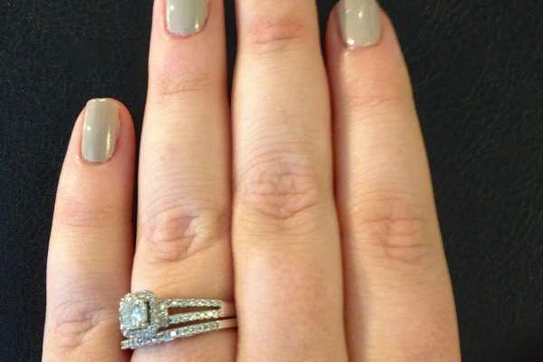

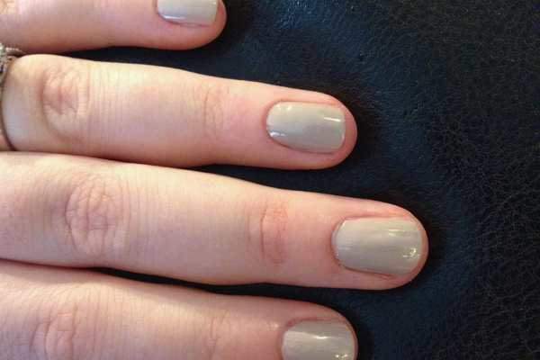

- Paint a second coat and let that one dry too! (Above: Pic on left is one coat, pic on right is two! MUCH less streaky!)

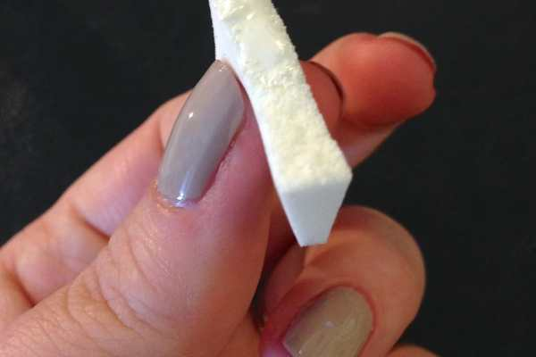

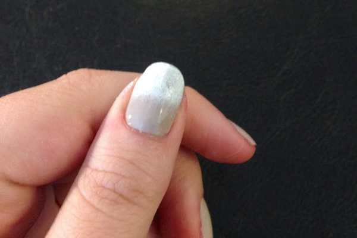

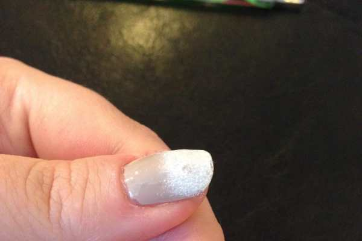

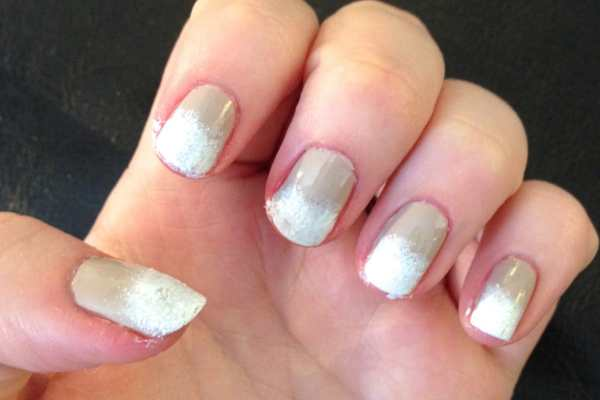

- Apply a little white to your torn makeup sponge, and dab on your nails about halfway down to create the “sea foam”.

- Let dry completely.

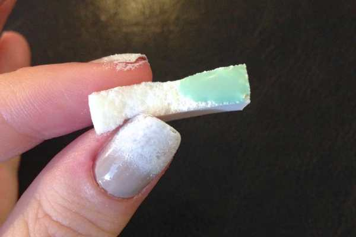

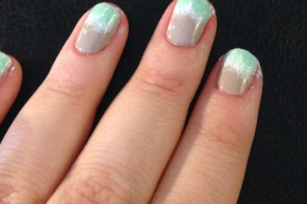

- Apply the “Fashion Playground” (I loveeeeeee this mint color! It has a little glitter in it so it’s extra amazing for the summer!) on your torn makeup sponge and dab on just like before, on the top third of your nail. Make sure to leave a line of the white showing to be the foam. This green will be your water!

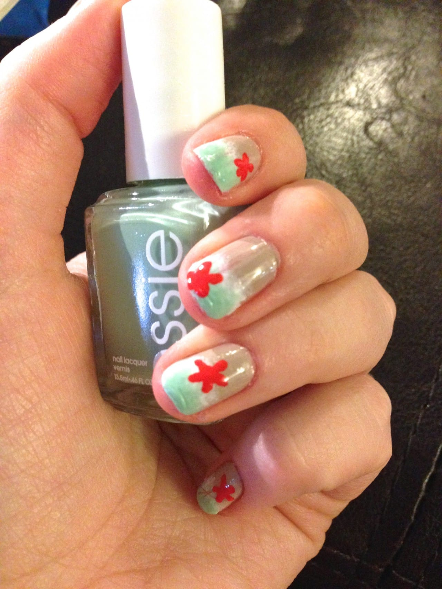

My favorite polish color of the summer!

- After that coat is dry, do one more coat of the green on just the top portion of your nail, to make it more opaque. Let that dry completely, too.

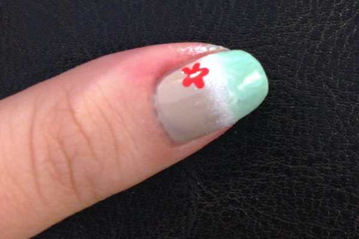

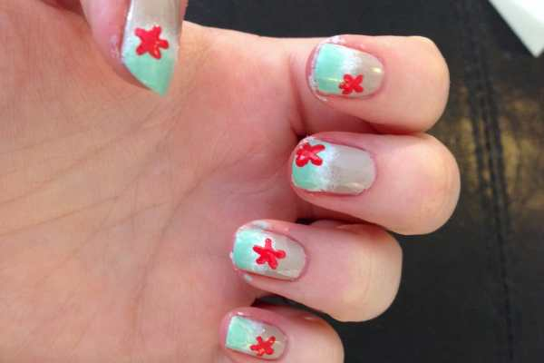

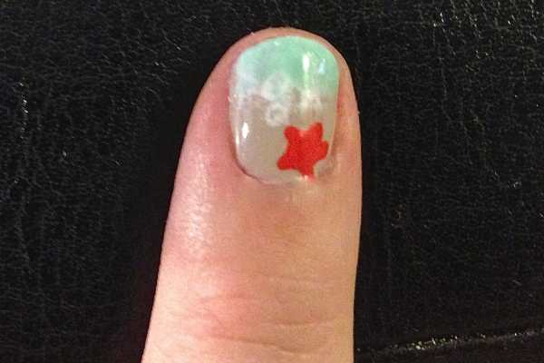

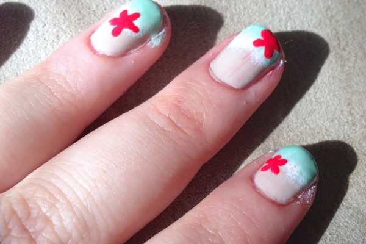

- Using your dotting tool and the “Come Here” color, draw little starfish on your nails in various places, in both the “water” and the “beach”!

- Let dry and seal in with clear top coat.

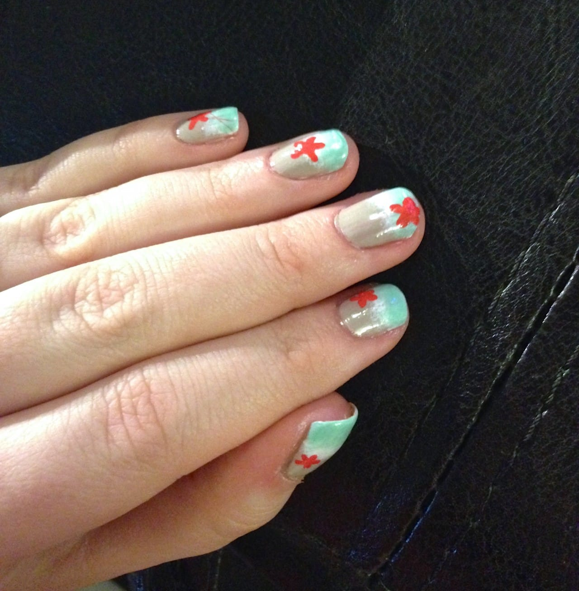

- Clean up any polish that got on your skin, and enjoy your fun summery beachy seaside nails!

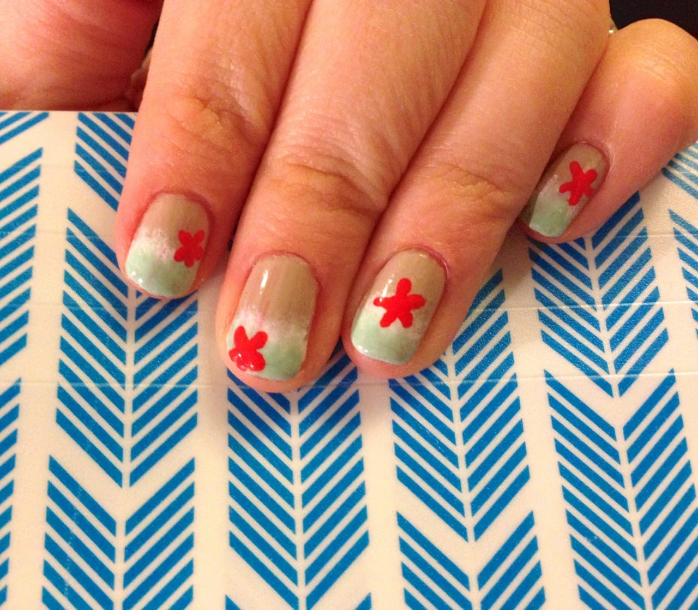

If you try out my fun beachy seaside nail art design, take some shots and share them in the comments! How do you like to wear your nails in the summer?
