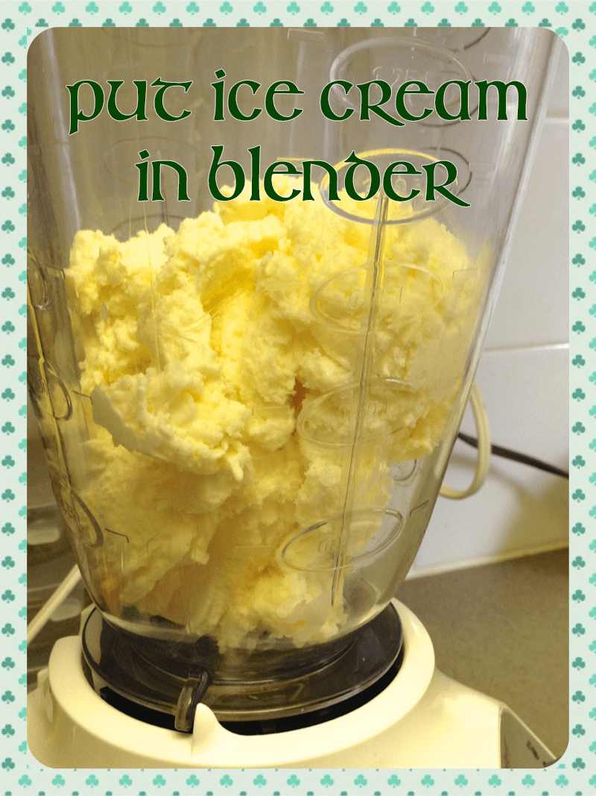
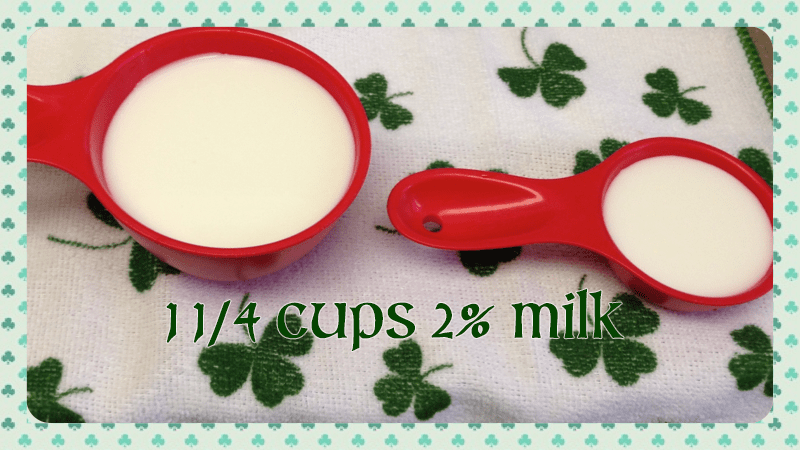
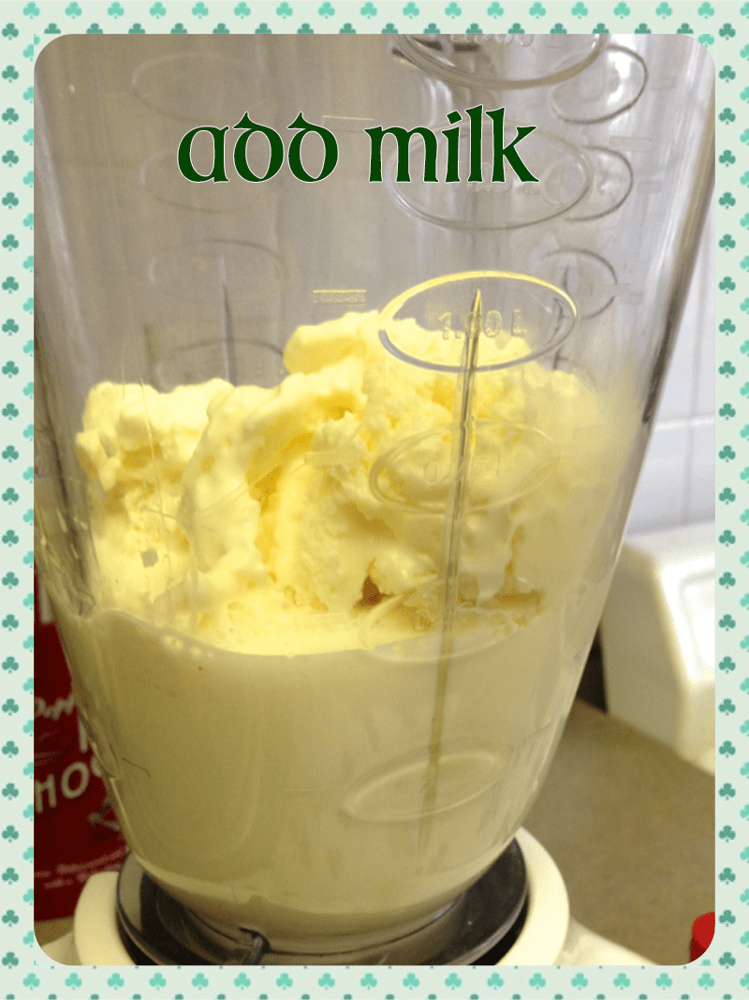
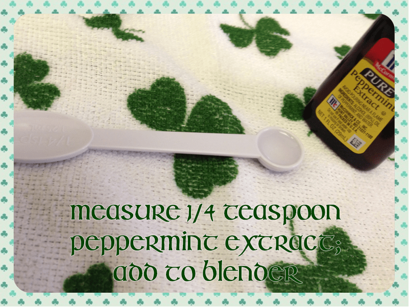
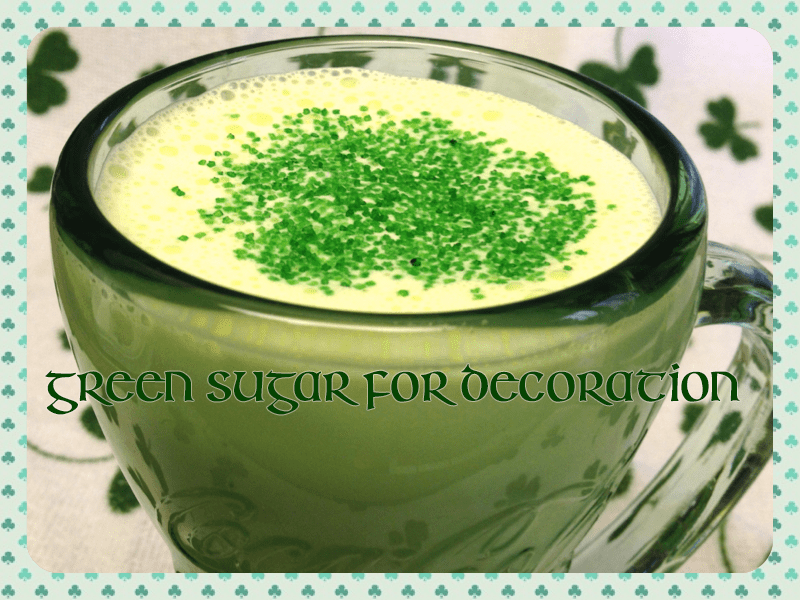

Recipe: Shamrock Shake!

Happy Saint Patrick’s Day! I spent hours slaving away in the kitchen to come up with a very special treat just for you! Okay, fine. I spent about 5 minutes in the kitchen, but that’s all you’ll need to make my version of the infamous McDonald’s Shamrock Shake!

I’ve seen various recipes for the Saint Paddy’s Day shake, but this is my favorite. I’ve even seen it almost identical to mine but with strict instructions to use mint extract, NOT peppermint. Well, I don’t like the flavor of mint extract much, and I love peppermint anything, so that’s what I use. And I think it’s pretty spot on!

## Ingredients (makes 2):

- 2 cups of vanilla ice cream

- 1 1/4 cups of of 2% milk

- 1/4 tsp peppermint extract\*

- 10 drops of green food coloring (I used NEON green, but you can use regular green!)

- green sugar crystals to decorate, if so inclined

\*Feel free to use regular mint extract if that’s what you have on hand. Additionally, the Husband doesn’t like things too pepperminty so I used 1/4 tsp in this batch. Personally, I like more mint, so I will double up on the peppermint for the next round. It’s all to taste, so do what you like!

## Instructions:

Very, very simple. Just follow the photos below to learn how to make it! Serves 2 (or one giant glass like the one below for yourself + one much smaller glass for your Husband)

Have a happy and safe Saint Patrick’s Day! If you try out my version of the Shamrock Shake and have any tips to share, leave them in the comments!
