In case you missed it, this past Friday, May 8th, was National Public Gardens Day!

_(And this whole week is[Love Your Park Week](http://loveyourpark.org/)in Philly!)_

Husband and I celebrated by going to a hidden Philly gem we’d been wanting to visit forever, but never got the chance to til now:

[Shofuso Japanese House and Garden](http://www.japanesehouse.org/)

. It was gorgeous!

Gardens are kind of my thing. Some people like visiting the beautiful mountains. Others prefer burying their toes in the sand on a sunny beach. I like gardens. I like visiting as many different gardens, arboretums and the like as possible- which is why we got married in one! I find them so pretty and so relaxing. They are my happy place. It’s a shame it took me this long to visit Shofuso, because it’s such a treasure! I will definitely be going back!

Upon entering, you’re immediately guided to the ticket booth by a tall hedge, which was placed there for that very purpose. Beyond the hedge you can hear the faint trickling of a waterfall, but you can’t see it yet- it’s a surprise! That was also intentional, as we learned on our guided tour with Shofuso’s Head Gardener. We learned a lot about the three types of gardens there (the Viewing Garden, Tea Garden and Strolling Garden) and took lots of photos of each.

Shofuso was originally designed by architect Junzo Yosimura in 1953, as an exhibition for the MoMA in NYC. When the exhibit was over, it was moved and reassembled in 1957-58 in it’s permanent residence of Philadelphia.

It was such a wonderful trip, I can’t wait to go again! Now that you have a little history behind it, check out the ton of photos I took while there! You’ll see the different gardens, lanterns, tea house, the deck that you sit on while peacefully enjoying the Viewing Garden, and lots more! Enjoy!

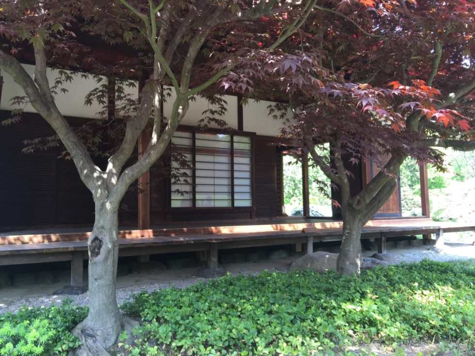

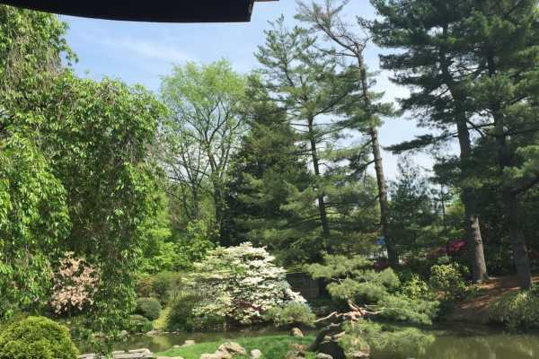

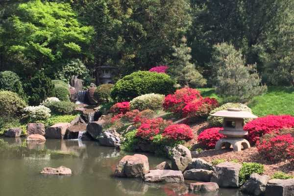

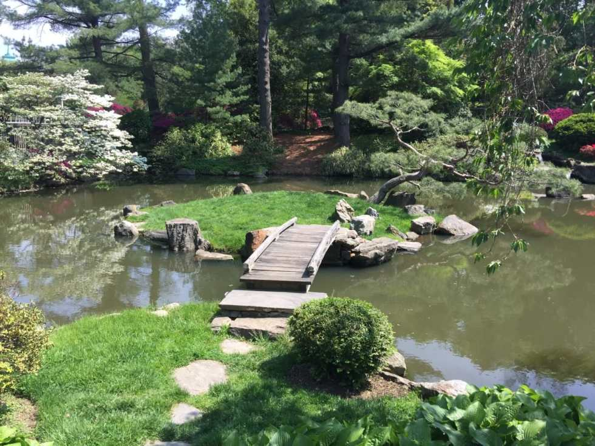

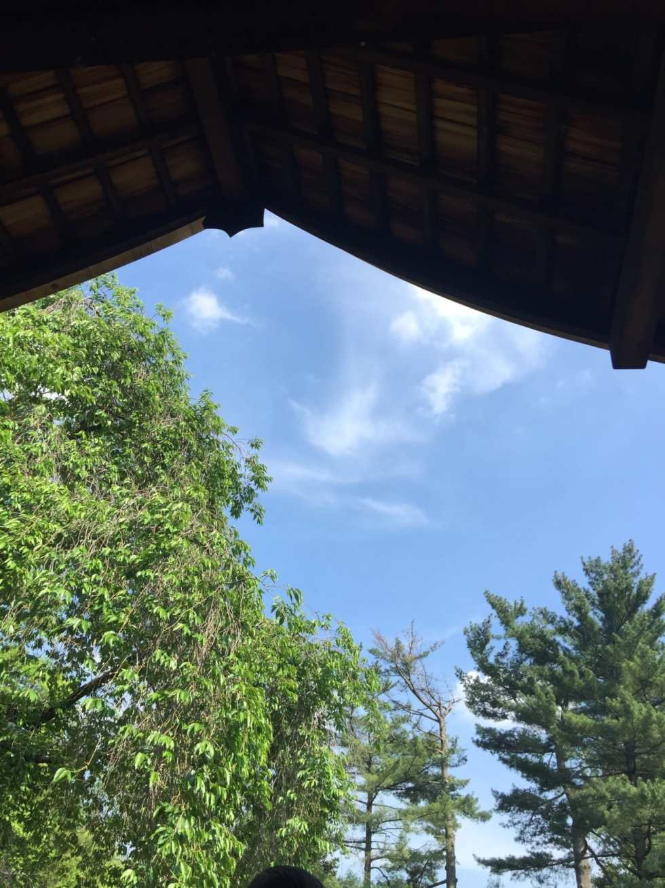

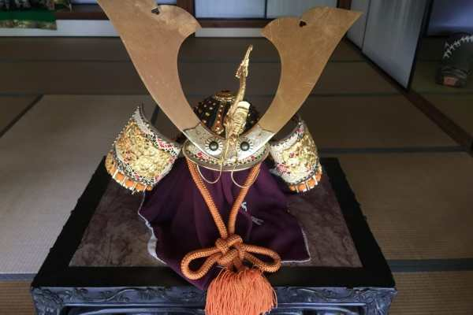

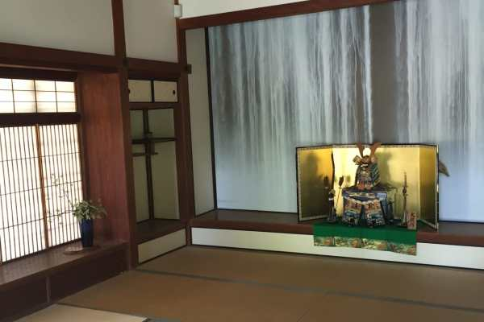

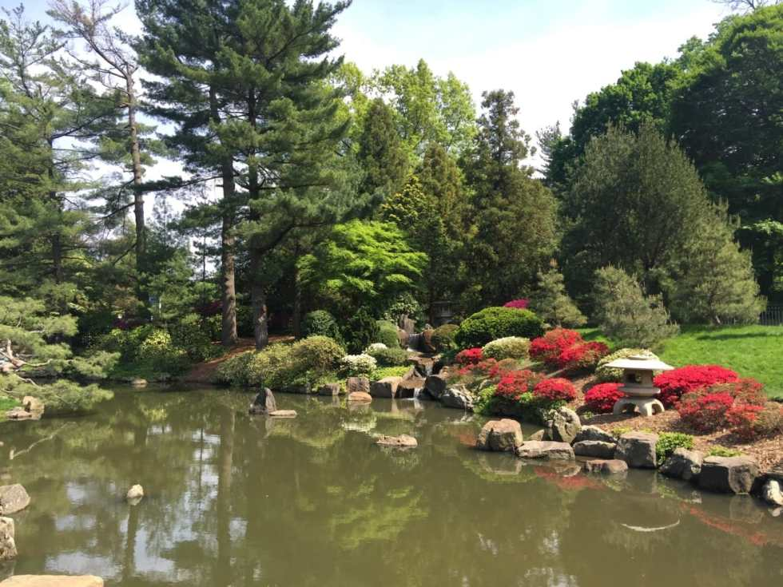

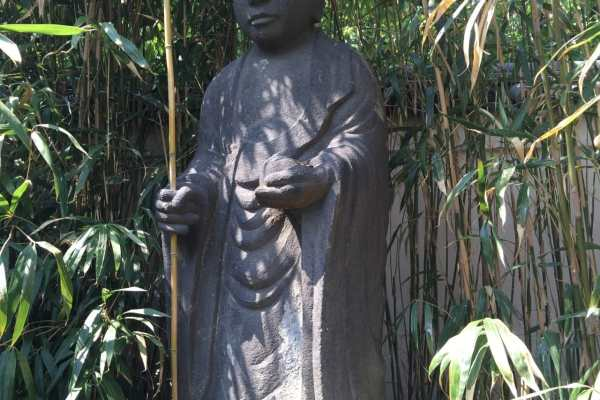

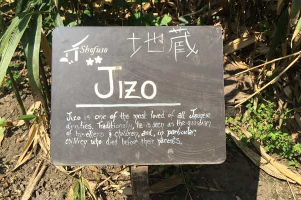

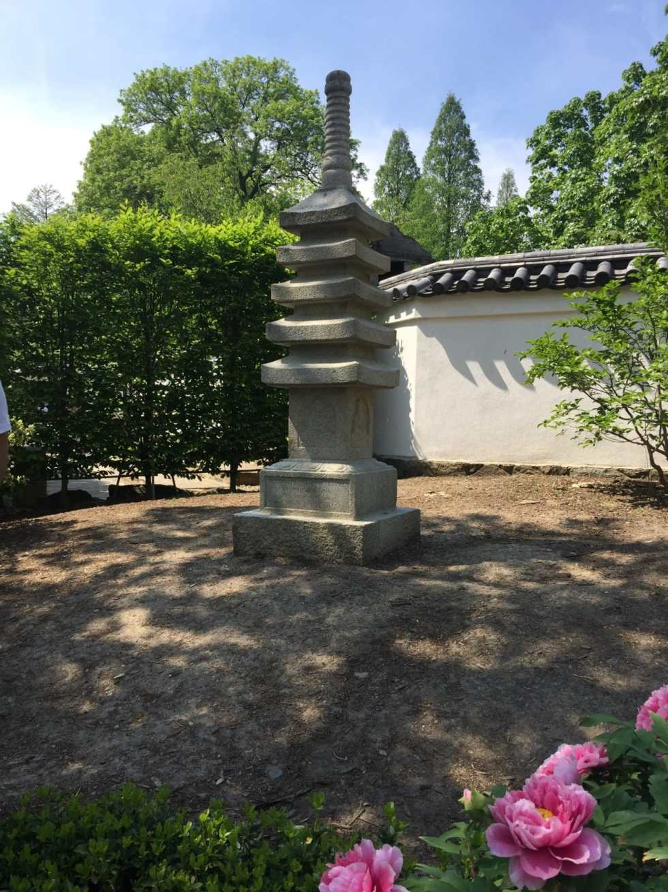

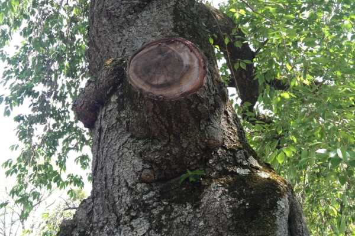

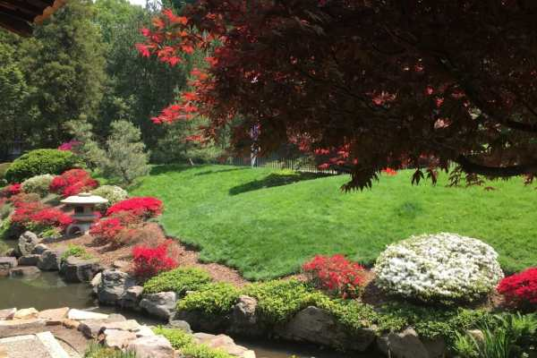

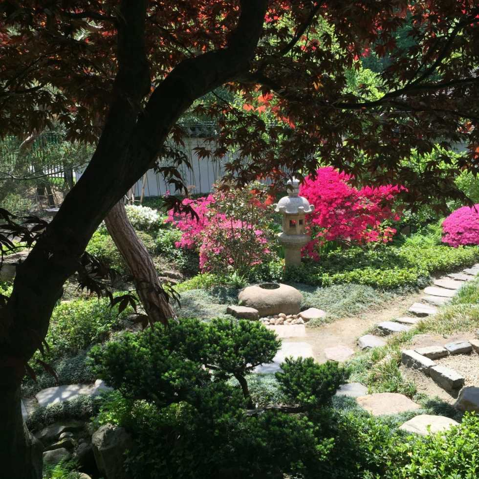

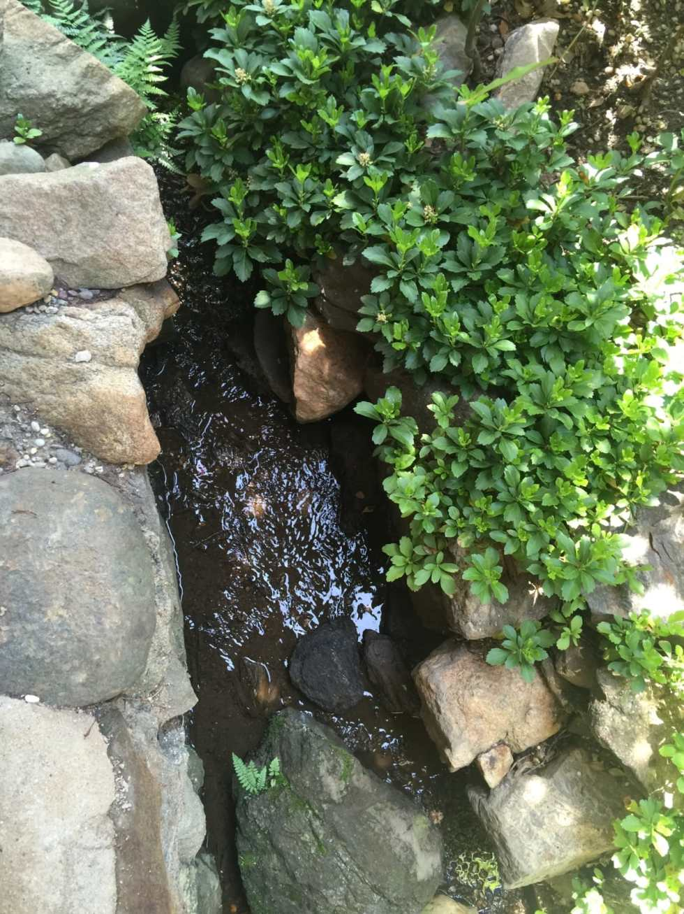

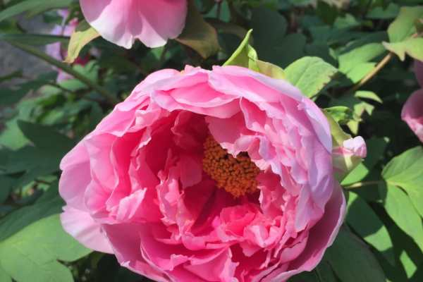

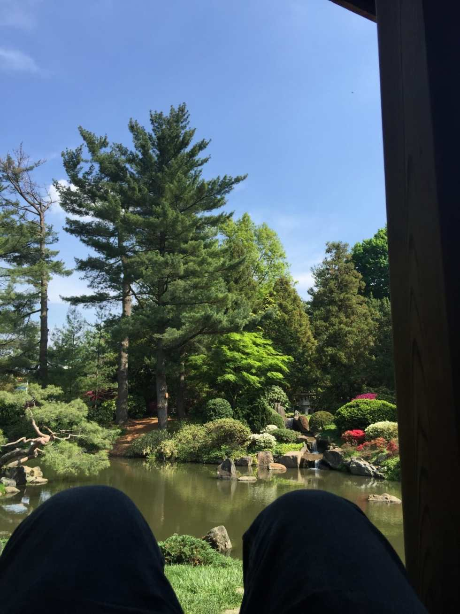

Husband’s knees, as he lays on the deck enjoying the scenery.

Me and the Husband!

Did you celebrate National Public Gardens Day? Where is your happy place?
