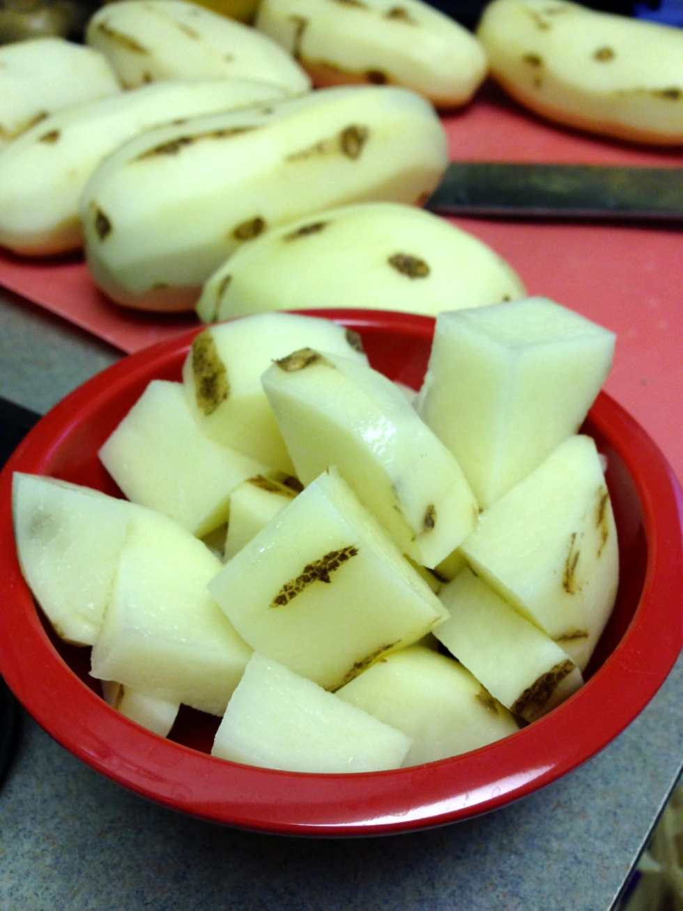
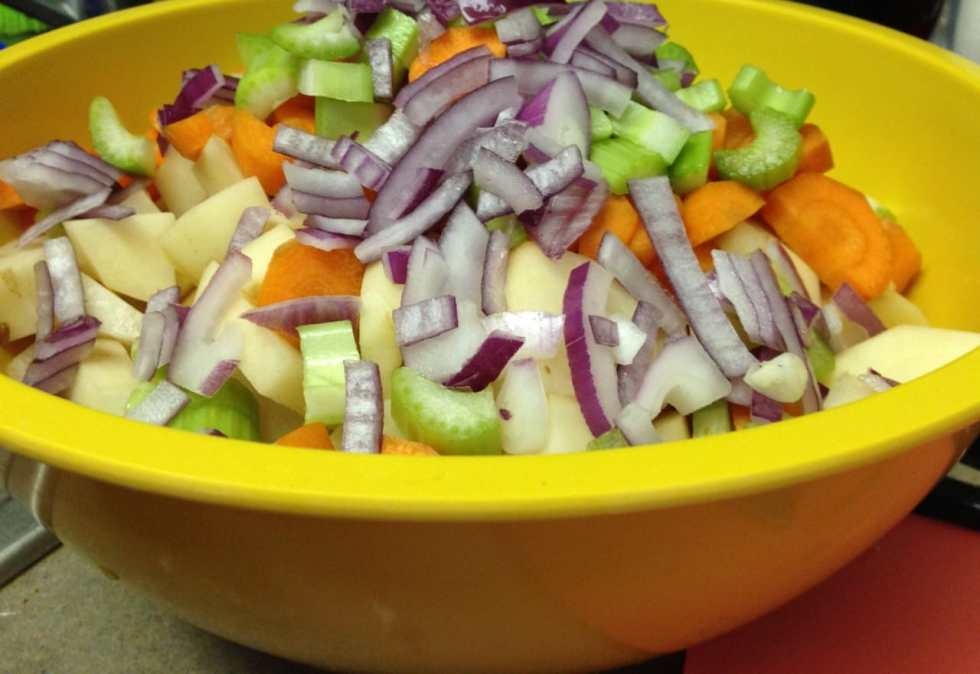
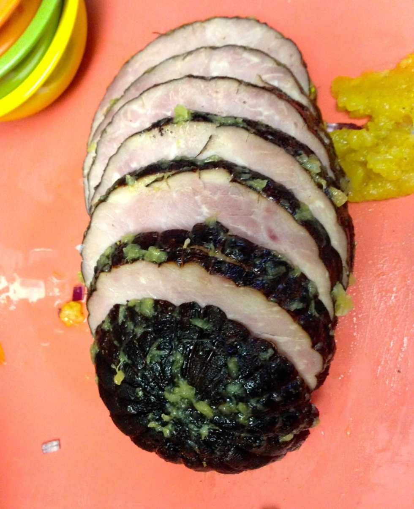
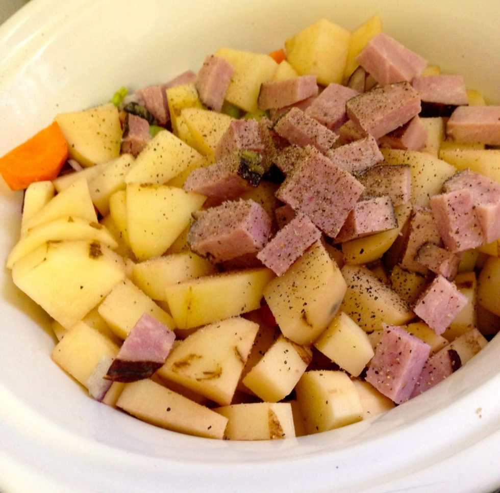
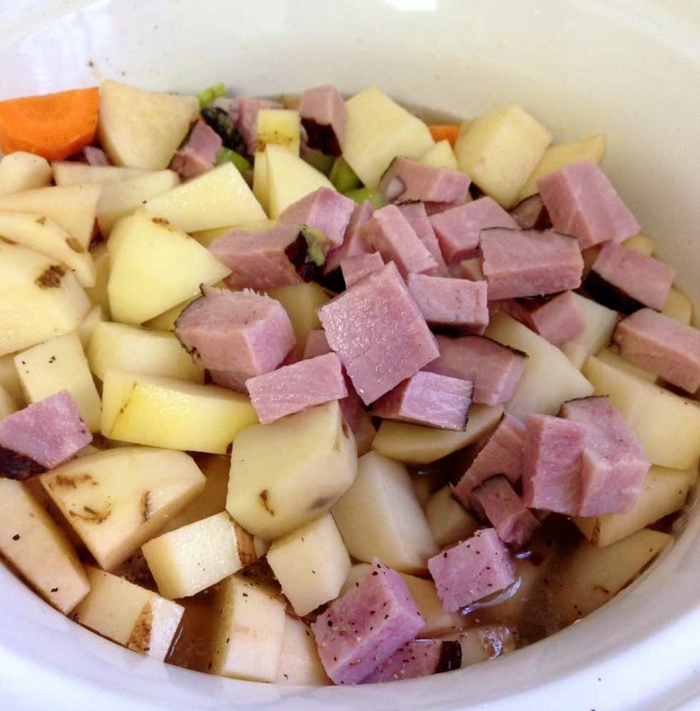

Recipe:

**Slow-Cooker Beer and Cheese Chowder (with Potatoes and Ham)**

Prep Time:

1 hour

Cooking Time:

6-8 hours (on low)

The Husband and I are big soup/stew/chowder lovers. If we could eat soup (with some really good crusty bread) for every meal we absolutely would- especially when it’s this cold outside. Besides, who doesn’t love an easy ‘set it and forget it’ crock pot meal? That being said, I have dozens of recipes bookmarked for later use when we’re ready to try a new soup out.

Earlier this week, we made a small ham for dinner. Even a small ham is still a ham, and there’s only two of us. Needless to say we ended up with a lot of leftovers. We figured it was the perfect time to make a hearty soup with ham in it. To my bookmarks I went! I found several recipes I wanted to try, and so I combined (and altered) several of them. That’s how I came up with this beer and cheese chowder with potatoes and ham recipe!

Ingredients:

- 3 cups of cooked, diced ham

- 7 cups of potatoes, peeled, chopped (approx. 7 potatoes)

- 1 1/2 cups of carrots, peeled, chopped (approx. 3 carrots)

- 1 cup of celery, chopped (approx. 2 stalks)

- 1/2 cup of onion, diced (approx. half a large onion)

- 32 ounces (large container) of chicken broth\*

- 12 ounces of beer (one bottle)

- 2 cups (8 oz.) of cheddar cheese, shredded

- 1/2 cup of heavy cream

- salt and pepper to taste

- croutons for topping (optional)

\*This will make for a thinner soup rather than a thick chowder. Cut broth amount in half for thicker more chowder-like meal.

Instructions:

- First, you’ll need to wash all your veggies! Unless you want dirt in your soup. That’s up to you. 🙂

* Next, get out a nice big prep bowl and something to measure your chopped veggies in. I have mini prep bowls that hold about a cup which are perfect for just this use!

- Peel your potatoes and carrots.

* On to chopping! Dice potatoes, carrots, celery and onion. Throw all in your big prep bowl, measuring as you go. Throw in crock pot when finished!

- Now you’ll need to chop your ham in to cubes. If there is any delicious, delicious glaze on it from baking (that recipe will come soon!), just scrape it off. Using a sharp knife, cut three cups worth of ham.

Ooooh, the glaaaaze!

- Add chopped ham to crock pot. Salt and pepper as much as your heart desires. I used a 1/4 teaspoon ground pepper and 1/2 teaspoon salt since the amount of potatoes in it is gigantic. You can use more or less depending on your taste, and can always add more to your individual bowls after it’s cooked!

- Pour the broth on top of the other ingredients. Add the beer and the wine now, too!

- Set your slow-cooker to

  **LOW**

  and put it on for

  **6-8 hours.**

  I found 6 hours to be plenty of time for the potatoes to soften up. Go about your daily business!

- When it’s done, use a potato masher or the like to mash up the veggies, making it thicker.

- Before serving, add the cream and cheese. Replace the lid for 5 minutes to let the cheese melt. Then, give it a stir and serve! Add croutons to the top of it for a little crunch.

Tips:

- To make this recipe vegetarian friendly, nix the ham and switch to vegetable broth! Still mega hearty and delish. With the cheese and cream, though, it’s definitely not diet-friendly. 😉

- Don’t be afraid to experiment! Soups are the very best canvas, so throw in anything you think may work!

Rating:

3.5

out of

**5**

stars! I initially used too much broth making it thinner than I would have liked (hence the suggestion to halve the amount of broth up in the ingredients section). The flavor was very good, but missing something. I think next time I’ll add butter to the crock pot as well. If you make this recipe and figure out what it’s lacking, please share! I’d love to give it another go!
