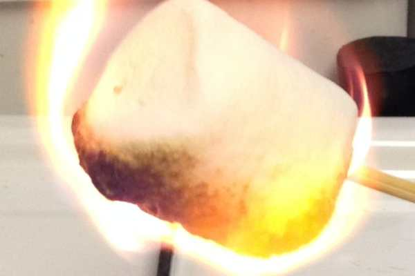
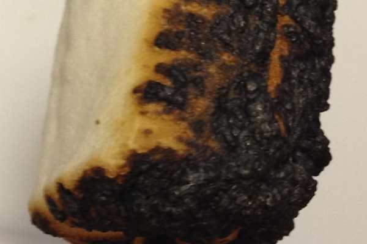
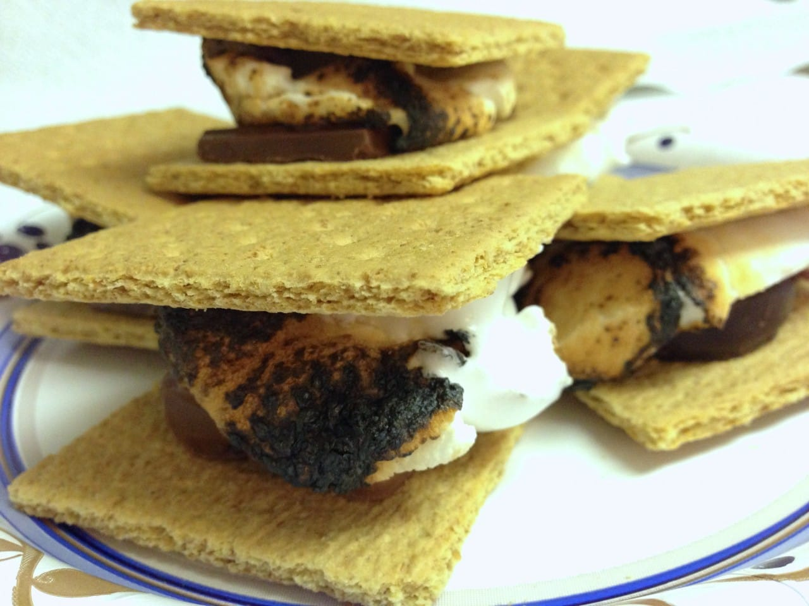
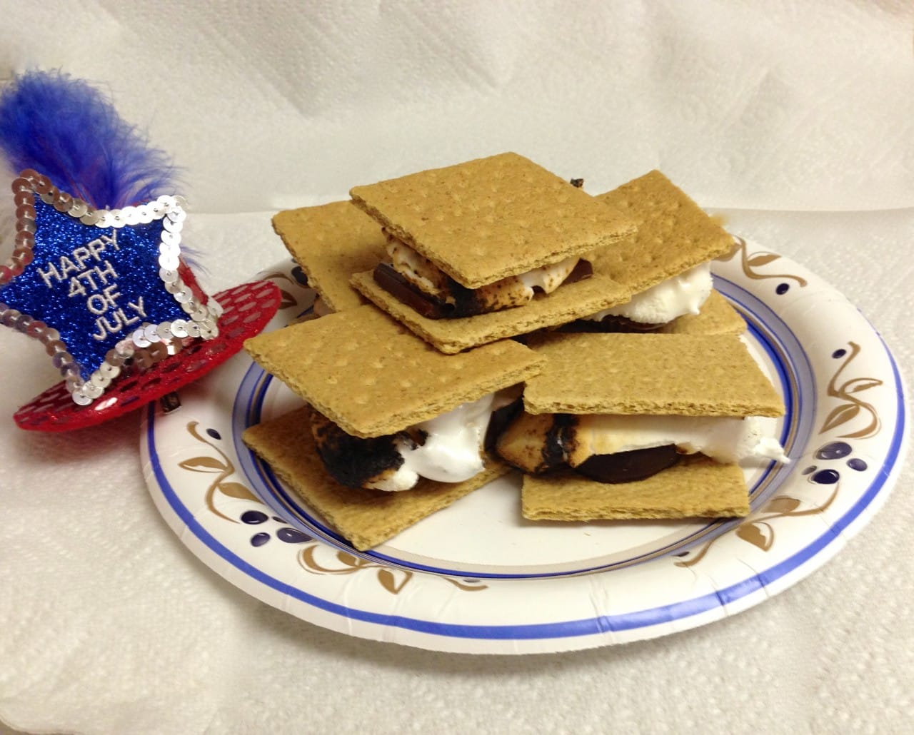

The Ultimate 4th of July Dessert: S’mores in 5 Different Ways!

With 4th of July right around the corner, Katie, her Husband (which I will refer to only as Brother-in-Law) and myself started discussing what to make for a picnic. We had different ideas about salads, hamburgers vs. hotdogs, and even what to drink. There was one thing, however, we all could agree on! No 4th of July picnic would be complete without S’mores! How could something so simple to make, taste so good? We decided that we should try to make the S’mores a bit more fancy this year rather than just the normal way. We then came up with five different versions to try at the picnic, and these are the results! We each rated them from 1 to 5.

## Traditional S’mores

This S’more is made with graham crackers, a marshmallow and Hershey’s Milk Chocolate all put together; the one you all remember from childhood that was the staple of Summer Camps around the USA. We absolutely couldn’t do these tests without having the Traditional, especially because the other S’mores may not turn out as good. On a scale from 1 to 5 this is how we each rated it:

_Jess: 4_

_Katie: 5_

_Brother-in-Law: 5_

## Reeses S’mores

This S’more is made with graham crackers, marshmallow, and a Reese’s Peanut Butter cup as the candy bar used. It’s a good option for those who love peanut butter in their desserts or like to eat it out of the jar. So how did this one stack up against the Traditional you ask? Surprisingly (even though we’re all PB lovers!) it didn’t hold up for any of us.

_Jess: 3_

_Katie: 3_

_Brother-in-Law: 3_

## Crunch S’mores

This S’more is made with graham crackers, marshmallow, and a Crunch Bar. It is very similar to the Traditional one only with some crunchies added to the mix.

_Jess: 4_

_Katie: 4_

_Brother-in-Law: 3.5_

## Whatchamacallit S’mores

Now, my Brother-in-Law loves this candy bar and decided this was a good one to use in a S’more. It follows the same recipe that the others follow: graham crackers and marshmallows, only it uses this candy bar. I wasn’t too fond of this one personally.

_Jess: 2_

_Katie: 3.5_

_Brother-in-Law: 4_

## **York Peppermint Patty S’mores**

This S’more is made with graham crackers, marshmallows and a York Peppermint Patty. This one was a breath of fresh air from the previous one in my opinion. It’s the perfect way to cleanse your palate after eating some garlic bread or pasta salad that used a lot of onions. This one was given a unanimous rating of 5 across the board!

_Jess: 5_

_Katie: 5_

_Brother-in-Law: 5_

score sheets!

No matter which one you choose to make (or if you go with a few of them) it will be a hit! I wish you all a very Happy 4th of July!
