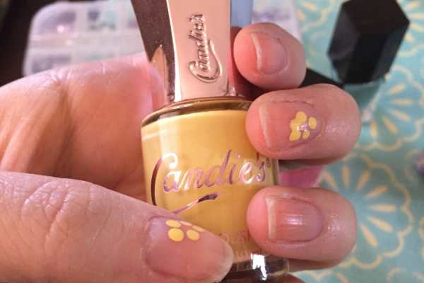
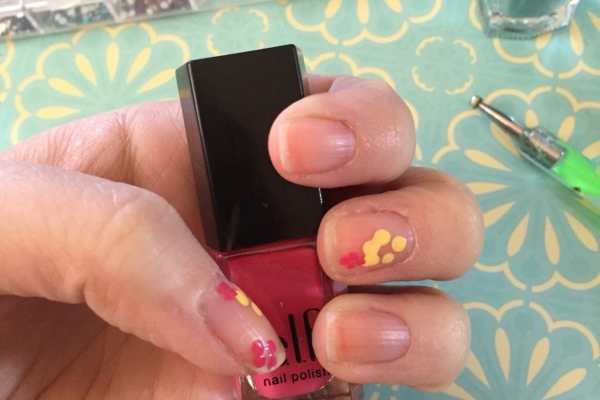
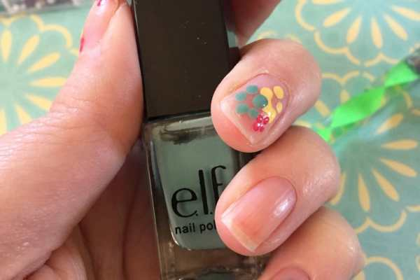
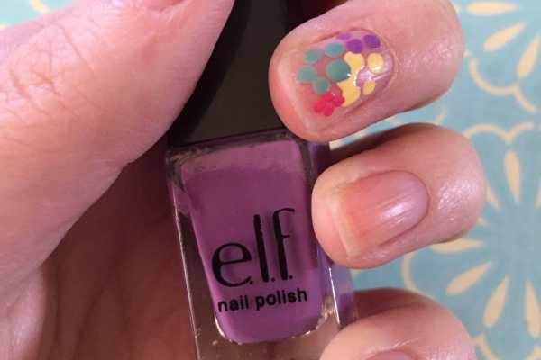
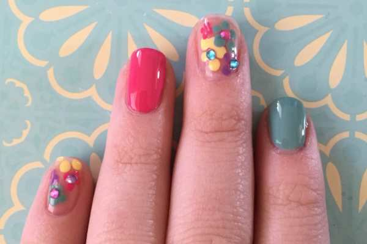
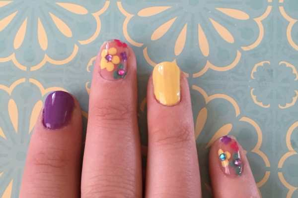
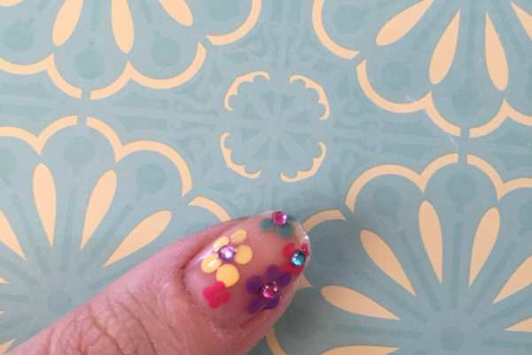
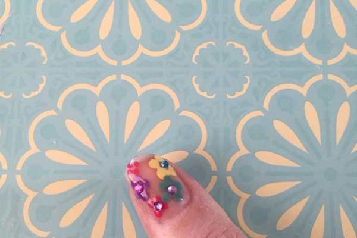
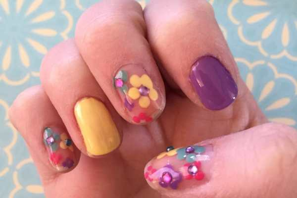
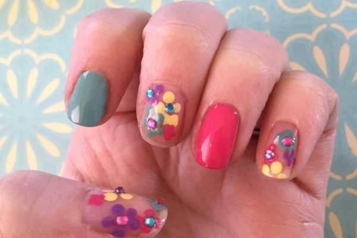

It’s April already! Wow! The year is flying by and the weather is changing every day. I saw tons of beautiful flowers and trees blooming all over this weekend so I figured I may as well try a new Spring Flowers nail art design for Manicure Monday! This one incorporates negative space, happy Spring colors, flowers and rhinestones for a really fun look.

You can use whatever nail polish colors you prefer, but the below picks are the ones I liked for this tutorial.

## Materials:

- Yellow nail polish

- Pink nail polish

- Lavender nail polish

- Light blue nail polish

- Clear top coat

- Dotting tool

- Acrylic nail art rhinestones

## Instructions:

- Begin with clean, dry nails. Pick which you’d like to do flowers on and which you’d like solid. Since I was using four different colors, I decided to do one solid nail of each color and the other six would be floral.

- Use the large end of the dotting tool dipped in your first color, and make 3 to 5 dots in a circle to create a flower. Do this in random spots on each of the nails you’ve designated as “flower nails.” Let dry in between layers.

- Clean off your dotting tool and repeat this process with the other three colors, one at a time. Be sure to flip your dotting tool over and use the smaller end to make tinier flowers, too!

- While your flowers finish drying, do one coat of each solid on your remaining nails. Let dry completely, and do a second coat. Let dry.

- When ALL your nails are COMPLETELY dry (not even tacky!), you may seal in your look with clear polish. If they are still slightly damp, the flower colors will streak into each other and ruin your design!

- With the clear polish still wet, carefully place a nail gem in the center of a few select flowers on each nail. If you have quick drying top coat, make sure you only paint one nail at a time to assure the polish is still wet enough to hold the rhinestone.

- Let your nails dry and then clean up any stray polish from your skin.

- You’re all done! Happy Spring!

What other Spring nail art tutorials would you like to see? Comment below and I’ll try a new one soon!
