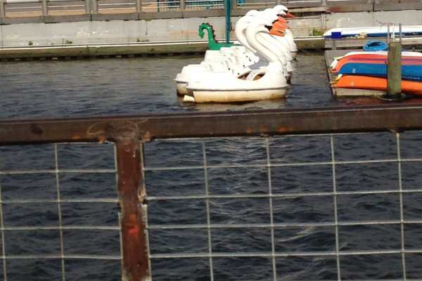
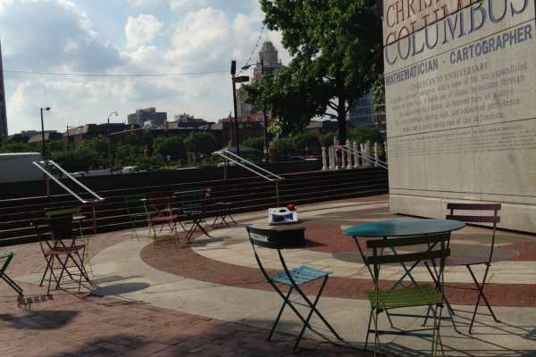
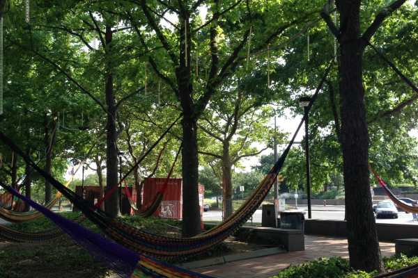
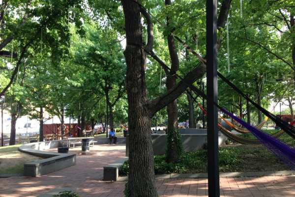

I love living in the city. There is just about everything you could possibly want all within walking distance. Still, there are certain things I miss about living in Jersey and having a car. Especially in the summer. Especially when it involved a random boardwalk trip. Luckily, Philly came up with a wonderful summertime idea: a pop up boardwalk/harbor/awesome place to hang out, drink beer and have funnel cake!

Since my sister is visiting for the week, we grabbed a friend and headed over to

[**Harbor Park**](http://www.delawareriverwaterfront.com/places/spruce-street-harbor-park "Spruce Street Harbor Park")

to see what the new spot was all about! It just opened a few days ago, so we assumed it would be pretty packed and went before everyone got out of work. It was definitely the way to go! We got to see everything without a ton of people crowding us, which also meant for better photos! It was a really hot day so we grabbed some beers and sat on the floating faux-beach-picnic-area-jobber! Then we swung on the hammocks (of which there are dozens!) until I got yelled at for swinging. Womp womp. Here are all our photos from the afternoon!

Here I am, sending Husband pics of the place!

And here Sister is… being Sister!

Spruce Street Harbor Park is only open through August, so if you’re in the Philly area this summer, come check it out! 🙂
