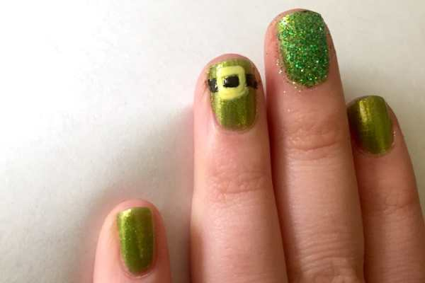
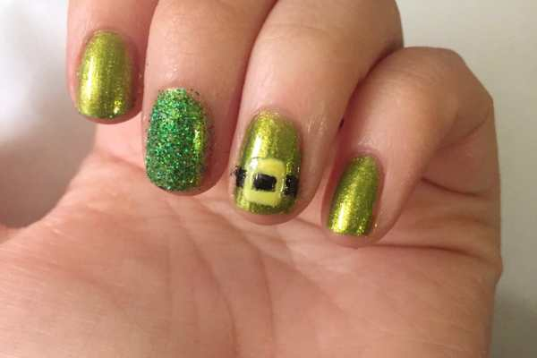
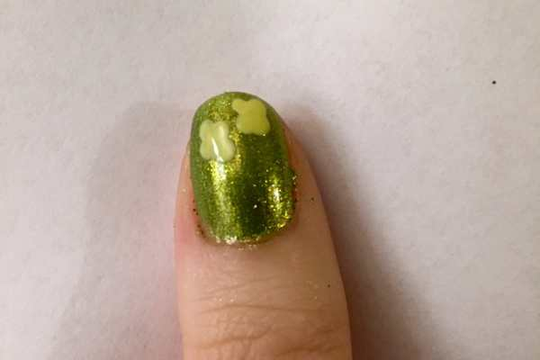
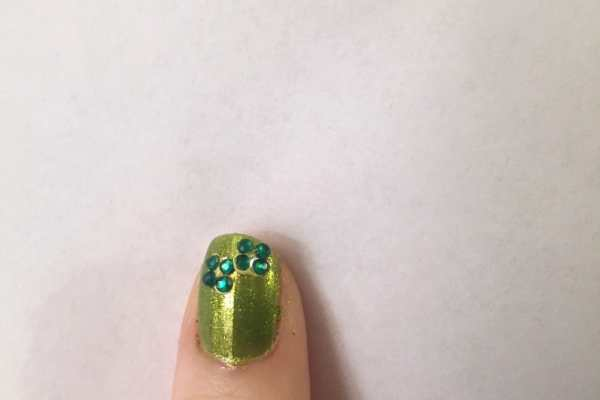
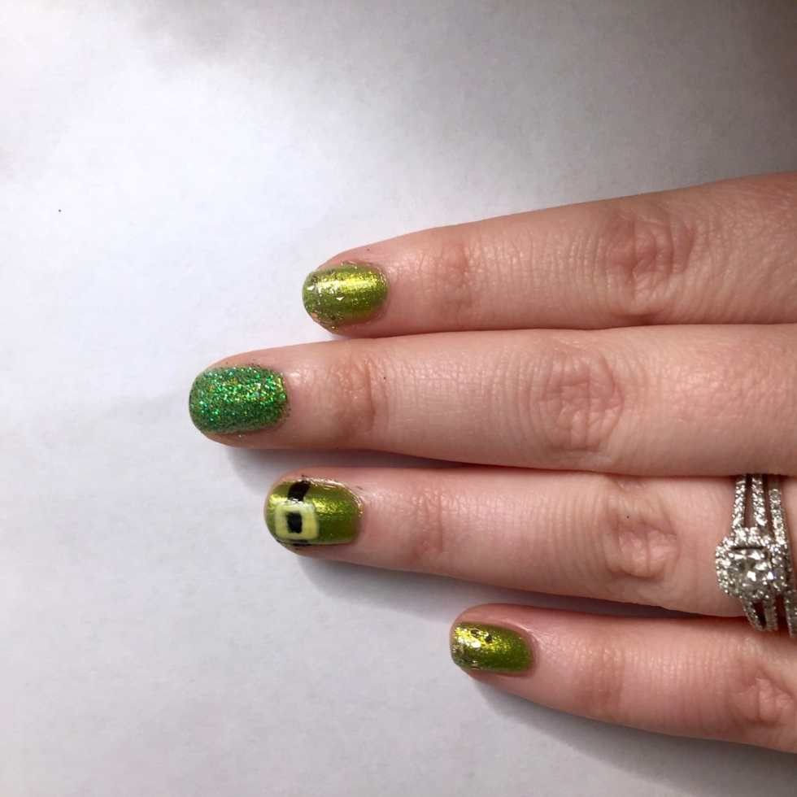

I’ve rocked some pretty cute nail art designs for St. Patrick’s Days past (remember my

**[Classy Clovers](/blog/nail-art-classy-clovers/)**

and

**[Plaid and Shamrocks](/blog/st-patricks-day-nail-art-design-plaid-and-shamrocks/)**

looks?), so I obviously had to come up with something adorable for this year too! I took my inspiration from the buckle on a Leprechaun’s hat for this year’s look and am loving my St. Paddy’s Nail Art for 2016!

## Materials:

- Green nail polish (I used a shimmery one from Julep!)

- Yellow nail polish

- Black nail polish

- Gold chunky glitter polish

- Green glitter, extra fine

- Dotting tool

- Nail art brush

- Clear top coat

- Green rhinestones

## Instructions:

- Begin with clean, dry nails. Do one to two coats of your green nail polish as a base. Let dry completely before going on to next steps.

- Decide which nails will be the different accents, then pick which one you’d like to begin with. I started with my glittered nail.

- Do a coat of clear polish on your chosen nail and while it is still wet, gently tap the green glitter all over the nail. Let it dry for a minute, and then carefully shake off excess. There will be some on your skin, but it will wipe off easily- don’t worry!

* Next I did the buckle nail. You can do the black strap part first or the yellow/gold buckle part first, depending on what kind of polish you use. My yellow polish is a little transparent, so I knew the black would show underneath it if I drew the buckle right on top. That’s why I decided to do the buckle first and paint the black belt behind it. It took a little more work but it wasn’t hard! Use your nail art brush or dotting tool dipped in yellow to draw the lines to make it.

- When the yellow is dry, clean your nail art brush and dip it in the black polish. Carefully fill in the middle of the buckle and then draw two lines to complete the belt. Don’t worry if it looks imperfect or bumpy at all- when you seal it with clear coat later on, that will all be smoothed out.

- Next it is time for the little shamrocks on your thumb. I used the dotting tool to create them in the yellow nail polish and added the rhinestones right on top while the yellow was still wet. You can do the same thing with the green polish you used as your base if you do not want yellow showing through.

- Lastly, use your chunky gold glitter for your remaining nails. Start at the tip and swipe down. Let dry, and repeat, concentrating the glitter towards the top to create a gradient.

* Let your nails dry completely (110%!) before you seal each nail in clear nail polish. When that is dry, you can clean up the bits that are still on your skin.

Enjoy your green and gold nails and have a Happy St. Patrick’s Day, whether you’re Irish or not!
