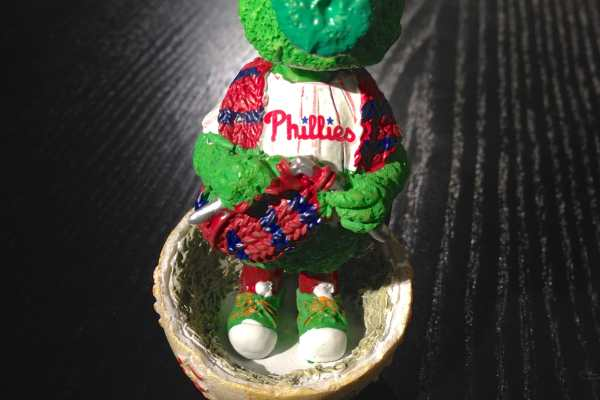
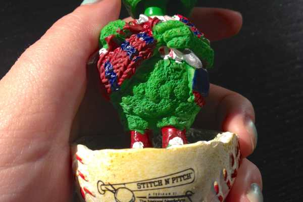

Stitch N’ Pitch Phillies Game

[The National NeedleArts Association (TNNA)](http://www.tnna.org/ "The National Needlearts Association")

sponsors a Stitch N’ Pitch night at a Phillies game each year and this year the Husband and I went! I packed my yarn and crochet hooks and half-watched the game against the Astros last Wednesday (which we won, btw!) while hanging out amongst other crafty Phillies lovers. It was quite fun!

We unfortunately had to leave the game early because we had to get home and clean like crazy since they were showing our apartment mega early the next morning and it was oh-so-unpresentable for strangers to walk through, but the 7.5 innings we caught were great. I even put away my yarn and needles long enough to have some ice cream in a little Phillies hat (my fave!) Even though we left early, I made sure to collect the fun goodies that TNNA provided! An awesome tote bag (which will become my new official bag for Knitting Class on Thursdays!), cups for both me and the Husband, and the most adorable little Phanatic bobblehead (pictured below)! He’s knitting a scarf. I love him, so much.

I wish I took more photos during the night (I usually take a TON during games), but my hands were occupied by yarn! I’ll definitely go again next year, and hopefully will remember to take more photos next round. 🙂

Me & Husband!

Have you ever gone to a sponsored Stitch N’ Pitch baseball game before?
