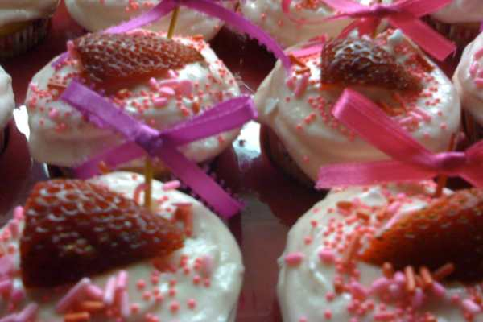
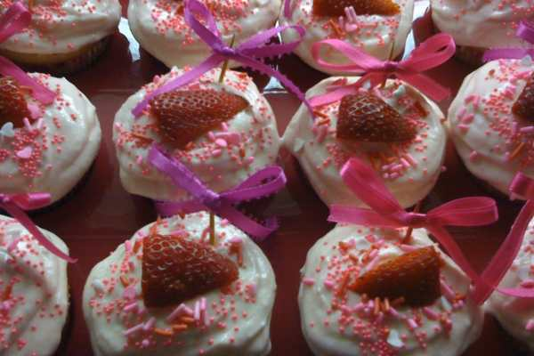

Recipe: Strawberry Daiquiri Cupcakes

Today is my sister’s birthday! (Happy Birthday, Jess!) To celebrate, I’m sharing one of my (and her!) favorite cupcake recipes with you! In fact, when it’s my Dad’s birthday in 10 days, and the Husband’s birthday in two weeks, I will also share cupcake recipes! You’ll be so cupcake’d out by the end of May, you won’t want to see another recipe for awhile!

These cupcakes are a perfect summer treat! Even better, it’s a cheat recipe! Using a boxed cake as your base makes this one super easy. Pair them up with some real daiquiris and some good friends, and you’ve got yourself a party.

My cupcakes were “virgin,” but you can certainly add a little clear alcohol (white rum, vodka) to the batter/icing to spice it up a bit.

## Ingredients:

- One box of white cake mix

- ¾ can of Bacardi Strawberry Margarita/Daiquiri frozen mix

- vegetable oil and egg whites, as they call for on the box

- 1 (8oz) container frozen whipped topping, such as Cool Whip

- Strawberries for garnish

- Strawberry syrup/liqueur

- Coarse sugar crystals

- Umbrellas/straws (optional, but adorable!)

## Instructions:

- Line your cupcake tin with papers and preheat your oven to 350°F.

* In a large bowl, add cake mix, the strawberry daiquiri mix, oil & eggs. Beat together for a few minutes and pour into your cupcake wrappers.

- Bake approximately 15-17 minutes. Cupcakes will be extremely moist and sticky because of the daiquiri mix. This is normal- don’t mistake it for undercooked and over bake them!

* While cupcakes cool, using a low setting on your mixer, beat together the Cool Whip and a shot of strawberry syrup/liqueur.

- Frost cupcakes generously, making sure to cover entire cupcake.

* Roll cupcake’s rim in sugar to mimic the sugar crystals on a cocktail glass. Cut a straw in half or use an umbrella to make cupcake more cocktail-like. Slice a strawberry for garnish.

Hope you enjoyed my strawberry daiquiri cupcake recipe! If you try it out, tell me in the comments!

## Tips:

- Skip the Cool Whip and make your own whipped cream for the frosting! Just be sure to serve them quickly as the Cool Whip will stay longer than the fresh whipped cream will!

- I didn’t have Strawberry syrup on hand when I made them last time, so I used Raspberry instead. It was just as good and you couldn’t really taste the difference!

- For a kid’s party, I nixed the daiquiri feel and used toothpicks, ribbon and pink and purple sprinkles to make them as adorable as my little cousin! Check them out below!

