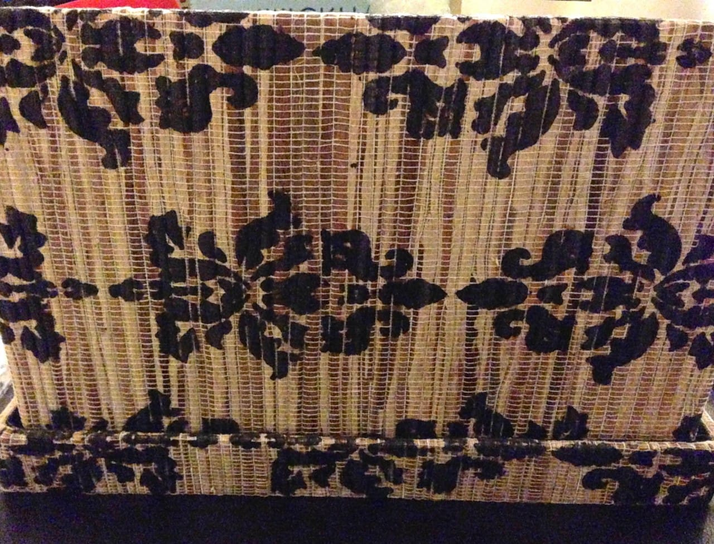
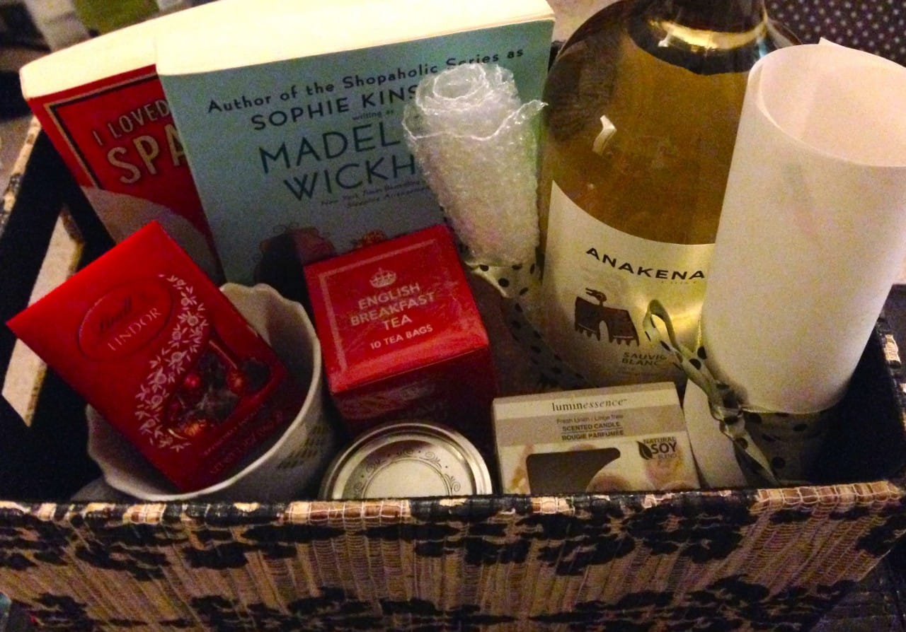
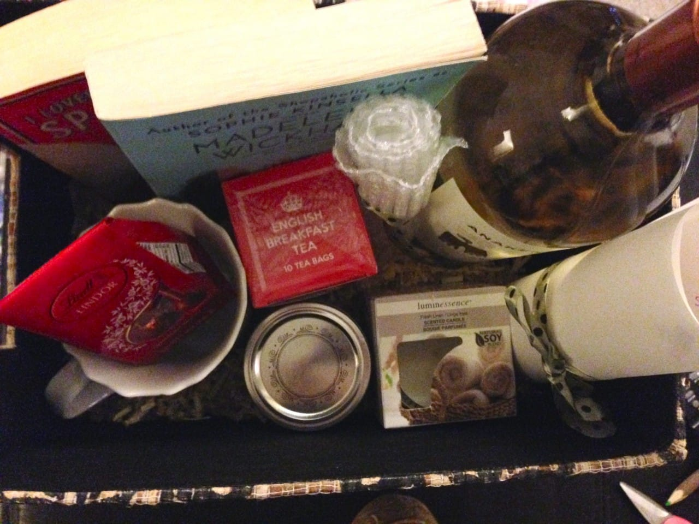

Project: Stress Relief Basket (+ Lavender Bath Salt Tutorial!)

On Sunday, we celebrated my oldest friend, Krystal, at her bridal shower! I put together some decorations, the centerpieces and a few extras (which I’ll show throughout the week!) I know how stressed I was in the month before my wedding, so I wanted to help her out with a basket filled with stress relieving goodies!

I really wanted to pull together things that would make Krystal feel better, or at least forget about wedding-stress-blues momentarily over the next few weeks as her big day approaches. It took me a few days to figure out what I wanted to put in the basket, but I think it came out pretty well!

This basket is less of a how-to project and more of a this-is-what-I-bought-to-put-in-the-basket. I DID make the bath salt though, so I’ll tell you how to make that!

First, let’s talk about how cute this basket is. It was one of those really awesome Marshalls finds that happens occasionally! If there were two, I would have picked one up for myself as well. The pattern, the material. I just love it. It’s so pretty!

## Contents of the basket…

- Two adorable books that are easy to read and fluffy to take her mind off drama! The first is

  [“The Wedding Girl” by Madeleine Wickham](http://amzn.to/1nF71EN "The Wedding Girl by Madeliene Wickham")

  . The second is

  [“I Loved, I Lost, I Made Spaghetti” by Giulia Melucci](http://amzn.to/1enylkH "I Lived, I Lost, I Made Spaghetti by Giulia Melucci")

  . Both are great reads that I definitely recommend!

- A cute little mug for tea, with little birds on it (she’s obsessed with birds!)

- A box of English Breakfast Tea to sip while reading

- Some Lindt chocolate truffles, because, um, chocolate!

- A little candle, scented like fresh linen (my favorite!)

- Bubble wrap to pop when stressed

- Lavender bath salts for a soothing bath

- A gigantic bottle of wine for when all else fails!

I decorated a sheet of paper with a list of the items in the basket and a little love note and rolled it up scroll-style to stick inside.

Now on to the lavender bath salt tutorial! This is SO EASY. I didn’t take pictures of it, but you really don’t need any. Just follow the instructions below!

## Materials:

- Epson Salt, 2 parts

- Course Sea Salt, 1 part

- Dried Lavender, 1 or 2 tsp(s)

## Instructions:

- Mix both salts and dried lavender together. Stick in mason jar. BOOM!

- To use, sprinkle in warm bath water. Relax and enjoy!

I hope the basket brings my darling friend a few minutes of peace in the weeks to come! What would you put in your stress relief basket?
