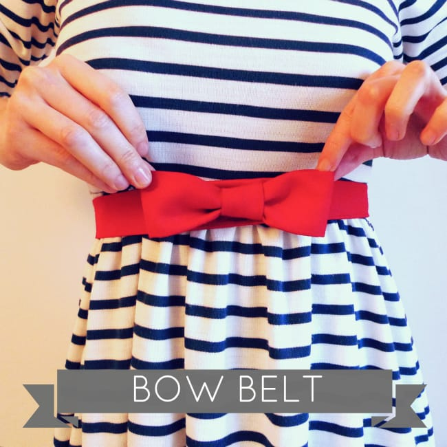

Happy Sunday!

Each Sunday, I will have a

**“Sunday Funday”**

post, where I fill in my favorite things for each week in five categories.

They’ll be flexible, but they’ll basically be as follows:

1. **Makes Me Laugh**

   – (think YouTube and think cat videos… probably for most of the time!)

2. **What I’m Reading**

   – a book, article or snippet I read this week that I loved

3. **Place I Love**

   – a place, past or present, that I’ve visited and adored

4. **Something Delicious**

   – something completely tasty that I either ate this week, or found the recipe for and cannot wait to try making

5. **Project That Inspires**

   – this will be a project, craft or the like that I’ve found and draw inspiration from. Maybe it will be something I try in the future! If you have ideas for this or want one of your projects to be considered (and your blog linked to it), just send me an email!

Without further ado, let us get on with

**Sunday Funday: Issue 1!**

## Makes Me Laugh: Smitten – Simon’s Cat (A Valentine’s Special)

Ahhh

[**Simon’s Cat**](http://www.youtube.com/user/simonscat?feature=watch "Simon's Cat")

! How I love you. A new Valentine’s short was posted this week that was adorable, so I must share it with you!

## What I’m Reading: “Meet Me at the Cupcake Café” by Jenny Colgan

Right now, I’m smack in the middle of a cute book by

**Jenny Colgan**

called

[**“Meet Me at the Cupcake Café.”**](http://amzn.to/1erpp9m)

It’s about a woman who is passionate for baking and decides to open a café after being laid off her desk job. It’s super cute and fluffy- just the type of reading I’m in to lately. Anything that’s heavy or makes me cry just isn’t in the cards right now.

**Bonus:**

Included before every chapter of this book is a delicious recipe! I’ll certainly be trying some out.

## Place I Love: Plenty Café!

[**Plenty**](http://www.plentyphiladelphia.com/ "Plenty Cafe Philadelphia")

is my absolute favorite coffee shop here in Rittenhouse, and conveniently only a block away. The Husband (in the black coat standing at the counter!) and I are obsessed and go there many, many times a week. Sometimes we bring along our books to read or our laptops to work. It’s lovely.

## Something Delicious: Café Mocha & Lemon Macaron!

[**Plenty**](http://www.plentyphiladelphia.com/ "Plenty Cafe Philadelphia")

(in addition to amazing food and being one of my favorite places to visit) has the best café mocha

**ever**

(made with homemade chocolate!) and this week they also happened to have macarons, too! My favorite coffee AND my favorite dessert? Perfection.

## Project That Inspires: Bow Belt by Tilly and the Buttons

I really want to start making cute belts for dresses before the Spring weather hits, and am totally in love with this

**[Bow Belt by Tilly and the Buttons](http://www.tillyandthebuttons.com "Tilly and the Buttons")!**

Check out her

**[tutorial](http://www.tillyandthebuttons.com/2010/06/bow-belt-tutorial.html "Tilly and the Buttons - Bow Belt Tutorial")**

for instructions on how to make your own!

That’s it for this issue of Sunday Funday! Hope you liked it! Have a loverly day!
