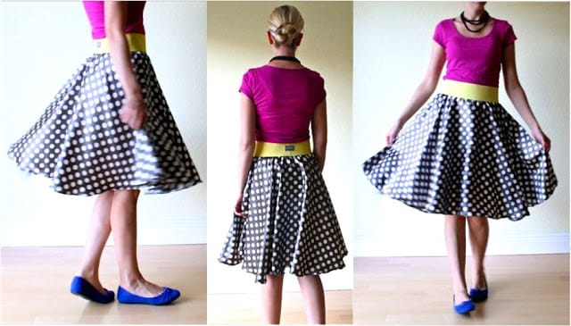

My hope is that while this post is being published, I’m still in bed catching up on sleep! Big dreams. I’m also hoping that today I can get a lot done with my craft projects for the week, and finally (hopefully) get up photos from my honeymoon

**six months**

ago that I have been dragging my feet on uploading. I’ll have to do a post with pics from it, because it was a gorgeous trip \[

_to Italy_

]!

## Makes Me Laugh: Whack-a-~~Mole~~Cat

YET another thing Husband sent me! I was dying. It’s just so cute! I think I could watch it for hours!

## What I’m Reading: Open Source Seed Initiative

So I had no idea that some plants and seeds had patents on them!? They are seeds! Well, they do. With this new

[Open Source Seed Initiative](http://arstechnica.com/business/2014/04/open-source-comes-to-farms-with-restriction-free-seeds/?utm_source=feedburner\&utm_medium=feed\&utm_campaign=Feed%3A+arstechnica%2Findex+%28Ars+Technica+-+All+content%29 "Open Source Seeds")

, there are 29 kinds of plant varieties for farmers to use. Pretty interesting read!

\
Place I Love: Open House
------------------------

There’s this little shop by our apartment that I just adore called

[Open House](http://openhouseliving.com/ "Open House in Philly")

! It has really sweet handmade items, fun crafty housewares, stationary and jewelry, and a ton more! I just love it! Be sure to check out their

[blog here](http://www.openhouseliving.blogspot.com/ "Open House Blog")

. It’s also run by the same people who dreamt up one of my favorite restaurants,

[Barbuzzo](http://www.barbuzzo.com/ "Barbuzzo")

, so that helps. 😉

## Something Delicious: TBM Flatbread w/ Chicken from Fuel

I love pretty much everything from

[Fuel](http://www.fuelrechargeyourself.com/index.php "Fuel Philly")

, but this is the best! It’s tomato, basil pesto, mozzarella and grilled chicken on a flatbread. It’s exactly as amazing as it looks.

T.B.M. 8.95

400 Cals. 19g pro.

Sliced Tomato, Basil Pesto, Homemade Mozzarella

- – See more at: http\://www\.fuelrechargeyourself.com/menu.php#comingsoon

- See more at: http\://www\.fuelrechargeyourself.com/menu.php#comingsoon

T.B.M. 8.95

400 Cals. 19g pro.

Sliced Tomato, Basil Pesto, Homemade Mozzarella

- – See more at: http\://www\.fuelrechargeyourself.com/menu.php#comingsoon

- See more at: http\://www\.fuelrechargeyourself.com/menu.php#comingsoon

## Project That Inspires: Circle Skirt by Made

Dana over at

[Made](http://www.danamadeit.com/2008/07/tutorial-the-circle-skirt.html "Dana Made It")

has a great tutorial for a circle skirt, which is my next obstacle to try! I am kind of obsessed with them, and am hoping to make and perfect it quickly enough that I can fill up my summer wardrobe with them! Wish me luck!

That’s all for today! Happy Sunday!
