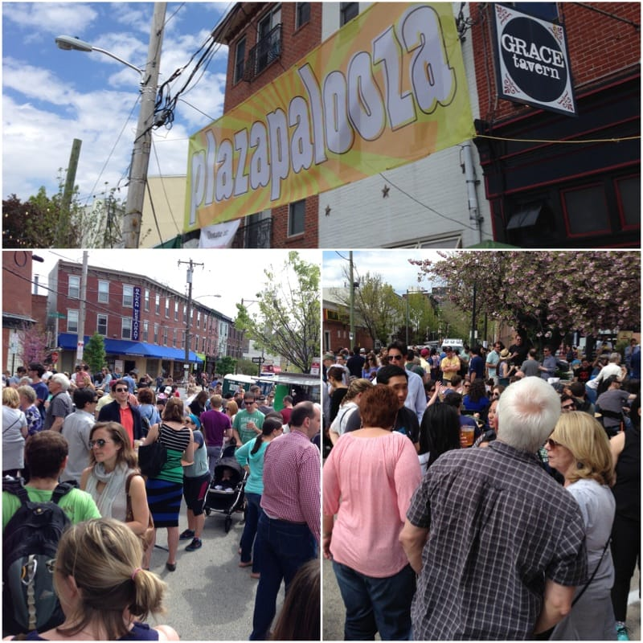
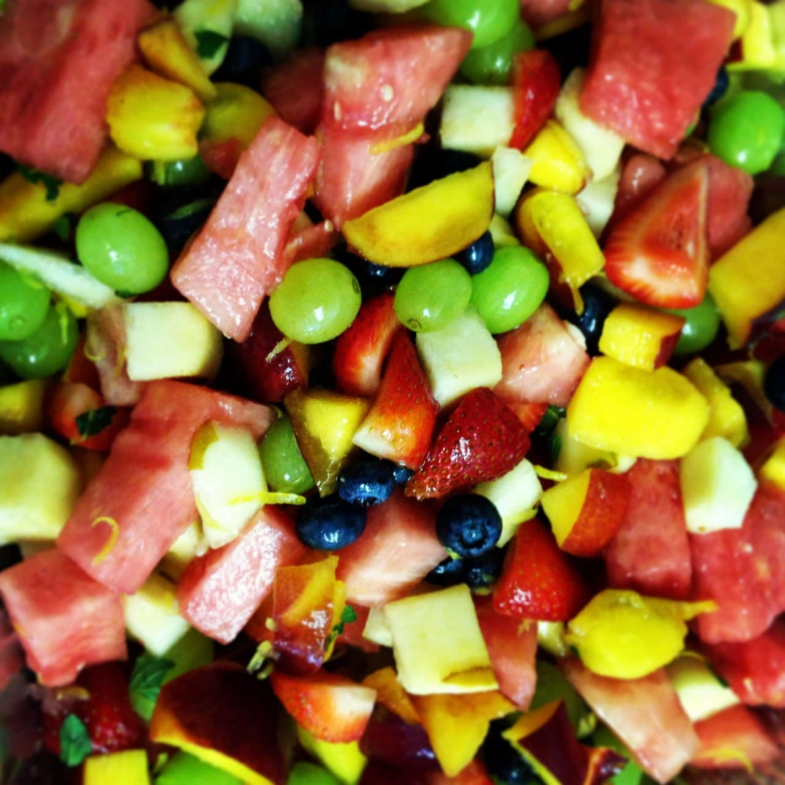
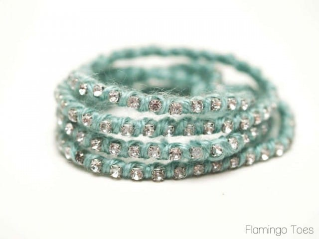

What a lovely weekend! The first we didn’t spend traveling all over the place (though it was still quite busy!) Once May hits in Philly, it’s officially festival season. Usually the festivals are spread out across the summer, but yesterday there happened to be at least 5 on the same day at the same time! I only hit up two of them (then was sunburned and needed to go home and nap) but it was great just the same! While I hustle to get Monday’s post ready to roll, you can read about the festivals I attended in Sunday Funday: Issue 12!

## Makes Me Laugh: Adult Cat Finder

Seriously, I don’t know where Husband finds these things, but the majority of the silliness I blog about are things he sent me. This is no exception. Find hot local cats in your area!

[Right meow!](http://adultcatfinder.com/ "Adult Cat Finder")

## What I’m Reading: Blog Life from A Beautiful Mess

I’m currently devouring the newest e-book course, ‘Blog Life,’ from the talented crew over at

[A Beautiful Mess](http://abeautifulmess.com/ "A Beautiful Mess")

! My sketchbook is filled with their ‘homework’ and I’m taking it all in to try and get tips and tricks to make Katie Crafts the best it can be!

## Place I Love: Philadelphia in May!

As I mentioned earlier, festival season is in full force! Yesterday I went to Rittenhouse Row Spring Festival as well as Plazapalooza! Rittenhouse Fest was C-R-A-Z-Y packed, so we got through it as quickly as we could, eating up every fancy slider, mini crab cake and bourbon pulled pork sandwich we could fit in our bellies! Then we headed to Plazapalooza to hang out with some friends, sip beer and chat! We missed South Street Headhouse Spring Festival,

[Science Festival](http://www.philasciencefestival.org/ "Philadelphia Science Festival")

and the giant Flea Market we always attend that wraps around the

[Penitentiary](http://www.easternstate.org/ "Eastern State Pen")

, but concessions had to be made since everything was being held at once!

## Something Delicious: Summer Fruit Salad

I made this

[summer fruit salad](http://allrecipes.com/recipe/summer-fruit-salad-with-a-lemon-honey-and-mint-dressing/ "Summer Fruit Salad")

last year for our annual Fourth of July picnic and it was soooooo good! We had a chocolate mint plant (that was a trooper til we went to Italy for two weeks, then it committed suicide) and I was researching recipes that used it when I came across this. I didn’t halve the grapes, and I added blueberries and it was great! The ‘dressing’ comprised of honey, lemon juice and mint really brought out all the flavors. It was very refreshing!

## Project That Inspires:

Motivated by my

[DIY turban headband](/blog/diy-turban-headband-tutorial/ "DIY Turban Headband Tutorial")

from the other day, I decided to search the webs for other Anthropologie-inspired tutorials that I could try out myself! I found this amazing website devoted to all things knock off, appropriately named

[Copycat Crafts](http://www.copycatcrafts.com "Copycat Crafts")

! There is a

_whole collection_

of Anthropologie-style tutorials there! The first one I think I’ll try is this Sparkled Silk Wrap Bracelet, courtesy of

[Flamingo Toes](http://www.flamingotoes.com/2012/11/anthro-knockoff-sparkled-silk-wrap-bracelet/ "Flamingo Toes")

! Can’t wait!

Next weekend will be even busier! Friday we are hitting up the Rittenhouse Park Craft Fair and then drinks in our friend’s backyard, followed by dinner! Saturday we are going to hit up every vendor at Art Star Craft Bazaar (yayay!!! I’ll definitely do a full post on this!) and Sunday is our friend’s wedding! Woo hoo! I’m getting tired just thinking about it all. But that’s okay, because a few short days after it, Husband and I will be on a plane with two of our friends heading to New Orleans for a relaxing long weekend! I guess that means my next two weeks straight are gonna be quite crazy. Hope yours are equally as amazing!
