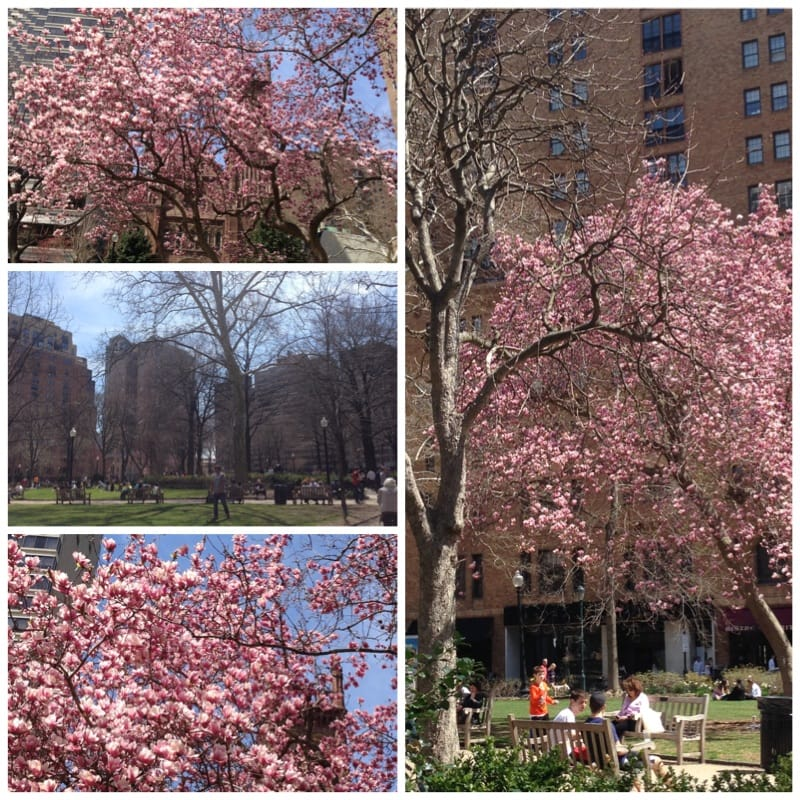
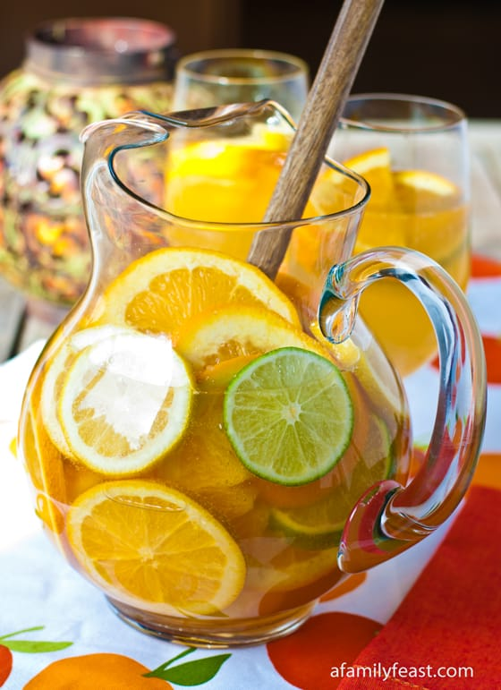
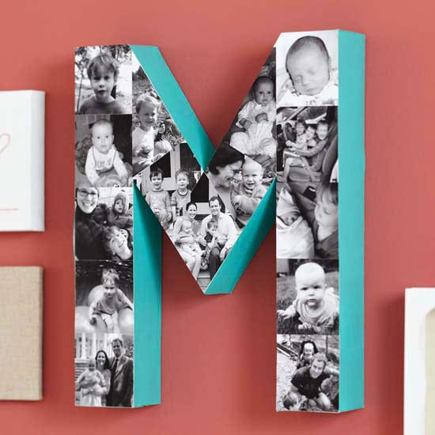

Happy Mother’s Day, Katie Crafts readers who are proud mamas! Today we celebrate you! In this special Mom edition of Sunday Funday, each of the categories will relate to all things “mom”! Hope you enjoy them, and hope your day is as special as you are!

## Makes Me Laugh: “Sometimes When I Open My Mouth, My Mother Comes Out.”

This is SO TRUE! I used to make fun of her for saying the word “neat”. It was her favorite word, and I was always telling her she sounded so old when she used it. “Be cool, Mom! No one says the word ‘neat’ anymore!” Now it’s one of my favorite words to use. I find myself talking more and more like her lately. She’s probably up there laughing at me!

## What I’m Reading: History of Mother’s Day

You may know a little

[history](http://www.history.com/topics/holidays/mothers-day "History behind Mother's Day")

behind Mother’s Day already, but here’s a refresher! Anna Jarvis, the one who initially petitioned for and thus created “Mother’s Day” in the early 1900s, spend the latter half of her life trying to abolish it! Find out why in this short really interesting video!

## Place I Love: Rittenhouse Square Park

It’s hard to pick a place that is “motherhood” related, so I’m picking one of my own absolute favorites: Rittenhouse Square. Every Spring when the magnolia trees bloomed, I’d send photos to my mom of them. She was always in awe of how gorgeous they were. Additionally, Husband and I love grabbing a book and a snack and sitting in the park reading on a bench or picnic blanket for hours on end, as moms and their babies run around laughing and playing near us. It’s pretty great!

## Something Delicious: White Wine Sangria

So I can’t find a recipe that is exactly the one my Mom loved, but

[this one](http://www.afamilyfeast.com/white-wine-sangria/ "White Wine Sangria on A Family Feast")

is pretty close, with a few differences! We would also add peaches, a shot of brandy, two shots of peach schnapps and some orange juice! We’d mix all the ingredients together except the OJ and ginger ale, and let it sit over night so the fruit could soak it all up. Then, upon serving, we’d add equal parts OJ and ginger ale into our cups- that way, everyone could dilute it as much as they preferred. Whenever I was coming home for the weekend, Mom would be sure to have a batch in the fridge waiting. In fact, it was the first thing we drank together after waiting for weeks and weeks for her to be cleared after chemo and radiation. It’s a great summer drink- I recommend everyone try it!

## 

## Project That Inspires: Black-and-White Photo Collage

This would make a great gift for a mom of any age! It could even act as a family tree of sorts. I always find awesome projects at

[Better Homes & Gardens!](http://www.bhg.com/holidays/mothers-day/gifts/mothers-day-photo-gifts/ "Better Homes and Gardens")

Happy Mother’s Day everyone!
