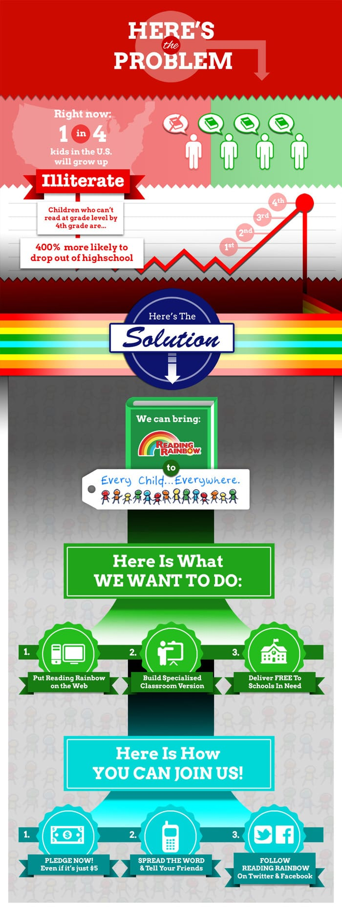
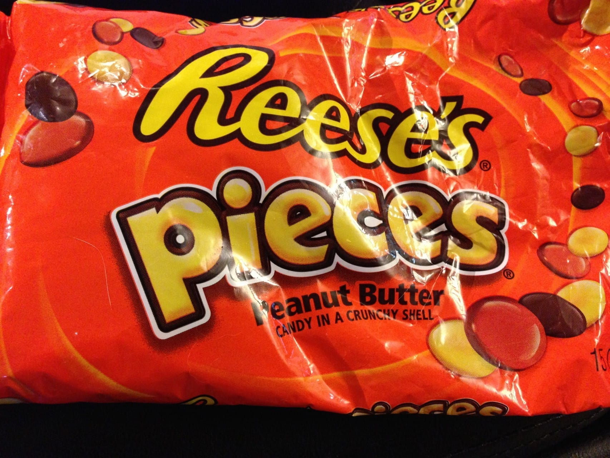
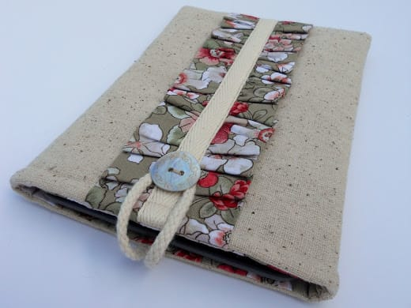

What a lovely weekend! Friday was off to a rough start. We had so many issues with the car we rented for the day, we had to take it back and switch to a new car which put a huge dent in our day. We also spent a good hour at PennDot getting new licenses since Husband’s was about to expire. That gave me the chance to officially (finally) change my last name to his, so there’s that! We went on to spend the remainder of the evening wandering around New Hope (full post on that tomorrow!) and having an awesome sushi/hibachi dinner! Saturday was spent at Reading Terminal Market and reading books in Washington Square Park. Well, I read. Husband fell asleep! Today we’re going for pedicures (yippee) before what I hope is the continuation of a relaxing birthday weekend for the Husband. I hope your Sunday is wonderful, too! Here are my weekly picks- hope you like ’em!

## Makes Me Laugh:Aug(De)Mented Reality

What fun! Artist “Hombre McSteez” takes some transparent cels, a marker and white out to create the most wonderful animated cartoon creatures. Don’t take my word for it- go watch! Then follow him on

[Instagram](http://instagram.com/hombre_mcsteez# "Hombre McSteez")

for more fun!

## What I’m Reading: Reading Rainbow Kickstarter

I really don’t back things on Kickstarter too often. Either I find the project to be totally ridiculous and absolutely not worth the money it’s asking for at ALL, or I simply can’t afford to. That being said, this week I backed a project by LeVar Burton and Reading Rainbow called

[**“Bring Reading Rainbow Back For Every Child, Everywhere.”**](http://kck.st/1kKwSrD "Bring Reading Rainbow To Every Child Everywhere")

I wasn’t the only one who felt it was worthy- it hit it’s goal of one million dollars just 11 hours in to posting! Just a couple of days later it has over 70,000 backers and has made over 3 million dollars. There are still 30 days left to go- let’s hope it breaks all Kickstarter records over the next month! Here’s why you should support this very important project, too!

## Place I Love: Tuscany

How can anyone say anything bad about somewhere so damn gorgeous!? We stayed in San Gimignano for a few days during our honeymoon, in a farmhouse smack in the middle of a vineyard. The views were just unreal- it was like looking at a postcard. That’s why this week Tuscany is my place I love!

## 

## Something Delicious: Reese’s Pieces!

Sometimes I don’t want something complicated. Sometimes, I just want a handful of Reese’s Pieces. Frozen, of course!

## Project That Inspires: Kindle Cover

Husband got himself a Kindle for his birthday, so I’m busy figuring out what fabric to use on a homemade Kindle cover! I found a tutorial I love over at

[Just Another Hang Up](http://justanotherhangup.blogspot.com/2012/05/ruffled-kindle-case-tutorial.html "Ruffled Kindle Case Tutorial ")

. I’ll obviously eliminate the ruffle for HIS, but will keep it for the one I make my sister! I’m really looking forward to taking a swing at making these. I hope they come out as well as the ones in the tutorial!

