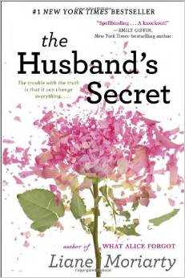
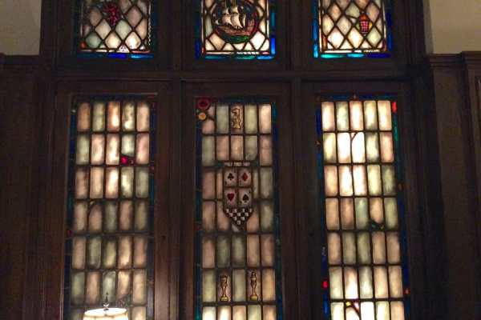
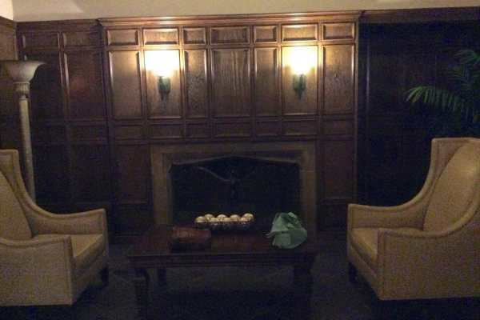
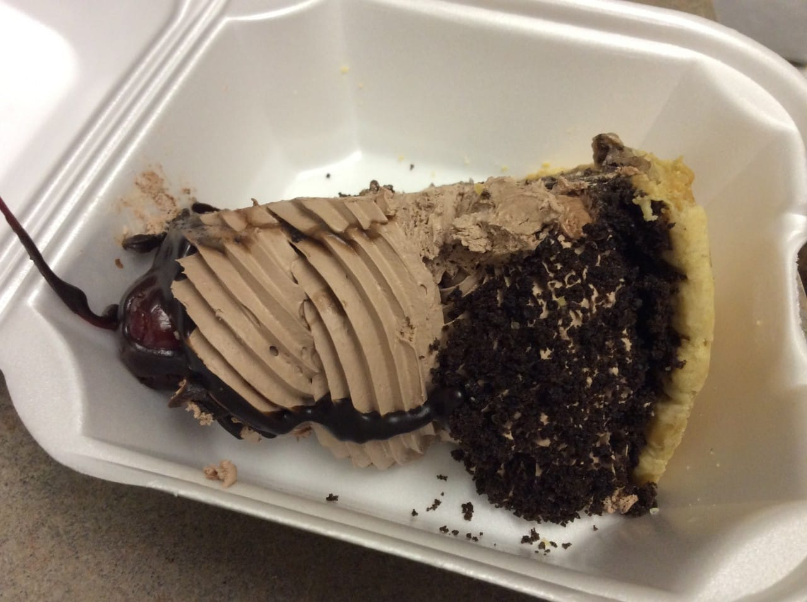
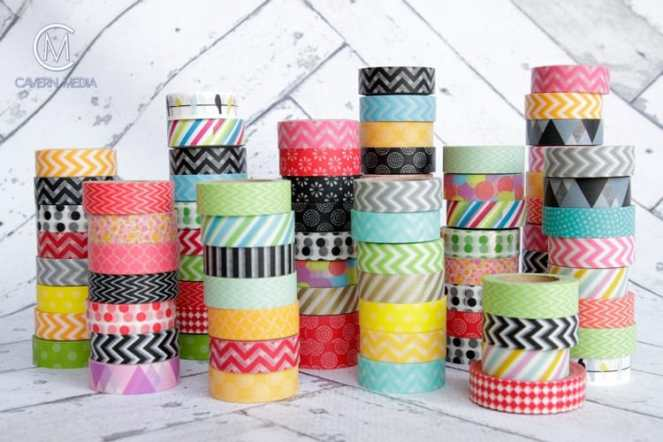

Sunday is here again. It sure seems like the week just flew by! I didn’t get too much accomplished this weekend so far (hopefully I do today!) but I did manage to get my hair cut, along with some summer highlights! Woo woo! Anyway, here are my picks for this Sunday Funday!

## Makes Me Laugh: 1 Minute Old Baby Elephant

Okay, so this one didn’t make me laugh so much as it made me squeal. A one minute old baby elephant!! As if my love for baby elephants could get any greater. I neeeeed him!!! HE’S SMILING!!!

## What I’m Reading: “The Husband’s Secret” by Liane Moriarty

I really just downloaded this book because I forgot to pack my new book in my bag for my train ride last weekend. I found myself at the train station with nothing to read and a three hour trip ahead of me. I opened the Kindle store and one of the first books on it was this one. I only had a few minutes before the train got there and I would lose internet, so I decided to go ahead and buy it. I am totally loving it, though! There are three main characters, each of which are first person tales, who are each going through their own dramas separately, and eventually their paths cross. It’s very well done and I really like it so far- and I’m only halfway through!

> Side Note: Liane Moriarty is the author of another book I bought a few months ago, “What Alice Forgot,” which is currently sitting on my bookshelf as one of the next few books I want to read. I didn’t even realize it when I bought this book. Now I know that one will also be good!

## Place I Love: The Sir Francis Drake Room

Our apartment building has a large lobby with lots of chairs and some coffee tables, but we also have a community room that is super adorable! Our building is a historic one built in 1929 that used to be a hotel. It opened up to the Avenue of the Arts and all the stars, actresses and singers would come from performances and the like to stay in The Drake. The Drake Room was originally a bar where the celebs, both famous and infamous (apparently it was Al Capone’s hang out spot!) would gather for cocktails. The bar itself is still there, complete with big old stools, stained glass windows, couches, tables, and even a working fireplace, though liquor is no longer served. You can rent it out for parties (which I want to do for the Husband’s 30th birthday next year!) or you can relax in a gigantic comfy chair and read for hours. That’s how we spent last night- lounging on the leather chairs working! (I worked- Husband fell asleep!) I just adore it in there!

## 

## Something Delicious: Chocolate Mousse Pie

Sometimes you just want a cup of diner coffee and a slice of chocolate mousse pie. It’s never even AMAZING and it’s typically the same no matter what diner you go to, but sometimes it really hits the spot.

## Project That Inspires: Washi Tape

I can’t say too much about this yet, as a gigantic how-to post is currently in the works, but this week’s project that inspires involves washi tape! Tomorrow I will post 5 adorable uses for the creative tape that hopefully YOU find inspiring. Then maybe you will as excited as I am for my big project post on Friday!

photo courtesy of paxtoncove.com

That is all for today, my friends! Hope your weekend has been great so far!
