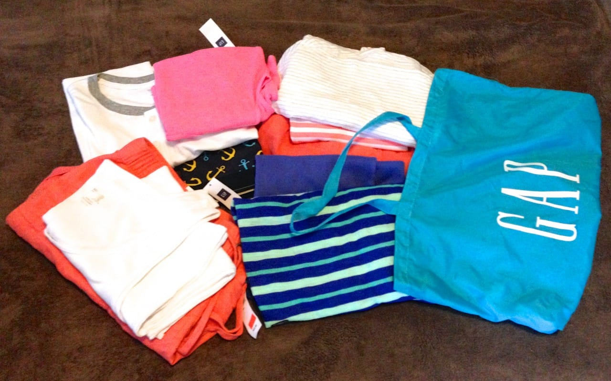
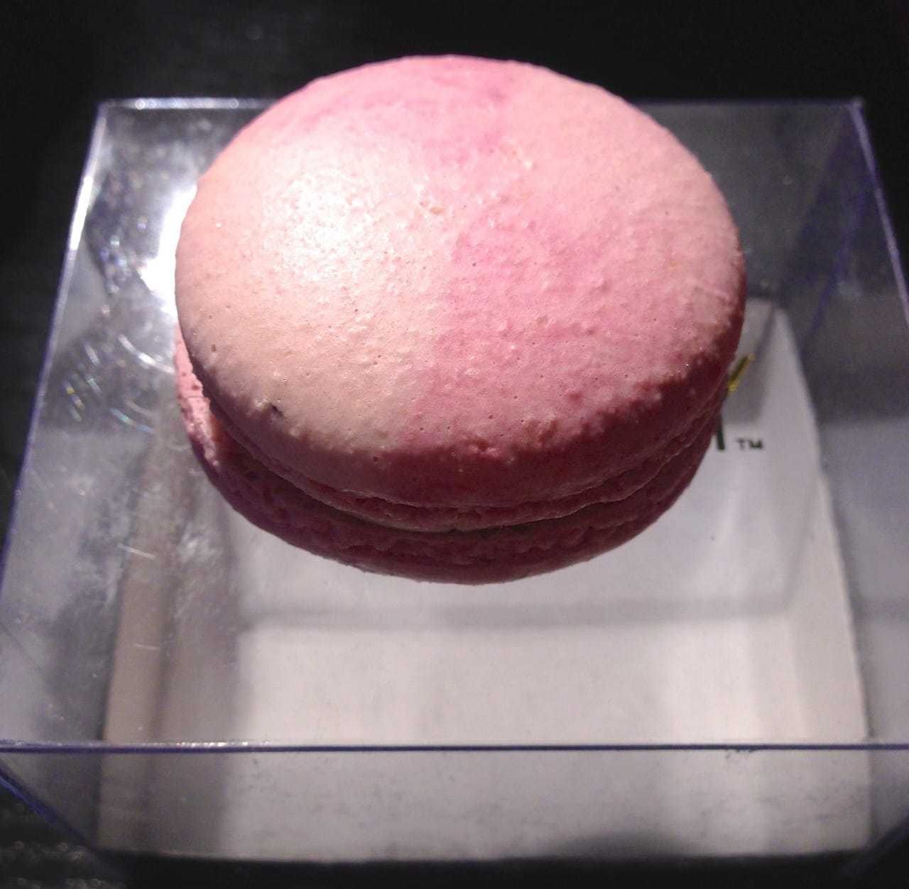
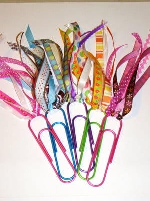

Hello everyone! Today’s Sunday Funday is going to be slightly different. While normally Katie is the one who does these posts, she has been busy getting things ready for the 4th of July picnic coming up and asked me to do it. My name is Jessica and I am Katie’s younger sister by 2 and half years. I am not as crafty as my sister but I can come up with some great poetry or a fictional story when the mood strikes me, so please bear with me for this post. This blog is my very first attempt so I hope you all enjoy it as much as I enjoyed typing it. 🙂

## Makes Me Laugh: Talking Cat – The New Fish Parts 1-3

I love watching videos on YouTube and several years ago I came across these videos. I found them funny back then but stumbled upon them again today so I decided these would be a good way to share the laughter. 🙂

## What I’m Reading: “Crossed” by Ally Condle

My sister mentioned the book

**[“Matched”](/blog/sunday-funday-issue-16/ "Sunday Funday: Issue 16")**

in

**Issue 16**

that she borrowed from me. I know she has been waiting patiently for me to read the next book in the series and this is that book. I am about halfway through it and the author doesn’t disappoint in both plot lines and character development. I strongly suggest you guys check out this series.

## Place I Love: Gap Outlet

Now usually I’m not the biggest fan of shopping and my sister can probably complain to you guys about fights we’ve had about my style of dress when we go somewhere fancy. My sister is really into cute skirts, dresses and pretty blouses while I tend to love graphic tees and jeans. We always tend to have different ideas of where great choices in clothes are but one place I don’t mind going to is the Gap Outlet because it has what we both love. I can get my graphic t-shirts, jeans and a few choice hoodies as well, while she can find the cute clothes she likes. (Shhh don’t tell her, but I tend to under pack my clothes when I visit just for an excuse to go there!)

## Something Delicious: Birthday Cake Macaron made by Dana’s Bakery

While out walking to the post office with my sister we passed by a place that was selling Macarons. As I’m sure my sister has mentioned them before, she got excited and we had to buy some. Well, I chose this one because it sounded the most delicious and indeed it was- with edible glitter to boot.

## Project That Inspires: Jumbo Clip Bookmarks

I found this fun idea for bookmarks on

[Altered to Perfection](http://alteredtoperfection.blogspot.com/2009/01/jumbo-clip-bookmarks.html "Altered to Perfection")

and I really like the way they look. I love to read and I have a bad habit of losing the place I was reading if it’s a paperback book. I have some bookmarks but the paper ones tend to break or get lost very easily. I live in a different state then my sister so when I visit I take the train to see her, but it’s a long train ride. In order to pass the time I usually bring books, but at the last second I can’t find a bookmark of mine so I grab a piece of post it. However, with this idea, not only will I be able to make a quick bookmark but I won’t knock it out and lose my place in the story. 🙂

Thank you guys for taking the time out of your day to read my first blog post. I hope you enjoyed reading it as much as I enjoyed making it and who knows maybe I will make more posts in the future. Hope your Sunday is great!
