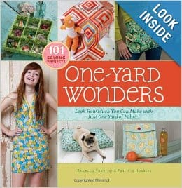
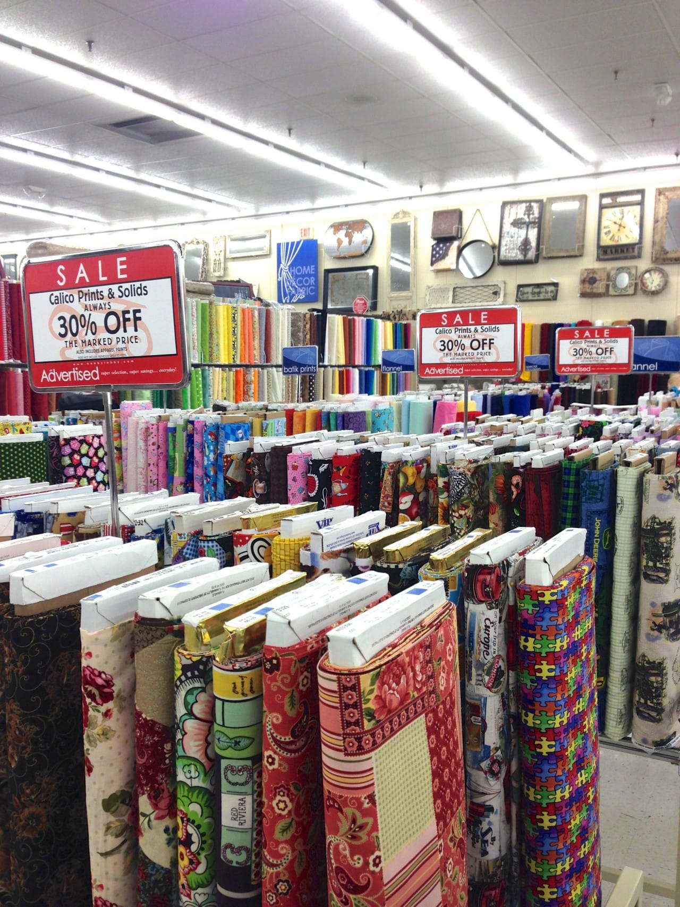
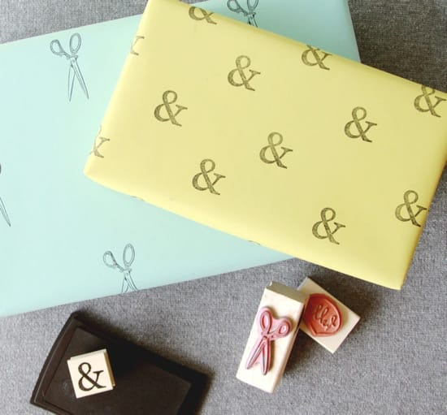

Happy Sunday! Here are the things that I loved this week, despite my mega boring Friday in the courtroom. Hope you are all having a wonderfully lazy day!

## Makes Me Laugh: “It all started this morning when I went on Pinterest.”

Found this pic, of course, on

[**Pinterest**](http://www.pinterest.com/ "Pinterest")

. It’s so perfect. And so, so true.

## What I’m Reading: “One-Yard Wonders” by Rebecca Yaker and Patricia Hoskins

The Husband and I go to

[**Barnes & Noble**](http://www.barnesandnoble.com/ "Barnes and Noble")

probably every other weekend. It’s across the street from our favorite park and we somehow always just wind up inside, spending all our pennies on new books. This week, I picked up

[**“One-Yard Wonders”**](http://amzn.to/1mApHos "One-Yard Wonders on Amazon")

by

**Rebecca Yaker**

and

**Patricia Hoskins**

. I’d seen the book before (and know they have more than one!) but hadn’t picked it up. Well, I finally did and was pretty bummed I hadn’t done so earlier. It’s amazing, has 101 sewing projects in it AND comes with patterns! Now I want to get the rest of their books!

## Place I Love: Hobby Lobby!

Oh,

[**Hobby Lobby**](http://www.hobbylobby.com/home.cfm "Hobby Lobby")

. How you suck me right in every time. I went on Monday to pick up “just a few things” during their big paper crafts sale. $100 later I left with the few items I needed, plus several more I didn’t need, plus 6 new fabrics. There was a sale! And clearance fabrics! Whoops.

## Something Delicious: Piccante Pizza

Every pizza we’ve ever had at

[**Pietro’s**](http://www.pietrospizza.com/ "Pietro's Pizza")

has been amazing- even the wild make-your-own selections we’ve thought up. This was no exception. The description of the Piccante pizza flat out tells you it’s going to be hot, “Spicy ham, aged provolone, crushed red hot peppers, Italian tomatoes,” but for some reason I guess I didn’t believe them. My mouth was pretty fiery the first few bites. Still, it was absolutely delightful. I’d gladly burn my mouth again for another slice.

## Project That Inspires: How To Make Custom Wrapping Paper With Stamps by Paper & Stitch

I still have a ton of stamps and ink left over from all my DIY wedding invites, RSVP cards, thank you’s and decorations (each of which I’ll feature at some point!), and I have been trying to think of another way to use them. This

[DIY wrapping paper project tutorial by**Paper & Stitch**](http://www.papernstitchblog.com/2012/05/16/easy-diy-how-to-stamp-your-own-wrapping-paper/ "DIY Wrapping Paper with Stamps Tutorial by Paper and Stitch")

is perfect! Especially since the week after Christmas I stocked up on solid colored rolls that were on sale in the “holiday” section just because they were plain red, plain green or plain blue. Can’t wait to try this out!

That’s it for Sunday Funday: Issue 2! The rest of my Sunday will be filled up with work, cleaning and laundry! Not the most exciting, but has to be done. What fun things do you have planned for today?
