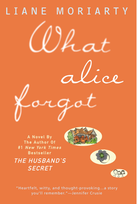
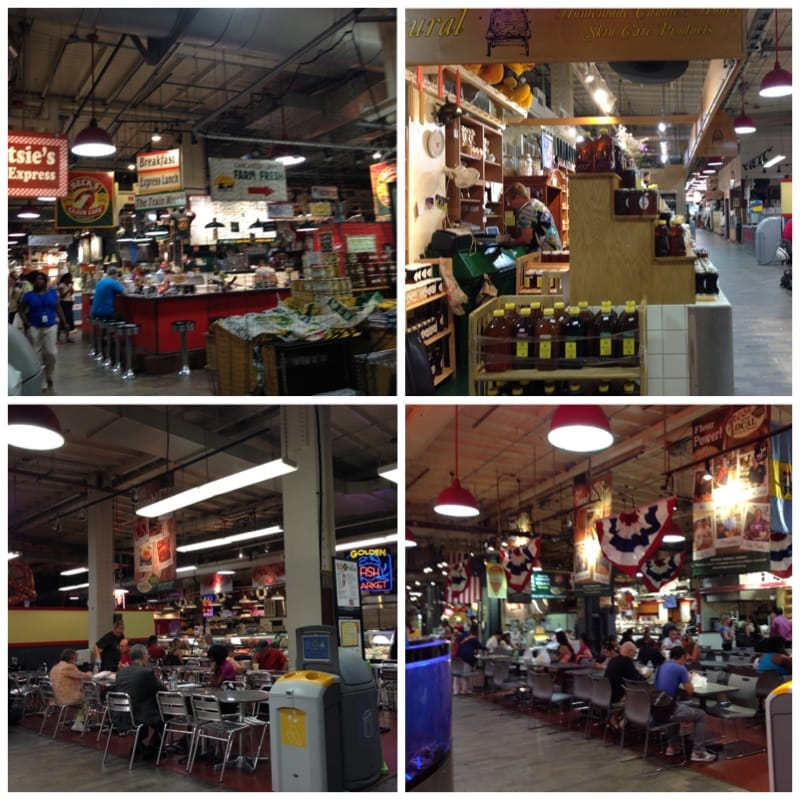

And it’s Sunday once more! This last week with Sister here has FLOWN by! If you haven’t had a chance to read her awesome posts this week for

_[Sunday Funday: Issue 19](/sunday-funday-issue-19/ "Sunday Funday: Issue 19")_

or

[_S’mores 5 Ways_](/smores-5-ways/ "S’mores 5 Ways!")

, you definitely should! Hopefully I can persuade her to blog for Katie Crafts on the regular! Even though we were super busy this week, I still found time to come up with all my weekly faves.

## Makes Me Laugh: Piggy In Bucket

Maybe this pig is in Tupperware and not so much a bucket, but whatever he is doing, I’m dying. He’s so happy! And smiling! And sooooooooosososososo cute! I laughed pretty hard when I saw him. And now I want a baby piglet to be friends with the baby elephant I also want. Thanks for finding me another great pic, Husband!

## What I’m Reading: “What Alice Forgot” by Liane Moriarty

I told you last time that I was reading

[“The Husband’s Secret”](http://amzn.to/1pRdsGd)

by Liane Moriarty, and that I already had this book sitting on my shelf as well. I finished up the last book – which was absolutely amazingly fantastic, by the way – and immediately had to begin this one! Liane’s writing is just superb! You really FEEL what the characters are feeling and really get invested in the stories. I absolutely recommend you check her out! I’m only on the fifth chapter of

[“What Alice Forgot”](http://amzn.to/1zgNFcc)

but I love it so far, and I can’t wait til Liane’s newest book,

[“Big Little Lies”](http://amzn.to/1tarN1P)

, comes out at the end of the month!

## Place I Love: Reading Terminal

I really, really love

[Reading Terminal](http://readingterminalmarket.org/ "Reading Terminal Market")

, a giant indoor marketplace in Philly. I brought Sister here once before but it was so brief she didn’t really get to see much. We wanted to grab lunch before heading to

[Spruce Street Harbor Park](/spruce-street-harbor-park/ "Spruce Street Harbor Park")

the other day, so this is where we went – they’ve got something for everyone! 🙂

## Something Delicious: Chocolate Martini at Max Brenner

I really don’t need to explain this one, do I? It is chocolate. It is a martini. It is topped with a chocolate drizzled strawberry. It is just perfect. It was also half price because we went during

[Center City Sips](http://www.centercityphila.org/life/SipsPartic.php "Center City Sips")

.

[Max Brenner](http://maxbrenner.com/ "Max Brenner")

(chocolate by the bald man!) does it again!

## Project I Love: Cross Stitched Cat Bookmark

While Sister and I were brainstorming new ideas for the blog, we came across cross stitching. Neither of us has tried it before and we think it may be fun to take up! I have a trillion other things I’m working on, so while I will perhaps dabble in it shortly, hopefully Jessica enjoys it enough to keep at it and get a few posts on it done. We haven’t had anything needlepoint related yet! While searching for project ideas, I came across this pattern on

[Killer Crafts & Crafty Killers](http://anastasiapollack.blogspot.com/2013/04/crafts-with-anastasia-cross-stitched.html "Killer Crafts & Crafty Killers")

for a simple cross stitched book mark- it seems like the kind of project that will be right up my sister’s alley! New craft, reading, and cats? YUP!

Well, that’s all she wrote! Happy Sunday!
