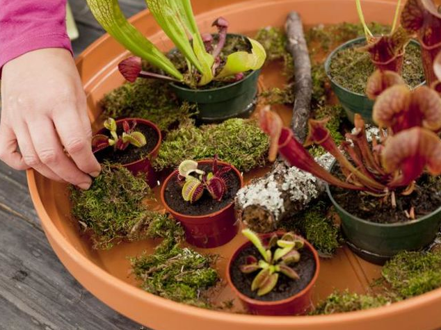
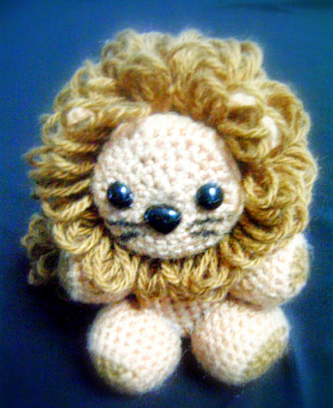

Such a busy week!! Ran around for two and a half days, then jetted to Jersey for my mother-in-law’s birthday dinner and to see my family for a few more days. Then back here (to Philly) to spend the weekend cleaning and doing not-fun-stuff! I am looking forward to a break, and hopefully that comes along today! For now, YOU can sit back, relax, and see what made it into this week’s issue!

## Makes Me Laugh: Snuggling Otter Babies

So damn cute. I want a pair of otter pups to snuggle in my house! They look like they’d just cuddle up anywhere. I’m sure my cats would love to snuggle them too. I am pretty sure I need them now!

## What I’m Reading: Quizzes!

I love taking online quizzes. I can’t get enough! I see someone post one on Facebook, I click through to take it, and before I know it it’s been over an hour and I’ve taken three dozen quizzes. It’s a deep dark hole, for certain. For instance, my sister just posted a quiz to find out what your hobby should be. Turns out I should grow carnivorous plants. Who knew? You can take it too if you want!

[Here’s the quiz!](http://www.playbuzz.com/annden10/what-hobby-should-you-have "What Hobby Should You Have Quiz")

photo courtesy of playbuzz.com

## Place I Love: Good Karma Cafe

Every Thursday, I get together with a few awesome girls for a Knitting group (Okay, so I crochet while they knit. I’ll learn eventually!) Anyway, we have a standing reservation in the back room of

[Good Karma Cafe](http://thegoodkarmacafe.com/ "Good Karma Cafe in Philadelphia")

so we have the room to ourselves to discuss our craft projects and/or chat about whatever. It’s a great break from the week and something I look forward to! Good Karma has this KILLER drink that I love love love called the Dandy Lion, consisting of green tea, lemonade and lavender syrup, which I get every time I’m there. Last time, they swapped out the green tea for African nectar tea to keep my caffeine intake at a low, and it was even better! I’m pretty obsessed. It’s easy to see why this is my “place I love” this week!

photo courtesy of thegoodkarmacafe.com

## Something Delicious: Butter Chicken

Chicken Makhani, aka Butter Chicken, is by far my favorite dish in any Indian restaurant. It may very well be one of my favorite dishes ever, actually! Served over rice, or poured directly into my mouth, the sauce is just incredible. I’d love to try making it one day, so I found a recipe on

[All Recipes](http://allrecipes.com/recipe/chicken-makhani-indian-butter-chicken/ "All Recipes butter chicken recipe")

to add to my box. If I ever get around to testing it out, you’ll be the first to know!

## Project That Inspires: Little Lion Amigurumi

I found this pattern for an adorable crocheted lion on

[Maz Kwok’s Designs](http://beacrafter.com/little-lion-amigurumi/ "Little Lion Amigurmi Pattern on Maz Kwok's")

! It’s so cute! I already started and I only hope it comes out even slightly as sweet as this one did!

That’s all she wrote! Happy Sunday!
