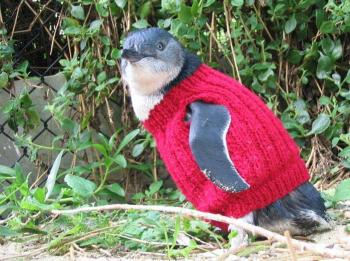
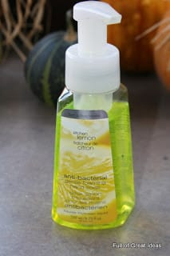

Happy Daylight Savings Day! All right, it’s probably not too happy. It is your Sunday, after all. The last glimmer of your weekend, and you just had to give up an hour of it to the Daylight Savings Gods. Pity. Try to enjoy the rest of it with a cup of coffee and my Sunday Funday: Issue 4!

## Makes Me Laugh: ‘Mean Moms’

“Mean Girls” is one of my all time favorite movies, so to hear another Rosalind Wiseman book-turned-movie is going to happen makes me laugh already. Casting Jennifer Aniston in it is just the icing on the cake. Tina Fey may not be the creative mind behind this upcoming flick, but it still sounds amazing. Can’t wait til an official trailer comes out!

## What I’m Reading: Knit A Jumper For A Penguin!

I wish I could knit! As a crocheter, that’s not something I’d typically say, but look at the adorable little penguin below. He needs help! The sweet little penguins affected by oils spills need knitted jumpers to stay warm as part of their rehabilitation. You can download a pattern to knit them a jumper right from The

[**Penguin Foundation’s website!**](http://penguinfoundation.org.au/about-the-penguin-foundation/wildlife-rehabilitation/ "The Penguin Foundation")

## Place I Love: The Philadelphia Flower Show!

I know I

[just blogged about it,](/2014-philadelphia-flower-show-recap/ "2014 Philadelphia Flower Show Recap!")

but it was definitely my favorite place to visit this week. Go check out the post for tons of photos!

## Something Delicious: Short Rib Cheddar Duck Fat Fries from Village Whiskey

We probably only go here a couple times a year, but this

[**Garces**](http://www.villagewhiskey.com/ "Village Whiskey")

restaurant is a favorite of ours. The duck fat fries with melty cheddar sauce and delicious short rib on top are just ridiculous. I dream about them often. Now my stomach is growling again because I’m thinking of them. It never ends.

## Project That Inspires: DIY Foaming Soap Refill

My favorite type of soap to keep by the sink is the foaming soap from

[**Bath & Body**](http://www.bathandbodyworks.com/home/index.jsp "Bath and Body Works")

. I don’t know why- maybe it’s the way the foam really gets in everywhere when it lathers, or maybe that my hands aren’t quite as dry after using it. Whatever the case may be, it’s really the only kind we buy. I’m running low and don’t see a trip to Bath & Body in the near future- so why not make my own? I found a great and EASY DIY for

**Foaming Soap Refills**

on

[**Full Of Great Ideas**](http://fullofgreatideas.blogspot.com/2010/10/diy-foaming-soap-refill.html "Full of Great Ideas - DIY Foaming Soap Refill")

that I will be trying out ASAP!

Hope what’s left of your Sunday is a good one! Tomorrow’s post will be a special one, so stay tuned!
